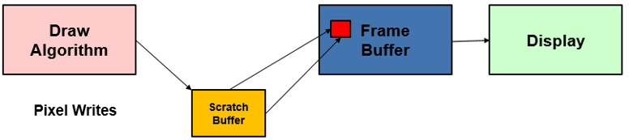
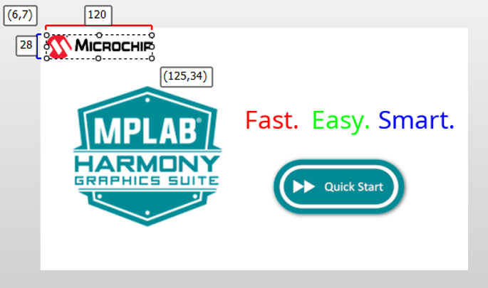
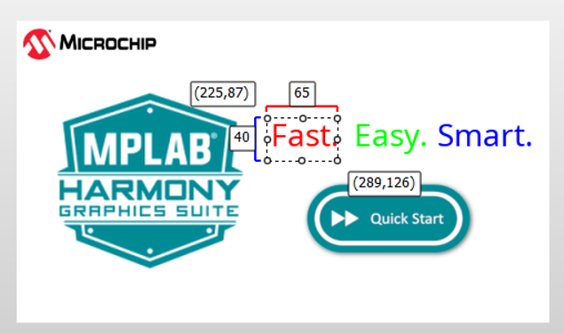
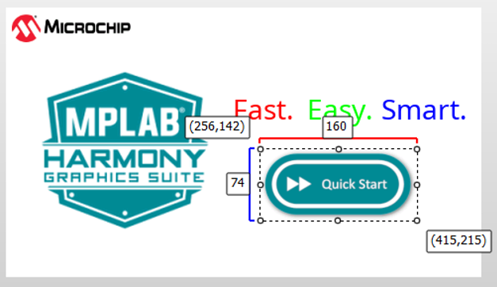
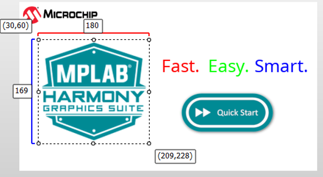
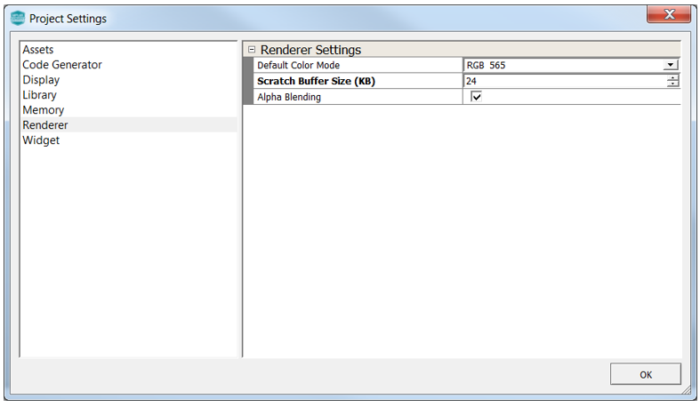

#  Adjusting Scratch Buffer Size

To update the display frame buffer, the Legato Graphics Library utilizes a scratch buffer.  Pixels updates are first drawn into the scratch buffer.  The scratch buffer is then copied into the frame buffer memory.

On a screen update, the library tries its best to update the screen based on the size of the scratch buffer.  This means if the scratch buffer is smaller than the features in the screen, it may take multiple draw passes to complete.  On the display, it can catch the eye as unpleasant screen tearing.

By balancing the design of the screen and managing the scratch buffer size, draw tearing can be reduced and often eliminated.

The key to eliminate screen tearing is to identify the largest feature on the screen and allocate enough scratch buffer memory such that the library can update that feature in a single pass.

We can use the Legato Quickstart application design as an example.

The design is composed of the Microchip logo as an image widget (120x28 pixels)

Three label widgets (65x40), (70x40), (180x40)

A button widget (160x74)

And another image widget for the MPLAB Harmony Graphics Suite logo (180x169)

The MHGS logo image widget is the largest feature.  For a design with color format RGB565 (16 bits per pixel, a recommended scratch buffer size would be 180 x 169 x 2 = 60840 bytes.

However, depending on how frequent the feature is updated, the scratch buffer may not have to be sized to the largest feature.  In the case of the Legato Quickstart design, the button image is the one that is updated most often and gets the most visual attention, while the MHGS logo is only updated on screen draw.  Therefore, a scratch buffer size of 160 x 74 x 2 = 23680 bytes may be enough.

On the other hand, if there are free memory available in the system, for the best draw performance, it is ideal to allocate the remainder available memory for the scratch buffer.

Note that a scratch buffer can be as large a single frame buffer.  The design would essentially be a double buffer configuration.

The scratch buffer size can be adjusted under Project **Settings -> Renderer**.

***

If you are new to MPLAB Harmony, you should probably start with these tutorials:

* [MPLAB® Harmony v3 software framework](https://microchipdeveloper.com/harmony3:start) 
* [MPLAB® Harmony v3 Configurator Overview](https://microchipdeveloper.com/harmony3:mhc-overview)
* [Create a New MPLAB® Harmony v3 Project](https://microchipdeveloper.com/harmony3:new-proj)

***

**Is this page helpful**? Send [feedback](https://github.com/Microchip-MPLAB-Harmony/gfx/issues).