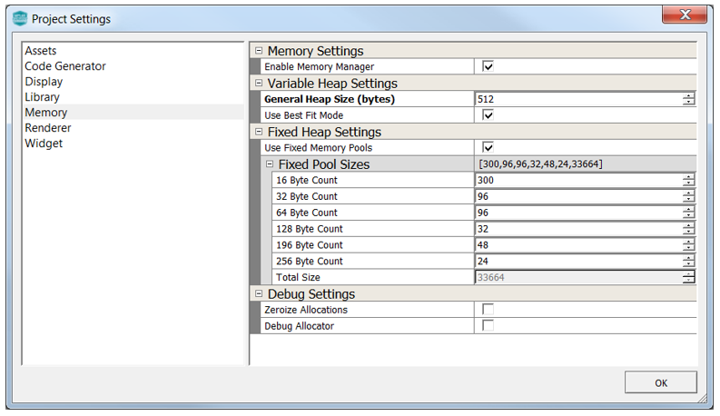
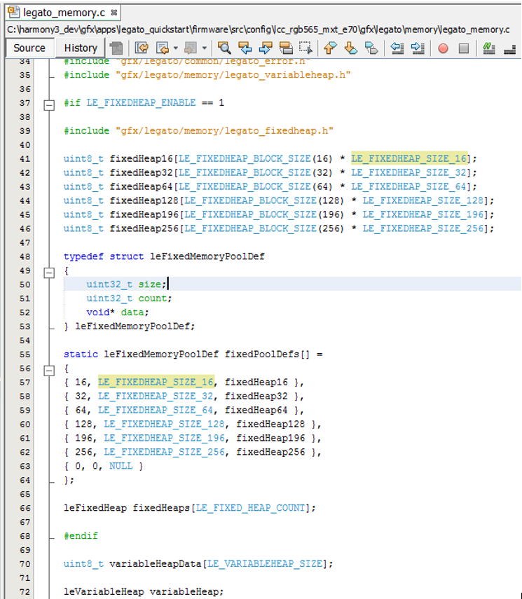

#  Allocating for the Fixed Pool and Variable Heap

## Allocating for the Fixed Pool and Variable Heap

The Legato Graphics Library owns and manages its own memory pool.  The memory pool is split into Fixed Pool and Variable Heap.

Note that Fixed Pool and Variable Heap are used by the Legato Graphics Library only.  They are in-addition to and are not connected to the general application heap.  Those are managed from within the MHC or in the MPLABX project.
Fixed Pool is a pool of micro buffers used by the Legato Graphics library for various runtime operations such as widget properties, pixel draw, palette color look-up and RLE decompression.  The micro buffers are allocated and freed as needed.

The total size of the Fixed Pool is shown in the Memory section of the Project Settings window.  The defaults shown were derived based on testing of various Legato demo graphics applications.

Variable Heap is single, often larger, memory pool.  The primary use is for operations requiring large dynamic memory operations such as JPEG and PNG decoding. If the design does not utilize JPEGs and/or PNGs, the Variable Heap is likely not used and can be set to zero.

The Best Fit mode is a feature to help with the reduction of memory fragmentation within the Variable Heap.  When Best Fit mode enabled, the Legato memory allocator will iterate over every free block record to try and find the block that will best fit the requested allocation size.  When disabled, the allocator defaults to “First Fit” and will return the first memory block that fits.

To reduce memory fragmentation, the Legato Graphics Library will prioritize drawing memory from the Fixed Pool, with the Variable Heap serving as a fallback.

Both can be configured under Project **Settings->Memory**.

These settings are generated into legato_config.h and are used in legato_memory.c.

By default, for performance, the memory in both the Fixed Pool and Variable Heap are not zero-ed.  Widget using dirty recycled memory can sometimes lead to unexpected behavior after screen transitions.  Setting Zero-sized allocation can be an option to address this.  

The Debug allocator setting is available as an option for to debug graphics memory allocation.  When enabled, memory allocation information is added to the generated code, which can then be routed to external console.

***

If you are new to MPLAB Harmony, you should probably start with these tutorials:

* [MPLAB® Harmony v3 software framework](https://microchipdeveloper.com/harmony3:start) 
* [MPLAB® Harmony v3 Configurator Overview](https://microchipdeveloper.com/harmony3:mhc-overview)
* [Create a New MPLAB® Harmony v3 Project](https://microchipdeveloper.com/harmony3:new-proj)

***

**Is this page helpful**? Send [feedback](https://github.com/Microchip-MPLAB-Harmony/gfx/issues).