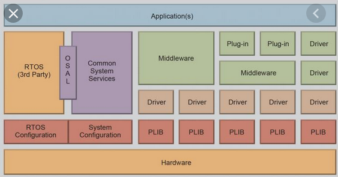
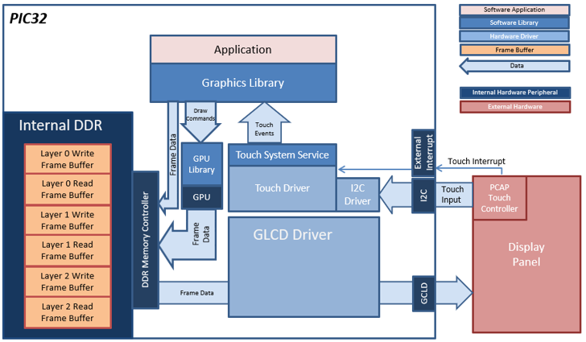
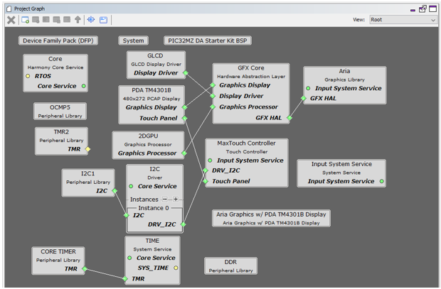

# Summary

A collection of applications are provided with MPLAB® Harmony Graphics Suite to help new users get started with MPLAB® Harmony Graphics Suite development. This page describes the makeup of a MPLAB® Harmony Graphics Suite application.

# Description

A collection of applications are provided with MPLAB® Harmony Graphics Suite to help new users get started with MPLAB® Harmony Graphics Suite development. They are meant to be a scalable starting point, written to express one or more best MPLAB® Harmony Graphics Suite development practices. Each application has a special set of documentation communicating its architecture, configuration needs, building requirements, and running instructions. This page describes the makeup of a MPLAB® Harmony Graphics Suite application. 

Note: You can run the applications on [Microchip Development Kits](https://www.microchip.com/design-centers/graphics/development-boards).  Each example is meant to illustrate how best to use MPLAB® Harmony Graphics Suite to do some particular task on that development kit, but for completeness the application will often use features from the suite that are generic across other development kits as well.

## Applications Naming Example

| Dev Kit | Application Name | Project Name|
| --- | --- | --- |
| [SAM C21N Xplained Pro Evaluation Kit](https://www.microchip.com/developmenttools/ProductDetails/PartNO/ATSAMC21-XPRO) | |
| | aria_quickstart | aria_qs_c21_xpld_xpro.X |
| | legato_showcase | legato_sc_e54_cu_cpro_parallel.X |
| [SAM A5D2 Xplained Ultra Evaluation Kit](https://www.microchip.com/developmenttools/ProductDetails/atsama5d2c-xult) | |
| | aria_benchmark | aria_bm_a5d2_xu_tm4301b.IAR |
|[Multimedia Expansion Board II](https://www.microchip.com/DevelopmentTools/ProductDetails/PartNO/DM320005-5) | |
| | aria_adventure  |aria_adv_mzda_intddr_sk_meb2_tm4301b.X|
| * [5.0" WVGA PCAP Display Board](https://www.microchip.com/DevelopmentTools/ProductDetails/PartNO/AC320005)| aria_dashboard |aria_db_mzda_intddr_sk_meb2_tm5000.X |

## Application Overview

Each MPLAB® Harmony Graphics Suite applications are made up of four distinct items listed below.  An understanding of the items of an application is helpful for accomplishing your future design tasks throughout the whole application development life-cycle, from creating a project to deploying the application to the target platforms.

1. Architecture
2. Configuration
3. Generating and Building
4. Hardware Setup

### Architecture of the Application
The architecture of an application is illustrated using a block diagram. The diagram help users understand how the application is organized and communicates its overall structure and relationships between its major system blocks. It is the first stage of the application design based on the hardware on which the application will run. In the application documentation the application architecture is illustrated using an image. The following image is an example which illustrates the data flow of an application using the graphics software library harmony library, hardware drivers, framebuffer, hardware peripherals, and external hardware.

### Configuring the Application
The configuration of an application is illustrated using the Project Graph. The developer will use the Application Architecture block diagram to help assemble the project graph.

The Project Graph window contains the project graph diagram to show the Harmony components that are included in the application. Lines between components are drawn to satisfy components that depend on a capability that another component provides. Additional configuration can be performed here to satisfy application goals. Once configured, the application code for the configuration must be generated to produce the application and platform specific files necessary to run the solution. 

In the application document the application configuration is detailed. The following image is an example which illustrates the configuration of an application using the graphics software library harmony library, hardware drivers, framebuffer, hardware peripherals, and external hardware.

### Building the Application
The building of an application will start with generating the code which is associated with the components displayed in the project graph window. Once generation is complete, the application can be built.

MPLAB X is the most common build tool for Harmony. A Harmony application for MPU can also be built using  [IAR Embedded Workbench](https://www.microchip.com/DevelopmentTools/ProductDetails/PartNO/AC320005)https://www.iar.com/iar-embedded-workbench/. In the application document the appropriate build requirements are detailed. The following table describes the build recipe for aria_showcase which runs on PIC32MZ DA with Internal DDR Starter Kit, MEBII and PDA TM4301b Display:

| Dev Kit | Build Tool | Project Name | Configuration |
| --- | --- | --- | --- |
| [Multimedia Expansion Board II](https://www.microchip.com/DevelopmentTools/ProductDetails/PartNO/DM320005-5) | MPLAB X | aria_qs_mzda_intddr_sk_meb2_tm4301b.X | glcd_rgba8888_mxt_mzda_intddr_sk |

### Configure Hardware

The configuring of the hardware ensures that hardware is set to successful allow the application to run as expected. In the application document the appropriate hardware setup is illustrated using images. For example, the following image illustrates the configuration of an MEBII board to use external memory.

### Next Steps

If you are new to MPLAB Harmony, you should probably start with these tutorials.

* [Getting Started with MPLAB Harmony 3](https://github.com/Microchip-MPLAB-Harmony/Microchip-MPLAB-Harmony.github.io/wiki) 
* [MPLAB Harmony Configurator User Guide](https://github.com/Microchip-MPLAB-Harmony/mhc/wiki)
* [Create your first peripheral library (PLIB) project](https://github.com/Microchip-MPLAB-Harmony/Microchip-MPLAB-Harmony.github.io/wiki/Create-your-first-peripheral-library-(PLIB)-project). 

If you are new to MPLAB Harmony Graphics Suite, you should probably start with these tutorials.
* [Getting Started with MPLAB Harmony Graphics Suite](https://github.com/Microchip-MPLAB-Harmony/gfx/wiki/Application-Development-Process)
* [Creating a New Graphics Application in MHC](https://github.com/Microchip-MPLAB-Harmony/gfx/wiki/Application-QuickStart)

If you are familiar with MPLAB Harmony Graphics Suite
   *   [Creating Graphics Application on your board](https://github.com/Microchip-MPLAB-Harmony/gfx/wiki/Application-Deep-Dive)
   *   [Migrate an application from Harmony v2.06 to v3.04](https://github.com/Microchip-MPLAB-Harmony/gfx/wiki/Migrate-aria_quickstart-v2.06-to-3.04-pic32mz_ef_sk_meb2)
   *   [Frequently Asked Questions (FAQs)](https://github.com/Microchip-MPLAB-Harmony/gfx/wiki/Application-Troubleshooting)