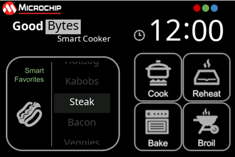
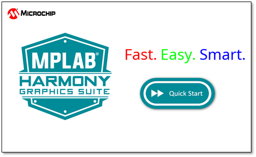

#  Application Demonstrations

Complete applications are part of each MPLAB Harmony Graphjcis Suite distribution.

A collection of [featured applications](Feature-Applications) are provided with MPLAB Harmony Graphics Suite to help users understand and create applications quickly. 

These applications were created using Microchip [supported development boards](Supported-Development-Boards). 

To find a detailed description of these applications, see [Aria Applications](https://microchip-mplab-harmony.github.io/gfx/docs/aria/html/frames.html?frmname=topic&frmfile=00727.html) and [Legato Applications](https://microchip-mplab-harmony.github.io/gfx/docs/legato/html/pages.html).

Although these examples run on Microchip development boards, customers are free to reference our solutions to enable their custom designs.

Legato Dashboard

The legato_dashboard emulates an interactive, touch-enabled automotive dashboard GUI. It leverages Graphcis Canvas, a new technology exclusive to Legato Graphics Library to present smooth motion needle movement.

Legato Climate Control

The legato_climate_control application emulates an interactive, touch-enabled vehicle climate control GUI.  It demonstrates 24-bit color, multi-layer, WVGA resolution design using Global Color Palette Look-Up Table (CLUT), using the PIC32MZ DA with internal SRAM.

Legato Cooker

The legato_cooker application demonstrates the ability of the SAM D5x/E5x device family to support a practical applicance UI.

Legato Quickstart

The legato_quickstart Demonstration provides a touch-enabled starting point for Legato graphics development.

***

If you are new to MPLAB Harmony, you should probably start with these tutorials:

* [MPLAB® Harmony v3 software framework](https://microchipdeveloper.com/harmony3:start) 
* [MPLAB® Harmony v3 Configurator Overview](https://microchipdeveloper.com/harmony3:mhc-overview)
* [Create a New MPLAB® Harmony v3 Project](https://microchipdeveloper.com/harmony3:new-proj)

***

**Is this page helpful**? Send [feedback](issues).