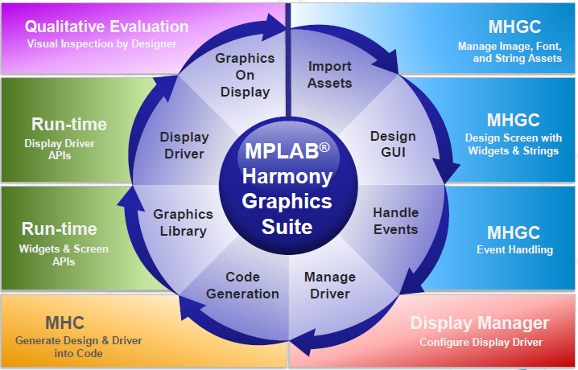
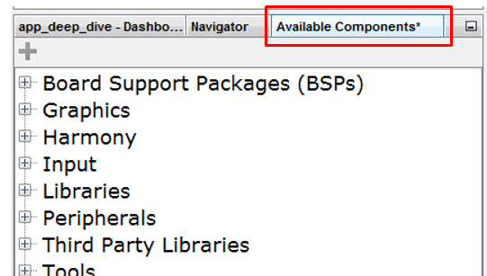
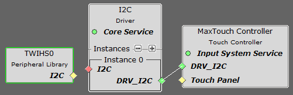
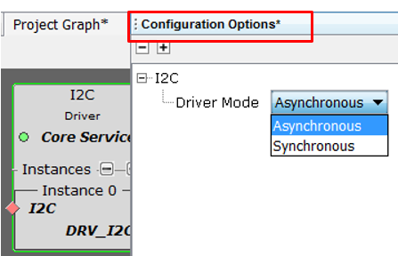
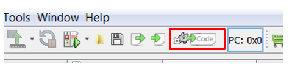

#  Application Development Process

A collection of application development tutorials are provided with MPLAB Harmony Graphics Suite to help users develop graphics applications using the MPLAB Harmony Graphics Suite development process.

The development process is an iterative activity as illustrated above. A basic understanding of this process is helpful when building your own applications or referencing [GFX examples](https://github.com/Microchip-MPLAB-Harmony/gfx_apps/tree/master/apps).

Note: Complete applications are part of each MPLAB Harmony distribution. Visit [Examples and Demonstrations](https://microchip-mplab-harmony.github.io/gfx/00548.html) and [feature examples](https://microchip-mplab-harmony.github.io/gfx_apps/00039.html) for more information. Each application contains a architecture diagram, project graphics, building instructions, and hardware configuration documentation.

# MPLAB Harmony Graphics Suite Development Process

* New Project Creation
* Configuration
* Composing
* Display Managing
* Generation

## New Project or Configuration

The process of establishing an MPLAB Harmony Graphics Suite application starts with the creation of a new Harmony 3 project using the MPLAB Harmony Project Wizard in MPLAB X or New Configuration in standalone version of [MHC](https://github.com/Microchip-MPLAB-Harmony/mhc/wiki). Both tools provide an easy step by step method for establishing your graphics application for Microchip 32-bit MCU or MPU. 

MHC establishes a project file for each application, it is: `harmony.prj`. The harmony.prj is used to store the device name, dependent Harmony package information, as well as C-compliant source code to be used during compilation.

Once the project configuration is created, the remaining steps below are iterative. That is, each step can be repeated until the application meets its expected goals.

## Configuration

The first iterative step is configuration.

**Component Selecting** 

A MPLAB Harmony application is made of functional software blocks. The MPLAB Harmony Configurator (MHC) tool provides a convenient GUI for selecting the software blocks. These blocks are added to the project graph and possibly connected to other blocks to form a working pipeline of functionality. Eventually, each software block is inserted into the application project as C code written for specifically for the device selected for the project. 

MHC provides an easy drag-drop or double-click method for establish components for your graphics application. All available components are listed in the Available Component window. See illustration below:

**Component Dependency Satisfying** 

Each component are essentially hierarchical in nature. Some may be a producer requiring the services of another component, some may be a consumer and satisfy the dependency of other components, while other components are independent and require no component connectivity.

Helpful red/green/yellow diamond icons will show the connection status. 
* red - connection is required
* green - connection is satisfied
* yellow - connection not required at this time

**Component Option Setting** 

When selected, a component advertises its options under the Configuration Options window. A component can produce code that can take on various personalities at initialization or runtime. Options should be set appropriate to the needs of the application.

**Pin settings** 

Not only are components connected to software modules, but connected to hardware pins. A critical step is to connect the software to peripherals, memory, graphics display,  or other items. The use of a board schematic is needed to appropriately perform pin settings.

Note: There are two macro based components for Microchip hardware:  Board Support Support (BSP) and Graphics Templates. They are used to auto-set components, its dependencies, options, and pins based on the device selected. Graphics Templates specifically set specific graphics connectivity such as display boards, external memory, touch input, and run-time RTOS support. These packages are not required, but are provided for ease-of-use. See: [Build a New Applicaton](https://github.com/Microchip-MPLAB-Harmony/gfx/wiki/Build-a-New-Application) to understand how to manually establish  connectivity using your hardware.

## Display Managing

A UI application cannot be visual until the display component has its correct properties managed. After the configuration process, development continues with [display manager](https://github.com/Microchip-MPLAB-Harmony/gfx/wiki/Display-Manager). The MPLAB Harmony Configurator (MHC) contains a display driver creation and management tool to support the interface to a variety of industry displays. It provides everything needed to support the rendering of pixel on your display.

## Code Generation

Once configured and display is managed, the code can be generated. This step creates compile-able C-compliant code specific to your hardware and application specification. The step will display differences during generation if the recommended code is different than your current code. The code can be compiled in MPLAB X or third-party IDE.

## Runtime Examination

Visual inspection of LED lights, backlight, pixel rendering is performed at this step. It expectations are not met, repeat one or more of the previous steps. Always regenerate the code and reinspect.

# Graphics Tutorials

* [Application-Components](https://github.com/Microchip-MPLAB-Harmony/gfx/wiki/Application-Components)

### Next Steps

* Learn about our graphics [quickstart guides](https://github.com/Microchip-MPLAB-Harmony/gfx/wiki/Application-QuickStart)

***

If you are new to MPLAB Harmony, you should probably start with these tutorials:

* [MPLAB® Harmony v3 software framework](https://microchipdeveloper.com/harmony3:start) 
* [MPLAB® Harmony v3 Configurator Overview](https://microchipdeveloper.com/harmony3:mhc-overview)
* [Create a New MPLAB® Harmony v3 Project](https://microchipdeveloper.com/harmony3:new-proj)

***

**Is this page helpful**? Send [feedback](https://github.com/Microchip-MPLAB-Harmony/gfx/issues).