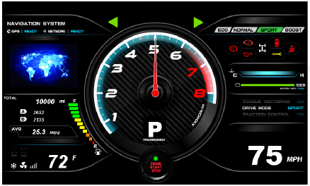
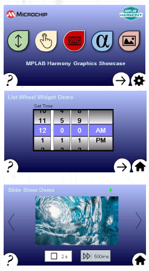

#  Application Essentials

MPLAB Harmony Graphics Suite is a embedded graphics library development tool for Microchip devices. It contains programmable elements found in most embedded graphics libraries.

If you are new to designing or developing embedded graphics, this guide provides definitions of basic concepts found in most discussions.

Essentials

* **Pixel**: A pixel is a physical point in a raster image, or the smallest addressable element in an all-points addressable display device. The number of Pixels Per Inch (PPI) is a metric for how finely the image is displayed.

* **Primitive**: A primitive is a basic building block for drawing to the screen: e.g. point, line, arc, circle, bar. 
* **Widget**: A widget is a graphical object that is used to convey information or provide user input to the system. Widgets are created by assembling multiple primitives. Examples of widgets in MPLAB Harmony Graphics Suite are: 

* **Font**: A set of type or characters of one style, weight and size for a given typeface, for example:

    

* **Glyph**: A pixel representation of an individual character in a given typeface.
* **Bit Block Transfer (BLIT)**: A data operation that combines two or more bitmaps using Boolean functions. An example of a BLIT would be adding an animated object (sprite) on top of a background image while ignoring the background (black) pixels in the sprite’s bitmap.
* **Layer**: The objects of a graphics design can be organized into a hierarchy with child objects which inherit properties from a parent object, which can be a child of another parent object higher in the hierarchy. Every design in MPLAB Harmony Graphics Suite has a Layer0. Additional layers can be added in the tree view panel to provide overlapping layers of objects which are all children of parent layers.
* **Sprite**: A small two-dimensional bit map that is added to a larger scene. Typically, sprites are used to simulate movement by quickly erasing a prior drawing and redrawing the sprite in a slightly different position.
* **Display Resolution**: The number of distinct pixels in each dimension that can be displayed. It is usually quoted in width x height in units of pixels.
* **Alpha Blending**: A graphical technique which blends pixels of overlapping widgets together instead of overwriting one with another. Alpha blending ranges from fully transparent to fully visible (blocking all beneath).
* **Color Depth**: The number of bits required to represent the color of a single pixel. It is expressed as bits per pixel (bpp). Typical bits per pixel are 8, 16, 24, and 32.
* **Color Model, RGB**: The RGB Color Model is an additive color model in which red, green, and blue light are added together in various ways to reproduce a broad array of colors. Colors are expressed as a triplet (RGB) (Source: Wikipedia). Examples of color models are:
    * **RGB 565** (16 bpp, Red: 5 bits, Green: 6 bits, Blue: 5 bits)
    * **RGBA 8888** (32 bpp, Red: 8 bits, Green 8 bits, Blue: 8 bits, Alpha: 8 Bits)
* **Graphics Controller**: The peripheral of a processor or separate device responsible for driving the pixel data to the display.
* **Frame Buffer**: The block of memory that stores the pixel data to be transferred to the screen. A frame buffer can be thought of as a copy of the display’s pixel values.
* **Graphics Processor**: Dedicated hardware within a microcontroller designed to accelerate updating the frame buffer for primitives such as lines and rectangles and for bit block transfers.

## Why Graphics?
A brief discussion of the growth and importance of graphics in modern embedded systems.
### Description
The arrival of smartphones that incorporate feature-rich graphics and easy-to-use touch interfaces has changed user expectations for all types of products, from coffee makers to industrial control panels. Users now expect intuitive, touch-enabled user interfaces with rich colors and crisp designs in the simplest of products. Simple gestures like swipes and pinching are all part of the touch interactivity experience. When compared to designs of a decade ago, modern embedded graphics are significantly more sophisticated.

When adding graphics to modern designs, a full-color display with touch capabilities has become a necessity. Every Graphical User Interface (GUI) involves three elements: images, text and geometric shapes. The use of fonts allows customization of text. Image formats such as JPEG or PNG may be used in lieu of raw uncompressed images, depending on the demands of the application. Graphics libraries with the capability to draw simple geometric shapes like circles and rectangles allow you to trade processing cycles for storage and memory space.

Modern graphics libraries use parameterized data structures called widgets to manage the three essential graphic elements. Widgets may also be used to create interactive touch elements such as buttons, slider bars or list wheels. Widgets are grouped into screens. Whether widgets are drawn in front or behind (the z-order) within the screen must be managed as well. One goal of any well-designed and organized GUI is to minimize pixel redraws that can occur when objects overlap.

To build screens using widgets, a What-You-See-Is-What-You-Get (WYSIWIG) design tool is essential. The GUI design tool should provide a pixel-exact representation of screen objects and provide quick iterations of object edits. There are many components that a good GUI design should have.

* **Language** – The GUI should support the user’s preferred language.
* **Graphics** – The GUI should be simple, comprehensive and easy-to-understand with a a modern, fresh look.
* **Motion** – Motion should be used to provide additional information, in addition to entertainment, to the user. 
* **information** to the user?
* **Information Design** – Information that the GUI is communicating should be easy to understand and use.
* **Interface Design** – The user should be able to successfully navigate and manipulate the interface to accomplish useful tasks.
* **Interaction Design** – The underlying firmware or software’s reaction to user inputs should not impede or detract from the user experience.
* **Programming** – The GUI should be robust and error free.

Several trends in today’s user interface designs can help keep a GUI design modern and fresh looking.

* **Seamless Interface** – This trend minimizes screen transitions by bringing up needed content without changing the application’s display or using many redraws. This is achieved by using double buffering, layers and mask colors.
* **Typography** – Large headlines in combination with smooth animation provides an eye-catching design without using unnecessary content. This is achieved with flexible font management tools that minimize the memory footprint of fonts and strings.
* **Gradient Transitions** – Smooth transitions from one gradient background to another signifying a specific action provides a very engaging user experience. Our gradient widget enables easy implementation of this trend.
* **Custom Illustrations** – High-quality illustrations or graphics in unique styles keeps the user coming back for more. Flexible support for images in multiple formats, as well as image compression, are needed to execute this capability.
* **Video** – Videos in a format that complements the look and feel of the GUI add interest and can quickly communicate complex ideas to the user.
* **Strong Focus on the User Experience (UX) - Combine ease of use with a clean and convenient user interface. Don’t trade effectiveness for beauty. Design iterations need to be made quickly and easily. User feedback should be easily be added to any design.
* **Interaction** – Each interactive element in the design should provide immediate and smooth feedback to the user. Event Management tools support the design of effective user interface.
* **Soothing Colors** – Give preference to a GUI palette with a calm pastel colors and avoid bright colors. Flexible color schemes should be able to be customized for a desired look and feel.

Why use MPLAB Harmony Graphics?

This section discusses the benefits of using the MPLAB Harmony Graphics Suite for embedded graphics development.
### Description
Here are the key reasons to use MPLAB Harmony Graphics Suite:
* It’s Good
* It’s Fast
* It’s Free
### It's Good
MPLAB Harmony Graphics Suite is tightly integrated with MPLAB X Integrated Development Environment to provide an enhanced, interactive development environment.
### Description
The GUI Editor provides an exact representation of the graphical design, eliminating the Tweak/Generate/Build/Load/Run iterative cycle needed when the physical display was the only way to see the design. It has the best multi-language font and string support of any available graphics suite.  In today’s worldwide market, it is essential that adding localization features be straightforward and quick. Strings are stored as an array of pointers to a glyph lookup table rather than an array of glyphs. This greatly reduces the cost of multi-language support using non-ASCII encoded fonts, such as Chinese and other languages with non-Roman alphabets.

A full set of internal tools is provided to manage all the assets needed to build a GUI, including fonts, strings and images. Images can be imported into the application in one format and stored in an alternate format. Images can be compressed to trade off smaller memory footprint for more image processing.

The memory footprint of all assets can be optimized using the Memory Configuration tool. This tool enables image compression or format translation to the image assets that use up the most memory. The Heap Estimator tool estimates heap usage for all widgets and image decoders used the application, minimizing wasted memory from a heap allocation.
Support for multiple graphic layers and double buffering is built into the tool suite and can be enabled using a few mouse clicks. Animation using sprites is easily accomplished using double buffering. Video is also supported. Support for both on-chip and off-chip display drivers is provided.

The Display Manager supports color encoding schemes from 8 bits per pixel using an 8-bit global Lookup Table (LUT) to 32 bits per pixel (32-bit RGBA blending). Using the global LUT replaces every pixel color value in frame buffers and images with just one byte that addresses a location in the global palette LUT. The Global Palette tool optimizes LUT values based on the images and color schemes used in the design to minimize posterization. Using the global palette LUT allows for double buffering on small memory devices, greatly improving graphics performance.

Multiple widget color schemes are supported, allowing easy and low-overhead customization of the interface’s look.
Managing application events, such as touches or swipes, is critical to building an effective GUI. The Event Manager tool supports events within the graphics stack and between the graphics stack and the application layer. In many cases, especially for events from one graphics widget to another, the Event Manager tool eliminates the need to write any code. In most other cases, an event code template is built by the Event Manager that can be customized to fully implement the required GUI behavior.

MPLAB Harmony Graphics Suite provides a full set of graphical design elements or widgets:

| Widget  | Description | Application Example |
| ------------- | ------------- |------------- |
| Arc  | Graphical object in the shape of an arc  | aria_showcase_reloaded|
| Bar Graph| Graphing widget that uses rectangular bars to show data in categories |aria_showcase_reloaded aria_weather_forecast|
|Button | Rectangular area that captures pressed or released events |aria_benchmark aria_showcase aria_quickstart aria_weather_forecast|
|Check Box|Rectangular area that captures checked and unchecked event states| aria_showcase_reloaded|
|Circle |Graphical object in the shape of a circle||
|Circular Gauge|Graphical object in the form of a circular gauge |aria_showcase_reloaded|
|Circular Slider|Graphical object in the form of a circular slider| aria_showcase_reloaded|
|Draw Surface|Container with a callback from its paint loop; a Draw Surface lets the application make draw calls directly to the Hardware Abstraction Layer (HAL) during LibAria's paint loop| |
|Gradient |Draw window that can be associated with a gradient color scheme, allowing for color variation in the window|aria_showcase (background)|
|Group Box| Container widget with a border and a text title ||
|Image| Displays an image | aria_benchmark aria_showcase aria_quickstart  aria_weather_forecast|
|Image Plus| Displays and controls image attributes; this widget can be set to accept two-finger touch input||
|Image Sequence| Controls display sequencing of an image|aria_showcase|
|Key Pad |Displays rows and columns of buttons; this widget has a key click event that can be customized |aria_showcase|
|Label | Displays text to be used as a label |aria_benchmark aria_showcase aria_quickstart aria_weather_forecast|
|Line| Displays a line between two points | |
|Line Graph|Displays a line graph using points and lines |aria_showcase_reloaded aria_weather_forecast|
|List Wheel|Allows multiple radial selections that were usually touch-based selections and browsing |aria_showcase|
|List| Container to display a list of other widgets||
|Panel| Container that is a simpler alternative to Draw Surface, as it does not have the Draw Surface callback feature.|aria_benchmark aria_showcase|
|Pie Chart| Graphing widget that shows data entries as sectors in a circle |aria_showcase_reloaded|
|Progress Bar| Displays progress horizontally or vertically||
|Radial Menu| Carousel of image widgets that rotates in an elliptical track simulating three-dimensional rotation||
|Radio Button| Button that displays checked or unchecked states and text |aria_showcase|
|Rectangle|Displays a rectangle with a filled color||
|Scroll Bar|Displays a vertical or horizontal scroll area||
|Slider |Display a vertical or horizontal slider|aria_showcase|
|Text Field| Displays tracking of touch inputs|aria_showcase|
|Touch Test| A widget that displays tracking of touch inputs.| aria_showcase|
|Window |Container like the Panel but has a customizable title bar||

### It's Fast
MPLAB Harmony Graphics Suite minimizes development time and produces very fast graphics on processors.
### Description
The MPLAB Harmony Graphics Suite produces fast graphics on PIC32 or SAM microcontrollers (MCUs), minimizing the processor resources and processing bandwidth that is dedicated to graphics. Our lineup of application examples and quick-start guides further enables this increase in graphics speed. These resources walk you step by step through the methods to get basic elements of graphics—image, text and widgets—up on an embedded display in a minimal amount of time.
Unlike third-party graphics tools, MHGS is deeply integrated and tightly coupled with the existing MPLAB development ecosystem. With third-party tools, each step in the graphics development process happens outside of the development environment and the code must be assembled manually, as illustrated in the graphic below:

The development of a GUI is a highly iterative process, requiring many loops through the process, as shown above, before converging into the final GUI design. This process takes more time and is more prone to user errors because of the manual assembly of all the code developed by the tools outside of the main toolset. The faster the loop time of each iteration is, the faster the final design will be.
Because all MPLAB Harmony Graphics Suite tools are tightly integrated into the MPLAB development ecosystem, the only place that manual software changes happen is in the application code of the project. Everything else is automated, thus reducing the risk of user error.

The graphics library is optimized to utilize MPLAB Harmony Graphics Suite’s capabilities. It’s not a one-design-fits-all-processors library; it is focused solely on PIC32 or SAM devices. This library can take full advantage of PIC32 or SAM device features, such as the 2D Graphics Processing Unit (2D GPU) and built-in display controller, when these features are available in the target processor.

The available graphics application examples provide optimized graphic designs that wring the maximum graphics performance out of each target processor. The Advanced Topics section in the documentation discusses additional performance-enhancing techniques, such as “Draw Pipeline Options” and “Improving Touch Performance with Phantom Buttons.”

### It's Free
MPLAB Harmony Graphics Suite is free to design with and use with our 32-bit microcontrollers.

### Description
There are no upfront costs and MPLAB Harmony Graphics Suite is royalty-free for use with all PIC32 and SAM MCUs. Full source code is available in each release of MPLAB Harmony and there are no restrictions on user customization of this source code. Finally, it works with the free version of the MPLAB XC32 Compiler so no additional investment in compiler upgrades is needed.

How Does MPLAB Harmony Graphics Work?

Here is a brief description of how MPLAB Harmony Graphics Suite works.

### Description

MPLAB Harmony Graphics Suite (MHGS) can be broken down into two parts: the development architecture and the application code architecture.

During graphics development, MHGS is launched from MPLAB Harmony Configurator (MHC). MHC supports the basic setup of the application’s code, including system clock setup, selection and configuration of drivers and display setup. MHGS supports the design of the application’s graphics, including font, string, and image management. The setup of color schemes and widgets is also supported by MHGS.

To design a GUI, use the drag-and-drop interface in the GUI Editor and MHGS configures all the code needed to initialize, configure, and manage a context. Then MHC can generate the code.

MHGC tools include:
* **GUI editor** – Enables drag-and-drop capability to visualize the design, select the drawing priority and establish parent/child relationships so that objects or widgets can be grouped as desired
* **Tree Manager** – Enables the user to select the drawing priority and establish parent / child relationships so that objects (widgets) can be grouped as desired
* **Event Manager** – Enables customizing of touch and logical events and interaction with graphical attributes
* **String and Font Managers** – Used to input strings in multiple languages for potential reuse and optimization of fonts and memory requirements
* **Image Manager** - Enables palette, compression, format changes and editing of images without external tools
* **Resource Manager** – Tabulated totals of memory usage for images, fonts and other elements used within the graphics design that can be used to optimize a specific design to fit within a given device’s Flash memory

**Graphics Library** – This library provides the capability for interface generation, management, and interaction. It provides the building blocks for constructing a user interface in the form of widgets or user interface elements. These consist of things like buttons, checkboxes, images, etc. This library also handles user interaction events for things like touch actions.

**Graphics Utilities Library** – This library is primarily responsible for managing and decoding assets such as images, fonts and strings. It provides the means for interacting with asset data, complex data decoding, data decompression and string asset look up. It also abstractly handles accessing external memory sources during asset decoding.

**Hardware Abstraction Layer (HAL)** – The HAL provides a standard software interface between the graphics libary and graphics hardware, like display drivers and Graphics Processing Unit (GPU). The HAL supports graphics buffer management, the graphics render pipeline and graphics primitive algorithms.

The HAL supports a seamless integration of a GPU via a standardized application interface that can switch between using a GPU for a hardware implementation of graphics primitives and a software implementation of the same primitives.

**Third Party Graphics Library** (Future Upgrade) – The third-party library can be used with the Harmony framework to perform the graphics operations if desired by the user. The third-party library has access to the Hardware Abstraction Layer (HAL), which has been configured to supply the frame buffer to be filled in by the third-party graphics library.
Touch Driver – Supports capacitive or resistive touch interface on the display.

**Graphics Controller Driver** – This software talks directly to hardware. Multiple drivers for internal, external and no-controller options are available. These can be customized with the Display Manager interface. No other software in the stack should have hardware access.

**Graphics Accelerator Driver**- This software interfaces with graphics accelerator hardware, when it is available.

Example Graphics Projects

Example projects showing MPLAB Harmony Graphics Suite in action.
### Description
The aria_dashboard application presents an automotive dashboard example demonstrating the use of high-resolution graphics. It is the first MPU running MPLAB Harmony Graphics Suite.

The aria_showcase Demonstration application provides a subset of capabilities offered by the Aria User Interface Library using Low-Cost Controllerless (LCC).

The aria_showcase_reloaded Demonstration application showcases the ready-to-use circular and graphing widgets that are available within MHGS: arc, circular slider, circular gauge, pie chart, bar graph and line graph. 

The aria_quickstart Demonstration provides a touch-enabled starting point for Aria graphics development.

The aria_weather_forecast Demonstration provides a practical single-layered, single-buffered application using the Aria User Interface Library.

***

If you are new to MPLAB Harmony, you should probably start with these tutorials:

* [MPLAB® Harmony v3 software framework](https://microchipdeveloper.com/harmony3:start) 
* [MPLAB® Harmony v3 Configurator Overview](https://microchipdeveloper.com/harmony3:mhc-overview)
* [Create a New MPLAB® Harmony v3 Project](https://microchipdeveloper.com/harmony3:new-proj)

***

**Is this page helpful**? Send [feedback](https://github.com/Microchip-MPLAB-Harmony/gfx/issues).