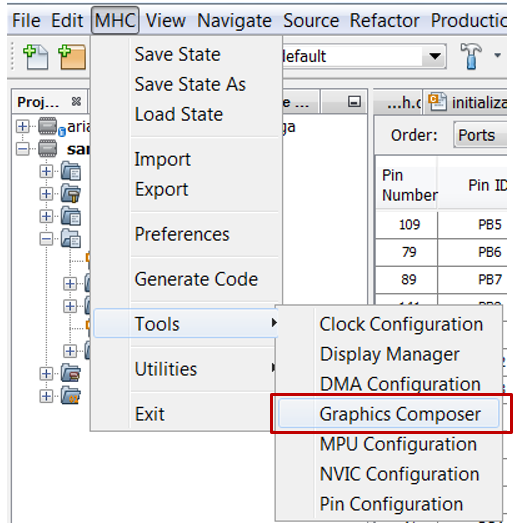

#  MPLAB® Harmony Graphics Composer (MHGC)

The MPLAB® Harmony Graphics Composer (MHGC) is a graphical user interface design tool that is integrated as part of the MPLAB Harmony Configurator (MHC). This tool enables you to easily configure and visually design user interfaces for MPLAB Harmony Graphics Suite applications.

### The Graphics Composer supports:
* Importing image and font assets
* Creating screens and schemes
* Adding widgets to screens
* Configuring properties

To start the MPLAB Harmony Graphics Composer:

1. Start MHC from the MPLAB X IDE (v5.20 or higher) main menu, **click**
_MHC>Tools>Graphics Composer_

***

If you are new to MPLAB Harmony, you should probably start with these tutorials:

* [MPLAB® Harmony v3 software framework](https://microchipdeveloper.com/harmony3:start) 
* [MPLAB® Harmony v3 Configurator Overview](https://microchipdeveloper.com/harmony3:mhc-overview)
* [Create a New MPLAB® Harmony v3 Project](https://microchipdeveloper.com/harmony3:new-proj)

***

**Is this page helpful**? Send [feedback](https://github.com/Microchip-MPLAB-Harmony/gfx/issues).