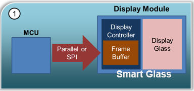
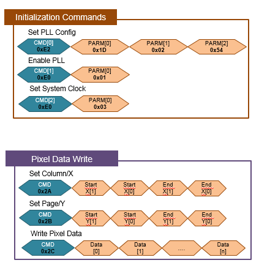
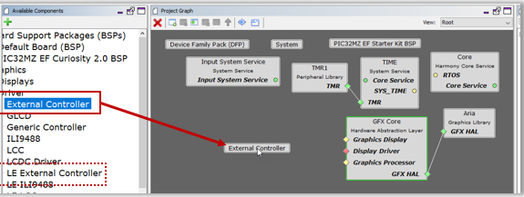
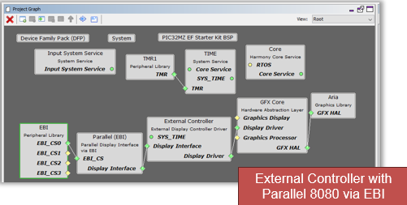
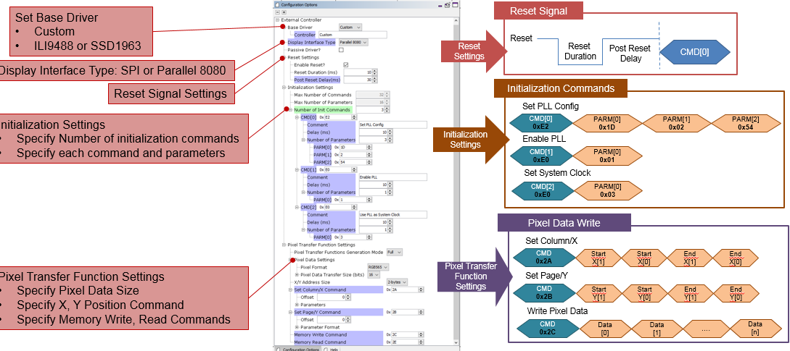
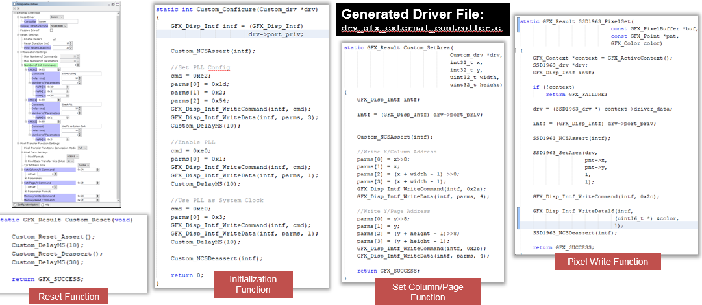
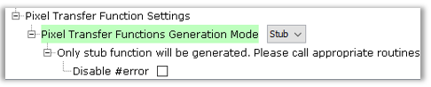
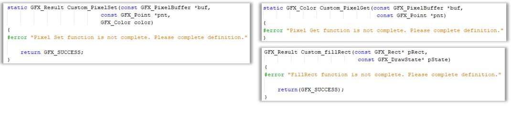

#  Display Driver Support

MPLAB Harmony Graphics Suite contains display driver support for the following
display controllers:
* [Microchip Graphics LCD (GLCD) Controller](http://ww1.microchip.com/downloads/en/DeviceDoc/54_GLCD_60001379A.pdf)
* [Low-Cost Controllerless (LCC)](http://ww1.microchip.com/downloads/en/AppNotes/00001387C.pdf)
* External Third-Party Controllers
  * [ILI9488](http://www.ilitek.com/index.aspx?lang=US)
  * [SSD1963](http://www.solomon-systech.com/)

## Microchip Graphics LCD (GLCD) Controller
The Suite contains integrated support for GLCD. Using the GLCD MHC component and its configurations options a GLCD driver is made available for various display sizes. No coding is required.

## Low-Cost Controllerless (LCC)
The Suite contains integrated support for LCC. Using the LCC MHC component and its configurations options a LCC driver is made available for various display sizes. No coding is required.

## External Third-party Controllers
The Suite contains integrated support for a class of external controllers. Using the External Controller MHC component and its configurations options a SSD1963 or IlI9488 driver is made available for various display sizes. No coding is required. The user must be able to reference appropriate command set of the third-party controller's datasheet.

* Quickstart [Display Driver for SSD1963 Controller](https://github.com/Microchip-MPLAB-Harmony/gfx/wiki/Third-Party-Display-Module)

### Supporting Third-Party Display Modules

Third-Party Display Modules
* Different resolutions
* Different Interfaces
* Different Display Controller vendors

### The External Controller Driver Generator

Generate a custom driver for a class of Display Controller Chips. Examples are ILI9488, SSD1963, ST7796S and SSD1351
* That uses a SPI 4-line or Parallel (16- or 8-bit) 8080 interface
* That uses [command] + [data] writes for setup and frame data
* That writes frame data using Column/Row addressing
* Supports 16-bit RGB565 color mode

For other Display Controllers, it can generate a skeleton driver that ties to the graphics library.

### Using the External Controller Driver Generator

Add the driver component to the project like a regular external controller driver
* Graphics > Driver > External Controller (Aria)
* Graphics > Driver > LE External Controller (Legato)

* Connect External Controller Driver component to library
* Connect the appropriate Display Interface component (SPI or Parallel)

### Configuring the External Controller Driver Generator

### Generated Custom Driver

### Generating a Stub Display Controller Driver

If the target external display controller has an unsupported pixel transfer protocol, set Generate Mode to ‘Stub’

This will generate stub pixel transfer functions definitions that must be completed manually.

> **_NOTE:_**  #error is added for enforcement. Remove or disable #error when definition is completed.

***

If you are new to MPLAB Harmony, you should probably start with these tutorials:

* [MPLAB® Harmony v3 software framework](https://microchipdeveloper.com/harmony3:start)
* [MPLAB® Harmony v3 Configurator Overview](https://microchipdeveloper.com/harmony3:mhc-overview)
* [Create a New MPLAB® Harmony v3 Project](https://microchipdeveloper.com/harmony3:new-proj)

**Is this page helpful**? Send [feedback](https://github.com/Microchip-MPLAB-Harmony/gfx/issues).
