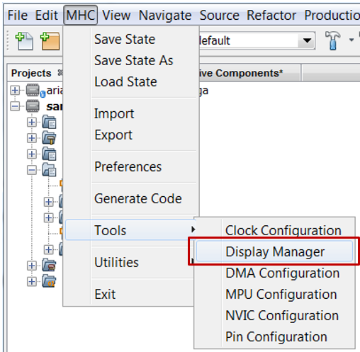
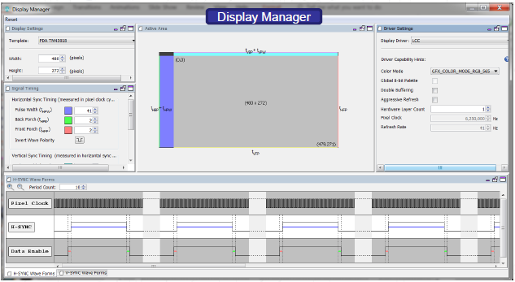

#  Display Manager

The MPLAB® Harmony Graphics Composer (MHGC) display manager is a graphical user interface design tool for creating and managing dynamic display drivers. The display manager is integrated as part of the MPLAB Harmony Configurator (MHC). This tool enables you to easily create and display drivers for any hardware to be used with MPLAB Harmony Graphics Suite applications.

### The Display Manager supports:
* Display Settings
* Signal Timing
* H-Sync Wave Forms
* General Driver Settings

**To start MPLAB Harmony Graphics Display Manager:**

* Start MHC from the MPLAB X IDE (v5.20 or higher) main menu, **click**
_MHC>Tools>Display Manager_

***

If you are new to MPLAB Harmony, you should probably start with these tutorials:

* [MPLAB® Harmony v3 software framework](https://microchipdeveloper.com/harmony3:start) 
* [MPLAB® Harmony v3 Configurator Overview](https://microchipdeveloper.com/harmony3:mhc-overview)
* [Create a New MPLAB® Harmony v3 Project](https://microchipdeveloper.com/harmony3:new-proj)

***

**Is this page helpful**? Send [feedback](https://github.com/Microchip-MPLAB-Harmony/gfx/issues).