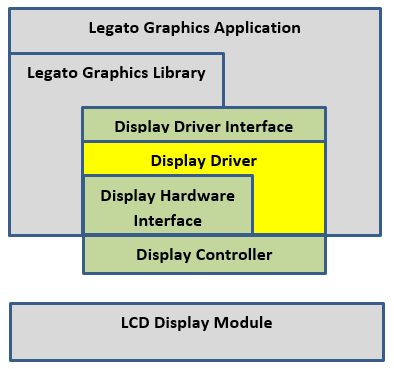

#  Driver Essentials

MPLAB Harmony Graphics Suite contains driver support for PIC32 and SAM peripheral on-chip hardware graphics controllers, direct-drive software graphics controllers and 3rd-party off-chip hardware graphics controllers. This article discusses the essentials of the graphics display driver framework and the pre-built graphics drivers used in applications on Microchip [supported development boards](https://github.com/Microchip-MPLAB-Harmony/gfx/wiki/Supported-Development-Boards).

For other 3rd-Party display controllers, use the MPLAB Harmony Graphics Suite graphics driver generator to create an appropriate Harmony driver. See [Generate my display driver.](https://github.com/Microchip-MPLAB-Harmony/gfx/wiki/Supported-Development-Boards)

## Essentials of the Graphics Display Driver

# 

The figure above shows the layers of the driver library stack. APIs are provided at each layer to access functionality which includes the graphics driver interface level(the GFX Driver API), the graphics display driver level (the Driver API) and at the display hardware interface (the Display Hardware Interface API).   All type definitions, labels, macros, and helper functions can be found in the `gfx_driver.h` file.

Essentials

When using the Legato graphics library, the sole access mechanism to the driver is the gfx_driver function pointer.

The Graphics Driver Interface defines a common abstraction API to the graphics library. Definitions for a display driver and gpu processor controllers are provided as function pointers. The graphics library does not need to reference the driver directly, but only need to reference the common abstraction API.

When rendering to the display module, the default behavior for the graphics driver is to read Legato graphics library is to render its widgets into scratch buffer memory, while the driver is responsible for putting the contents of the scratch buffer onto the screen. The library typically uses the `blitBuffer `API for this operation.

The display driver API includes the functions supported by a specific display controller or graphics processing unit. It contains the API which connects the common abstraction to the driver implementation. It is not required that all drivers implement all API ofthe graphics driver interface.

The Graphics Driver implements the functions defined by the Graphics Driver Interface. It provides a structure of functions for which it implements in its header. If the controller is not capable of a particular function, then the function is not implemented. The structure of functions uses a well-known reference by the graphics library.

The Display Driver Interface provides hardware specific routines for drivers that do not have direct access to frame buffer memory. This layer contains control and data communications routines for SPI, I2C, GPIO and other hardware port interfaces.

The Display Controller block defines either a software or hardware LCD controller. The hardware controller is a hardware peripheral within the MCU or attached external 3rd-party controller.

The display driver interface specifies the API for all display drivers. The implementation of the API will depend upon which controller for which the driver is written. The driver files, header and implementation, is named after the controller. For example,  DRV_`LCC`_Initialize() or DRV_LCC_lit().

The display drivers role is to initialize the controller, perform calls made by the caller to render pixels on the display. It is only driver that has direct knowledgeable access to the hardware.

The gfx driver API includes the following basic functions that must be supported by every display
driver:

`    gfxResult (*blitBuffer)(int32_t x,`
                           `int32_t y,`
                           `gfxPixelBuffer* buf,`
                           `gfxBlend gfx);`

The library references the functions through its function pointer table named gfsDisplayDriver. The actual names of these functions are not used by the library. It is the table structure that the display driver
exports and which the application uses when calling the graphics API function. This structure is defined in
gfx_driver.h.

There are a few functions in the driver that are not included in the function table. These are initialization and task routines. The initialization routine is called once during system initialization. The Task routine expected to be call during the application task loop for any short-term driver functionality.

### Next Steps

* Learn about our graphics [application development process](https://github.com/Microchip-MPLAB-Harmony/gfx/wiki/Application-Development-Process)

***

If you are new to MPLAB Harmony, you should probably start with these tutorials:

* [MPLAB® Harmony v3 software framework](https://microchipdeveloper.com/harmony3:start)
* [MPLAB® Harmony v3 Configurator Overview](https://microchipdeveloper.com/harmony3:mhc-overview)
* [Create a New MPLAB® Harmony v3 Project](https://microchipdeveloper.com/harmony3:new-proj)

***

Is this page helpful? Send [feedback](https://github.com/Microchip-MPLAB-Harmony/gfx/wiki/issues).
