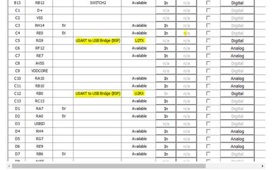
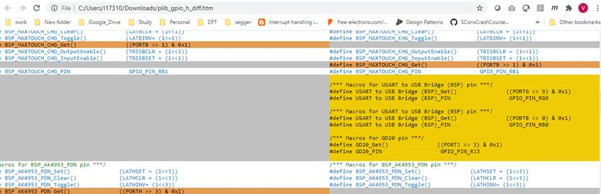

#  Aria Infotainment Demo: Regenerate code leads to build error with MHC v3.5.0 or newer

## Issue

There is a known issue regenerating code for [Aria Infotainment demo applications](https://microchip-mplab-harmony.github.io/gfx/docs/aria/html/frames.html?frmname=topic&frmfile=00017.html) using [MHC v3.5.0 or newer](https://microchip-mplab-harmony.github.io/mhc/release_notes.html) will result in build error.

Previous versions of MHC generate macros only for the custom names assigned to GPIO pins in the Pin Settings window. If a custom name was assigned to a pin configured for a peripheral function (example UART TX), no preprocessor macros were generated. However, there are situations where generating preprocessor macros for pins configured for peripheral function is necessary – for example in case of I2C bootloader that needs to read the status of I2C SDA line to decide whether to remain in bootloader or not. To address this, macros were added in MHC v3.5.0 for pins configured as a peripheral function.

Aria Infotainment uses the same custom name - “USART to USB Bridge (BSP)” – for both U2TX and U2RX lines. 

After code regeneration, two sets of preprocessor macros are generated that have the same name and that do not confirm to the C-language standard (note the spaces and special character in the custom name). 

This results in build error.

***

## Resolution

There are two options to resolve this issue:

**Option 1**. Change pin definition names.

1. Navigate to Pin Manager in MHC.
2. Change the names for the pins C5 (U2TX) and C12 (U2RX) to be different and C-language friendly (no spaces and special characters)
3. Regenerate code.

**Option 2**:  Use MHC v3.4.x (MHC plugin version v3.5.x).

Use the Harmony content manager to revert the MHC release to v.3.4.x.

See: [Content manager](https://github.com/Microchip-MPLAB-Harmony/contentmanager/wiki)
for content manager tutorial.

1. Navigate to MHC and select v3.4.x from selection dropdown.
2. Re-install MHC.
3. Exit and relaunch MHC.
4. Regenerate code.
