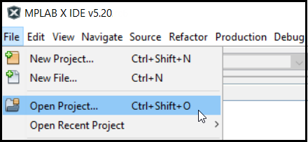
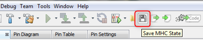
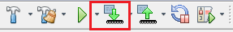

#  Feature Applications

Feature applications lets you get started with MPLAB Harmony Graphics Suite features in about 30 seconds. These applications should give you a ready-made starting point for writing your own UI application with MPLAB Harmony Graphics Suite.

These applications were created using Microchip [supported development boards](Supported-Development-Boards). 

To find a detailed description of these applications, see [Aria Applications](https://microchip-mplab-harmony.github.io/gfx/docs/aria/html/frames.html?frmname=topic&frmfile=00727.html) and [Legato Applications](https://microchip-mplab-harmony.github.io/gfx/docs/legato/html/pages.html).

Follow the steps below, to run a feature application.

## Step 1: Get a feature app

1. Clone the [Harmony v3 GFX](https://github.com/Microchip-MPLAB-Harmony/gfx_apps.git) repository.

> git clone https://github.com/Microchip-MPLAB-Harmony/gfx_apps.git

## Step 2: Import the feature app

1. Open the MPLAB X IDE and select **File->Open Project**

2. Navigate to the **`apps`/`aria_<_feature_>/firmware`** and select one of the [MPLAB X feature projects](https://microchip-mplab-harmony.github.io/gfx_apps/00039.html). Then click **Open Project** button.
3. Under **Projects** Right-click project name, select **Set as Main Project**.

## Step 3: Launch MPLAB Harmony Configurator (MHC)
1. After the project opens, start the MPLAB Harmony Configurator. In the MPLAB X IDE, select **_`Tools->Embedded->MPLAB Harmony Configurator`_**.
2. Select the path to the folder containing the MPLAB Harmony framework and click **Launch**.
3. The Configuration Database Setup window opens. Select **[] gfx**, then click Launch.
4. After MHC is loaded, observe the **Project Graph**.

## Step 4. Generate Source Code
1. When done, before generating code, click the **Save** icon as shown below.

2. Save the configuration in its default location when prompted.

3. Click on the **Code Generate** button as shown below to start generating code.

4. Click on the **Generate** button in the **Generate Project** window, keeping the default settings as shown below.
If prompted for saving the configuration, click **Save**.

MHC will include all the MPLAB Harmony library files and generate the code based on the MHC selections. The generated code would add files and folders to your Harmony project.

## Step 5. Program Device

1. Clean and build your application by clicking on the **Clean and Build** button as shown below.

2. Program your application to the device, by clicking on the **Make and Program** button as shown below.

***
## Next Steps
* Understand our [board support facilities](Quickstart-Board-Support-Application)
* Learn how to [build new applications](Quickstart-Pre-built-Applications)

***
If you are new to MPLAB Harmony, you should probably start with these tutorials:

* [MPLAB® Harmony v3 software framework](https://microchipdeveloper.com/harmony3:start) 
* [MPLAB® Harmony v3 Configurator Overview](https://microchipdeveloper.com/harmony3:mhc-overview)
* [Create a New MPLAB® Harmony v3 Project](https://microchipdeveloper.com/harmony3:new-proj)

***

**Is this page helpful**? Send [feedback](issues).