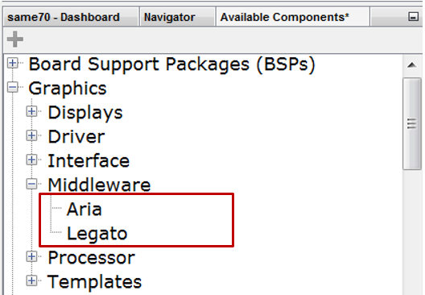

#  Graphics Library

The MPLAB® Harmony Graphics Suite graphics library provides the API for rendering optimized graphics on Microchip 32-bit PIC and SAM devices. It provides facilities for the creation, management, behaviors, and event handling of graphical elements. The library provides what is needed to create embedded GUI with interactive elements, smooth visual effects and with low memory footprint. 

The MPLAB Harmony Graphics Suite contains the following graphics libraries:

 
### The graphics library options:

* Microchip's Aria Graphics Library
* Microchip's Legato Graphics Library

To enable a graphics library:

1. Start MHC from the MPLAB X IDE (v5.20 or higher) main menu, **click**
_MHC>Tools>Graphics Composer_

2. Under Available Components expand Graphics>Middleware, **double click**, _Aria_ or _Legato_.

***

If you are new to MPLAB Harmony, you should probably start with these tutorials:

* [MPLAB® Harmony v3 software framework](https://microchipdeveloper.com/harmony3:start) 
* [MPLAB® Harmony v3 Configurator Overview](https://microchipdeveloper.com/harmony3:mhc-overview)
* [Create a New MPLAB® Harmony v3 Project](https://microchipdeveloper.com/harmony3:new-proj)

***

**Is this page helpful**? Send [feedback](https://github.com/Microchip-MPLAB-Harmony/gfx/issues).
