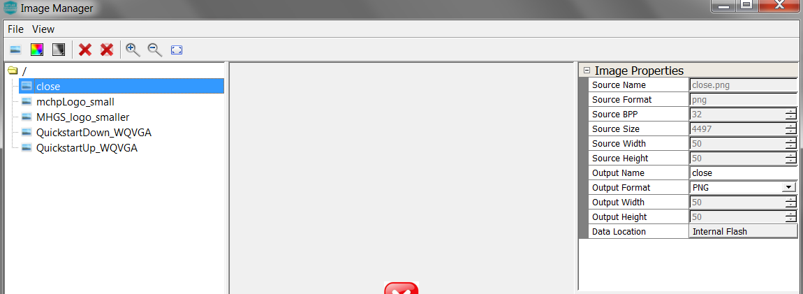
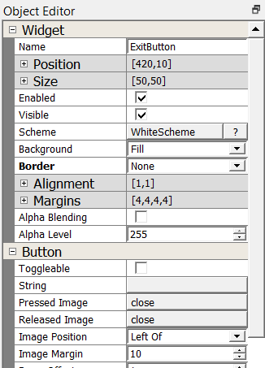

#  How to Add a Button Widget

It’s time to add a new Image widget. You’ll start by working on the user interface created from [How to Add Image Widget](./How-to-Add-Image-Widget).

## Add a Button

Add a Button widget to the screen. The button widget will provide a control to transition back to screen0.

1. In the Toolbox under Input, drag the **Button** widget onto Screen1. 

The size of the image is obtained using **Source Width** and **Source Height** in **Image Properties** found at **Assets -> Image** for **close**.

2. Use the Object Editor to set its exact size and location. Under **Position** field, set **X** to **420** and **Y** to **10**. Under **Size** field, set **Width** to **50** and set **Height** to **50**.  Set the button **Scheme** to **WhiteScheme**. Set **Image** field to **close**.

***

# Next Step

In this guide, you learned how add a Button widget and set its properties. You also learned that a Button widget can display a icon using a Image asset by setting its Image field. Go to the next guide in this tutorial: [How to add Text](./How-to-Add-Text).

***

If you are new to MPLAB Harmony, you should probably start with these tutorials:

* [MPLAB® Harmony v3 software framework](https://microchipdeveloper.com/harmony3:start) 
* [MPLAB® Harmony v3 Configurator Overview](https://microchipdeveloper.com/harmony3:mhc-overview)
* [Create a New MPLAB® Harmony v3 Project](https://microchipdeveloper.com/harmony3:new-proj)

***

**Is this page helpful**? Send [feedback](https://github.com/Microchip-MPLAB-Harmony/gfx/issues)