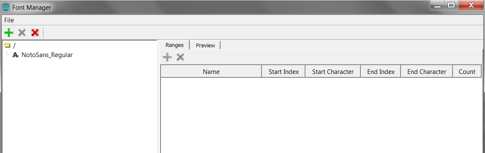
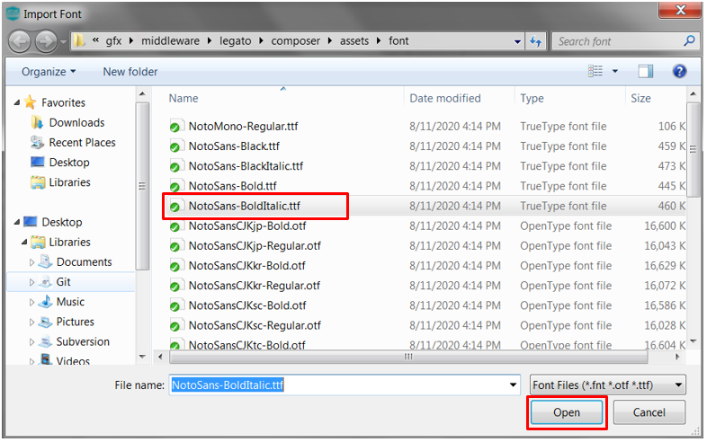

#  How to Add a Font

It’s time to add a Font. You’ll start by working on the user interface created from [How to add Text](./How-to-Add-Text).

# Add a Font

The Font manager is used to create and manage fonts. Follow these steps to create a font:

1. Select **Asset -> Fonts** to launch the Font Manager window. You will notice that font **NotoSans_Regular** already exists. This was created by the New Project wizard. Legato is installed with an extensive  set of fonts. These are located at: *gfx/middleware/legato/composer/assets/font*. We will add a new Font for our Text.

1.  Add a new font to the list of fonts. Select the **+** icon on the Font pane. Alternatively, you can click
**File -> Import**. Both selections will launch the **Import Font** file browser. Select font family contained in **NotoSans-BoldItalic.ttf**.

2.  Rename the font name and size defaults.  Under **Font Options**, set Name field to **LabelWidgetFont** and set Size field to **20**.

3. Select **Preview** tab to observe the changes.

Click **File -> Save** to save your new Screen create.

***

# Next Step

In this guide, you learned how to create a Font asset. You used the font to create a String. At this point, you’re ready to add a new String.
Go to the next tutorial in this series: [How to Add String](./How-to-Add-String).

***

If you are new to MPLAB Harmony, you should probably start with these tutorials:

* [MPLAB® Harmony v3 software framework](https://microchipdeveloper.com/harmony3:start) 
* [MPLAB® Harmony v3 Configurator Overview](https://microchipdeveloper.com/harmony3:mhc-overview)
* [Create a New MPLAB® Harmony v3 Project](https://microchipdeveloper.com/harmony3:new-proj)

***

**Is this page helpful**? Send [feedback](https://github.com/Microchip-MPLAB-Harmony/gfx/issues)