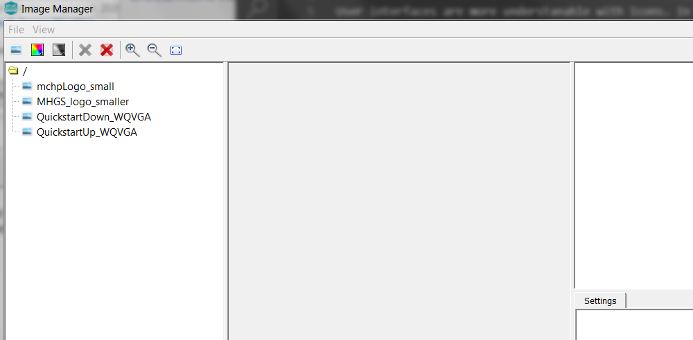

#  How to add a Image Asset

It’s time to add a new image asset. You’ll start by working on the user interface created from [How to Add Background](./How-to-Add-a-Background).

## Add an Image

The Image manager is used to add images to the project. Images are added first to the project as assets. Then they can be assigned to one or more display widgets.  

In this guide will create two image assets. One for display in a Image Widget and another for use as a Button Widget icon.

Later in this tutorial we will assign the image asset to a button widget to be used as an icon.

Follow these steps to import an image:

1. Select **Asset -> Images** to launch the Image Manager window. You will notice that a list of images already exists. This was created by the New Project wizard. You will need to import your own images.

2. Import the mhcp_large image to the list of images. Select the image icon on the toolbar. Alternatively, you can click
**File->Import RGB Image**. Both selections will launch the **Import RGB Image** file browser. Navigate to:
*<root>gfx/middleware/legato/composer/assets/image*. Select **mhcp_large.bmp**

3. Import the close image to the list of images. Select the image icon on the toolbar. Alternatively, you can click
**File -> Import RGB Image**. Both selections will launch the **Import RGB Image** file browser. Navigate to:
*<root>gfx/docs/images*. Select **close.png**

Click **File -> Save** to finalize your new Screen addition.

***

# Next Step

In this guide, you learned how to use the Image Manager to import two images to your existing design. Now the image is available to associate to a widget for display. At this point, you’re ready to add a button widget to which to assign the image..
Go to the next tutorial in this series: [How to add Image Widget](./How-to-Add-Image-Widget)

***

If you are new to MPLAB Harmony, you should probably start with these tutorials:

* [MPLAB® Harmony v3 software framework](https://microchipdeveloper.com/harmony3:start) 
* [MPLAB® Harmony v3 Configurator Overview](https://microchipdeveloper.com/harmony3:mhc-overview)
* [Create a New MPLAB® Harmony v3 Project](https://microchipdeveloper.com/harmony3:new-proj)

***

**Is this page helpful**? Send [feedback](https://github.com/Microchip-MPLAB-Harmony/gfx/issues)