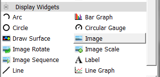
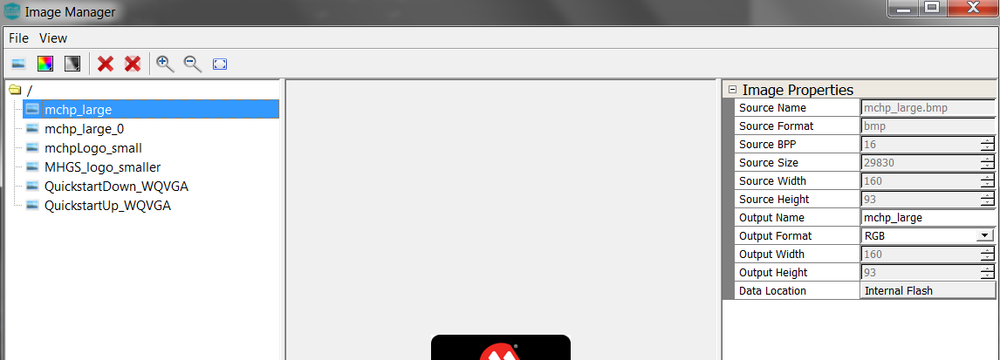
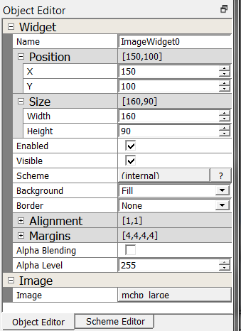

#  How to add an Image Widget

It’s time to add a new Image widget. You’ll start by working on the user interface created from [How to Add Image Asset](./How-to-Add-Image-Asset).

## Add a Image Widget

Add a Image widget to the screen. The Image widget is the primary means to display an image asset. A button widget will be used in the next guide to display an image as an Icon.

1. In the Toolbox pane under Input, drag the **Image** widget onto **Screen1**.

The size of the image is obtained using **Source Width** and **Source Height** in **Image Properties** found at **Assets -> Image** for **mhcp_large**.

2. Use the Object Editor to set its exact size and location. Under **Position** field, set **X** to **150** and **Y** to **100**. Under **Size** field, set **Width** to **160** and set **Height** to **90**.  Set the button **Scheme** to **WhiteScheme**. Set **Image** field to **mchp_large**.

***

# Next Step

In this guide, you learned how add a Image widget and set its properties. You also learned that a Image widget can display a Image asset by setting its Image field. Go to the next guide in this tutorial: [How to add a Button Widget](./How-to-Add-Button-Widget).

***

If you are new to MPLAB Harmony, you should probably start with these tutorials:

* [MPLAB® Harmony v3 software framework](https://microchipdeveloper.com/harmony3:start) 
* [MPLAB® Harmony v3 Configurator Overview](https://microchipdeveloper.com/harmony3:mhc-overview)
* [Create a New MPLAB® Harmony v3 Project](https://microchipdeveloper.com/harmony3:new-proj)

***

**Is this page helpful**? Send [feedback](https://github.com/Microchip-MPLAB-Harmony/gfx/issues)