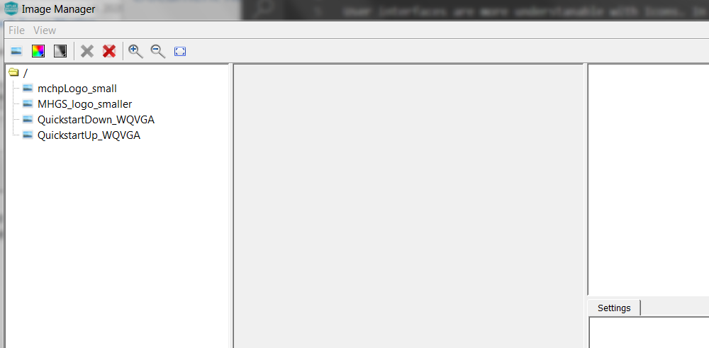
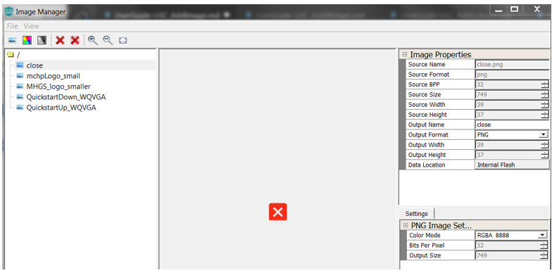
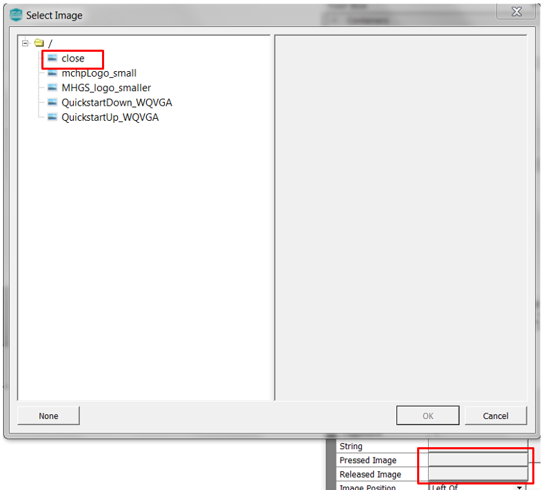
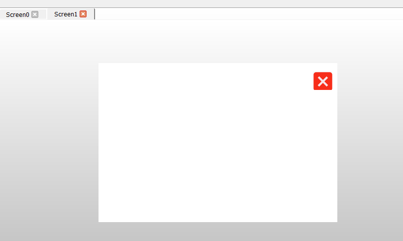

#  Add a New Image

It’s time to add a new image. You’ll start by working on the user interface created from Add a New Screen tutorial.

User interfaces are more understanable with Icons. In this tutorial we will add a button icon by adding a new image to the project and apply it to the button previously added.

When you have completed the steps...

## Add an Image

The Image manager is used to add images to the project. Follow these steps to import an image:

1. Select **Asset->Images** to launch the Image Manager window. You will notice that a list of images already exists. This was created by the New Project wizard. You will need to import your own image.

Import a new image to the list of images. Select the image icon on the toolbar. Alternatively, you can click
**File->Import RGB Image**. Both selections will launch the **Import RGB Image** file browser. Navigate to:
*<root>gfx/docs/images*. Select **close.png**

Select the image to set for **ButtonWidget0**. Using the Object Editor under the Button section, click **Pressed Image**. The Image Select panel will be displayed, select **Close**. In addition, click **Released Image**. Use the image select panel to select **Close**.

Notice that the button is showing a grey background and is beveled. We need to ensure that the interface is clean and clear. Set the button scheme to **WhiteScheme**. Set Border property to **None**.

Click **File > Save** to finalize your new Screen addition.

***

# Next Step

In Add new Image tutorial, you learned how to use the Image Manager to import a new image to your existing design. You learned to set the image onto a button. You also learn to set button properties to make a clean and clear button presentation. At this point, you’re ready to add a new widget event to transition between screens.
Go to the next tutorial in this series: [How to add a Event](./UserGuide-LGC_AddWidgetEvents).

***

If you are new to MPLAB Harmony, you should probably start with these tutorials:

* [MPLAB® Harmony v3 software framework](https://microchipdeveloper.com/harmony3:start) 
* [MPLAB® Harmony v3 Configurator Overview](https://microchipdeveloper.com/harmony3:mhc-overview)
* [Create a New MPLAB® Harmony v3 Project](https://microchipdeveloper.com/harmony3:new-proj)

***

**Is this page helpful**? Send [feedback](https://github.com/Microchip-MPLAB-Harmony/gfx/issues)