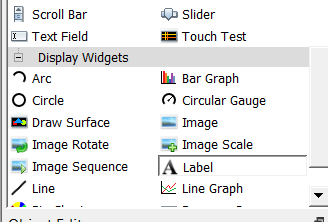
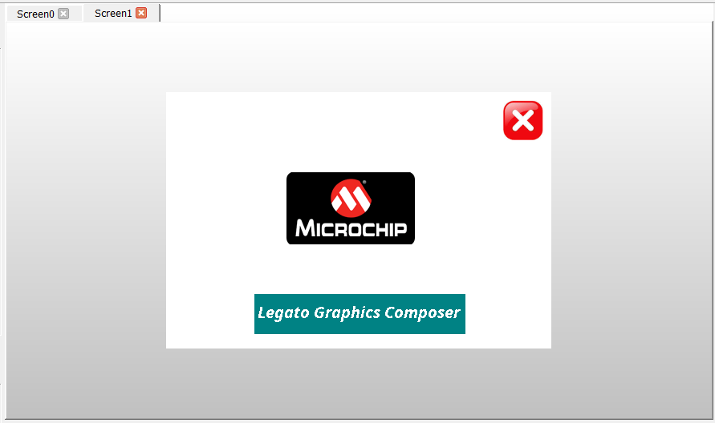
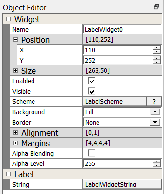

#  How to Add a Label Widget

It’s time to add a Label widget. You’ll start by working on the user interface created from [How to add a String](./How-to-Add-String).

## Add a Label Widget 

The Toolbox pane appears at the top right of the screen designer area on the right side of Legato composer. If you don’t see the Toolbox pane, click **Window -> Reset Windows** in the menu bar.

1.  Drag a Label widget from the Toolbox to your screen.

2.  Drag the Label widget so that it is positioned in the bottom half of the screen and centered.

3. Use the Object Editor to set its exact size and location. Under **Position** field, set **X** to **110** and **Y** to **252**. Under **Size** field, set **Width** to **263** and set **Height** to **50**.  Set the button **Scheme** to **LabelScheme**. Set **String** field to **LabelWidgetString**.

Note: the color of the Label is a default setting. In the next tutorial,  will create a new scheme LabelScheme and set our new Label's scheme property to LabelScheme.

Click **File -> Save** to save your new Screen create.

***

# Next Step

In this guide, you learned how to create a String asset. The String can be assigned to Widget. At this point, you’re ready to add colors.
Go to the next tutorial in this series: [How to Manage Colors](./How-to-Manage-Colors).

***

If you are new to MPLAB Harmony, you should probably start with these tutorials:

* [MPLAB® Harmony v3 software framework](https://microchipdeveloper.com/harmony3:start) 
* [MPLAB® Harmony v3 Configurator Overview](https://microchipdeveloper.com/harmony3:mhc-overview)
* [Create a New MPLAB® Harmony v3 Project](https://microchipdeveloper.com/harmony3:new-proj)

***

**Is this page helpful**? Send [feedback](https://github.com/Microchip-MPLAB-Harmony/gfx/issues)