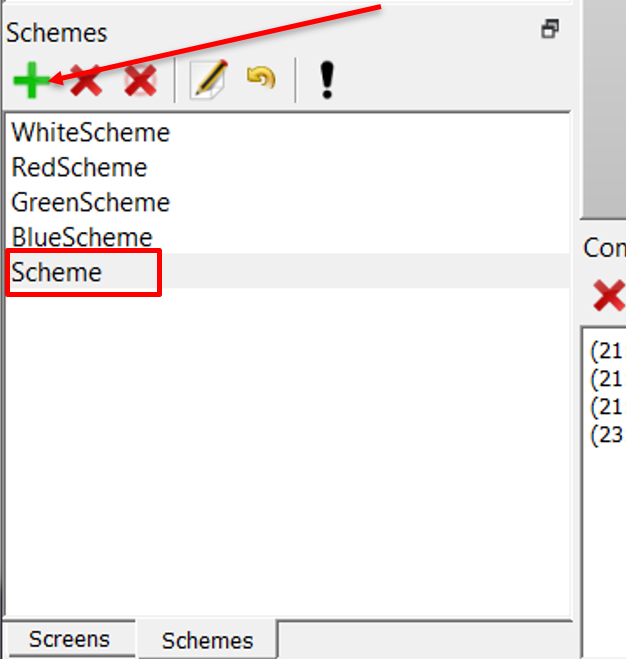
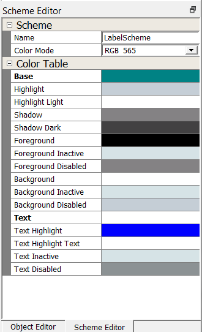
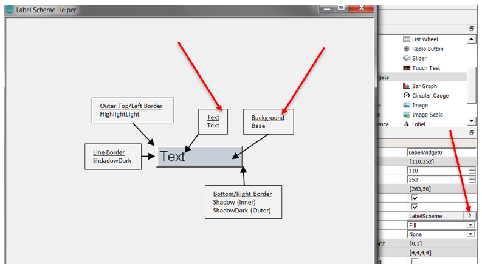
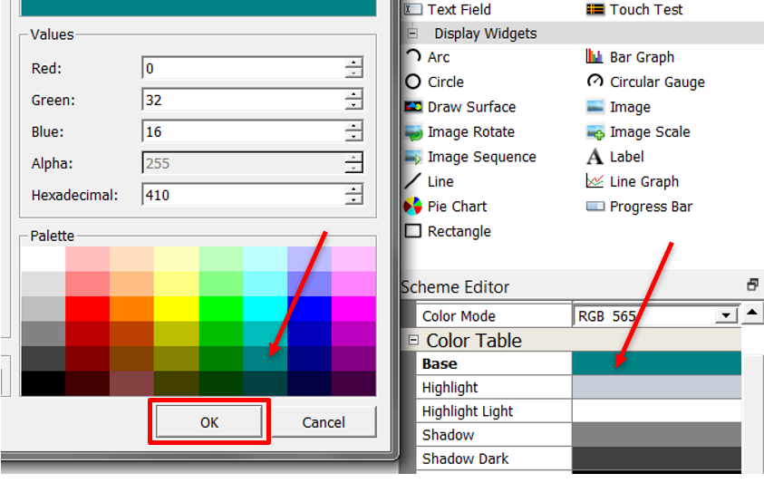

#  How to Add a New Scheme

It’s time to add a Scheme. You’ll start by working on the user interface created from [How to add Label Widget](./How-to-Add-Label-Widget).

By default, a New Project has a default scheme called WhiteScheme. The user is encouraged to define a scheme which adheres to their design goals. A design my have many schemes for each individual widget or it may share scheme across widgets.

## Add a Scheme

The color of the label and text is maintained by a scheme palette which defines colors for specific areas of a widget.  In tutorial, we will create a color scheme for the LabelWidget which will define color for the LabelWidget background and text.

1. Click **Schemes** to view the Scheme pane. It appears at the bottom right of the screen designer area on the left side of Legato composer. If you don’t see the Scheme pane, click **Window -> Reset Windows** in the menu bar.

2.  Add a new scheme to the list of schemes. Select the **+** icon on the Schemes pane.  This will add a new scheme named **Scheme**.

32.  Use the Scheme Editor to rename the **Scheme** to **LabelWidgetScheme**. Select **Scheme**. This will activate the scheme editor. Use the Scheme Editor's name field to change the name.

Each Widget has a scheme mapping. Click on the **?** next to scheme to view the scheme properties for each widget. Label scheme mapping is shown below:

3.  Use the Scheme Editor to set the base and text color value for LabelWidgetScheme. The base color will be viewed immediately, the text color will be viewed after added a string to the label.

Click **File > Save** to save your new Screen create.

***

# Next Step

In this guide, you learned that a one scheme is available for any new project. We also learned that scheme can be created and used in more than one widget. At this point, you’re ready to apply the scheme to a widget.
Go to the next tutorial in this series: [How to Apply Scheme](./How-to-Apply-Scheme).

***

If you are new to MPLAB Harmony, you should probably start with these tutorials:

* [MPLAB® Harmony v3 software framework](https://microchipdeveloper.com/harmony3:start) 
* [MPLAB® Harmony v3 Configurator Overview](https://microchipdeveloper.com/harmony3:mhc-overview)
* [Create a New MPLAB® Harmony v3 Project](https://microchipdeveloper.com/harmony3:new-proj)

***

**Is this page helpful**? Send [feedback](https://github.com/Microchip-MPLAB-Harmony/gfx/issues)