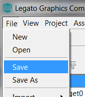

#  How to Add a String

It’s time to add a String. You’ll start by working on the user interface created from [How to add Font](./How-to-Add-Font).

Now that we have a font we can create a String. The String manager is used to create new strings. Multiple strings can be created; they can all share the same font if desired.

1. Select **Asset -> Strings** to launch the String Manager window.

2.  Add a new string to the list of string. Select the **+** icon on the String manager. Alternatively, you can select **File -> New** from the menu. This will add a new scheme named **String**.

3.  Rename the **String** to **LabelWidgetString**. Select **String**. This will activate the **String** edit field left of the list. Use the Name field to rename String to **LabelWidgetString**. An optional description can be applied. Insert **NewDesign** in the Value field. 

Click **File -> Save** to save your new Screen create.

***

# Next Step

In this guide, you learned how to create a String asset. The String can be assigned to Widget. At this point, you’re ready to add a Label widget.
Go to the next tutorial in this series: [How to Add Label Widget](./How-to-Add-Label-Widget)

***

If you are new to MPLAB Harmony, you should probably start with these tutorials:

* [MPLAB® Harmony v3 software framework](https://microchipdeveloper.com/harmony3:start) 
* [MPLAB® Harmony v3 Configurator Overview](https://microchipdeveloper.com/harmony3:mhc-overview)
* [Create a New MPLAB® Harmony v3 Project](https://microchipdeveloper.com/harmony3:new-proj)

***

**Is this page helpful**? Send [feedback](https://github.com/Microchip-MPLAB-Harmony/gfx/issues)