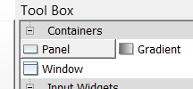
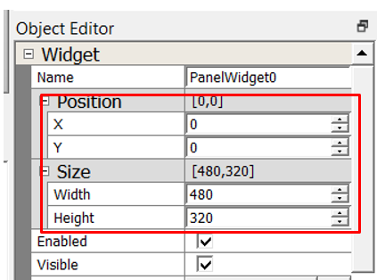
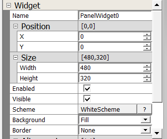

#  How to add a Background

It’s time to add a background. You’ll start by working on the user interface created from [How to Add a New Screen](./How-to-Add-a-New-Screen).

By default, a new screen is added to the project with a transparent background. A transparent background has no color. It is best practice to use a Panel widget to add color. The Panel widget is sized fill the extent of the screen.

# Add Panel

Add a Panel Widget to the screen to give it a background color.

1. In the Toolbox under Containers, drag the **Panel** widget onto Screen1.

2.  Use the Object Editor to set its exact size and location. Under **Position** field, set **X** to **0** and **Y** to **0**. Under **Size** field, set **Width** to **480** and set **Height** to **320**.
 

3. Use the Object Editor to set its **Scheme** field to **WhiteScheme**. This will change the PanelWidget0 base color to the base color of WhiteScheme.

There are no other property settings need at this time.

***

# Next Step

In this guide, you learned how to use the Screens Pane to add a new interface to your existing design. You learn to add Label Widget to set a background color. At this point, you’re ready to add additional UI widgets. Go to the next tutorial in this series: [How to Add a Image](./How-to-Add-a-Image).

***

If you are new to MPLAB Harmony, you should probably start with these tutorials:

* [MPLAB® Harmony v3 software framework](https://microchipdeveloper.com/harmony3:start) 
* [MPLAB® Harmony v3 Configurator Overview](https://microchipdeveloper.com/harmony3:mhc-overview)
* [Create a New MPLAB® Harmony v3 Project](https://microchipdeveloper.com/harmony3:new-proj)

***

**Is this page helpful**? Send [feedback](https://github.com/Microchip-MPLAB-Harmony/gfx/issues)