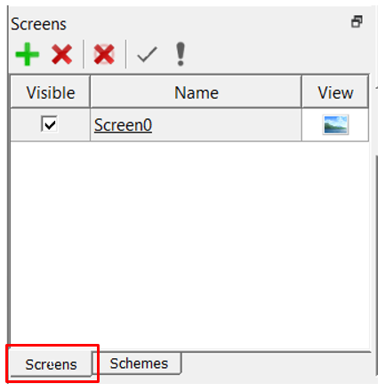
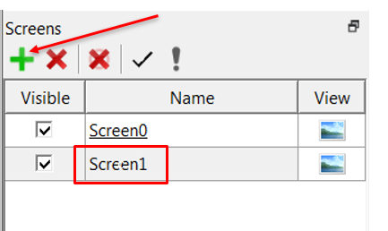
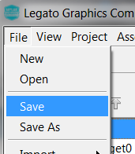

#  Create a New Screen

The Screens pane is used to create a new screen. Each screen added will be assign one default Layer (Layer0).

1. Select **Screens** tab to view the screens view

2.  Add a new screen to the list of screens. Select the **+** icon on the String manager. Alternatively, you can select **File->New** from the menu. This will add a new screen named **Screen1** to the project. The new screen is viewed in the screen designer window.

Click **File > Save** to save your new Screen create.

***

# Next Step

* Add a Layer to a Screen
* Add an event
* Add a panel to give it a background color

***

If you are new to MPLAB Harmony, you should probably start with these tutorials:

* [MPLAB® Harmony v3 software framework](https://microchipdeveloper.com/harmony3:start) 
* [MPLAB® Harmony v3 Configurator Overview](https://microchipdeveloper.com/harmony3:mhc-overview)
* [Create a New MPLAB® Harmony v3 Project](https://microchipdeveloper.com/harmony3:new-proj)

***

**Is this page helpful**? Send [feedback](https://github.com/Microchip-MPLAB-Harmony/gfx/issues)