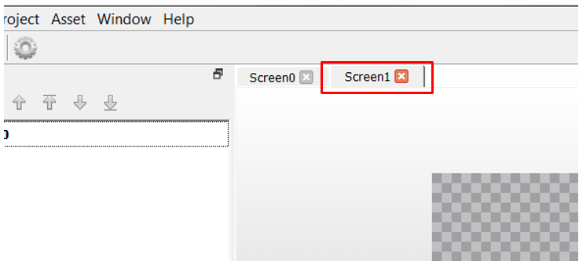

#  How to add a New Screen

It’s time to add a new screen. You’ll start by working on the user interface created from [How to create a New Project](./How-to-Use-New-Project-Wizard).

A UI is like a picture book. Complex book has many pages to communicate its message, similarily, a more complex UI may has more than one Screen to provide appropriate communication to the user. Pages in composer are called Screens. 

In this guide we will create a screen to display a Text, an Image, and a Button. The button will be used allow the user to transition from screen1 back to the screen0.

## Add a Screen

The Screens pane is used to create a new screen.

1. Select **Screens** tab to view the available screens.

You will notice that there is one screen0 in the list. We need to add another screen.

2.  Add a new screen to the list of screens. Select the **+** icon on the String manager. Alternatively, you can select **File -> New** from the menu. This will add a new screen named **Screen1** to the project.

 The new screen is viewed in the screen designer window.

You will notice that screen1 is not viewable in the **Screen Designer** center pane. Also notice that the background is transparent.

Click **File > Save** to save your screen addition.

***

# Next Step

In this tutorial, you learned how to use the Screens Pane to add a new screen to your existing design. You also learned that screen1 has no background or is transparent.
Go to the next guide in this series: [How to Add Background](./How-to-Add-a-Background).

***

If you are new to MPLAB Harmony, you should probably start with these tutorials:

* [MPLAB® Harmony v3 software framework](https://microchipdeveloper.com/harmony3:start) 
* [MPLAB® Harmony v3 Configurator Overview](https://microchipdeveloper.com/harmony3:mhc-overview)
* [Create a New MPLAB® Harmony v3 Project](https://microchipdeveloper.com/harmony3:new-proj)

***

**Is this page helpful**? Send [feedback](https://github.com/Microchip-MPLAB-Harmony/gfx/issues)