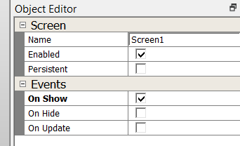

#  How to add a Screen Event

It’s time to screen event behavior. You’ll start by working on the user interface created from [How to add a Screen Event](./How-to-Add-a-Widget-Event).

Events and business logic add behavior to your application. In this guide, we will add a event to respond to a notification that screen1 is displayed. We will add application logic to receive the event.

## Add a On Show Event for screen1

Enable the On Show event

1. In the Screen designer select **screen1** to activate its properties in the Object Editor.

In the Object editor under Events section, enable **On Show**.

Upon MHC generate, the following event callback code will be generated:

**le_gen_screen_Screen1.h**

    // Screen Events:
    void Screen1_OnShow(); // called when this screen is shown);

**le_gen_screen_Screen1.c**

    Screen1_OnShow(); // raise event |

**app_Screen1.c** - We recommend users create a separate application file for each screen. Event handlers defined in le_gen_screen_Screen1.h should be implemented in your app_Screen1.c file. Implement the following code in your app_Screen1.c file.

    // event handlers
    void Screen1_OnShow()
    {
        // Add business logic to respond to the OnShow event
<!--
    Screen0_SplashHarmonyLogo->fn->setVisible(Screen0_SplashHarmonyLogo, LE_TRUE);
    Screen0_SplashHarmonyLogo->fn->setAlphaEnabled(Screen0_SplashHarmonyLogo, LE_FALSE);
-->
    }

Click **File -> Save** to finalize your new event addition.

***

# Next Step

In this tutorial, you learned to enable an onShow event for screen1. This event allows you to be notified when screen1 is displayed. At this point, you’re ready generate, build and run your application. This tutorial series is complete.

***

If you are new to MPLAB Harmony, you should probably start with these tutorials:

* [MPLAB® Harmony v3 software framework](https://microchipdeveloper.com/harmony3:start) 
* [MPLAB® Harmony v3 Configurator Overview](https://microchipdeveloper.com/harmony3:mhc-overview)
* [Create a New MPLAB® Harmony v3 Project](https://microchipdeveloper.com/harmony3:new-proj)

***

**Is this page helpful**? Send [feedback](https://github.com/Microchip-MPLAB-Harmony/gfx/issues)