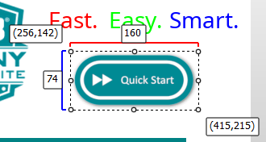
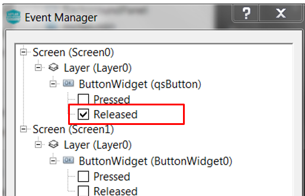
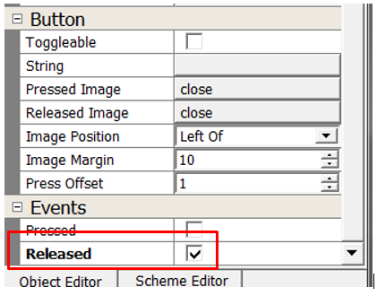

#  How to add a Widget Event

It’s time to add Widget event behavior. You’ll start by working on the user interface created from [How to apply Scheme](./How-to-Apply-Scheme).

Events, along with business logic, add behavior to your application. In this tutorial, we will add a event to respond to a release event on the qsButton widget. We will add logic to transition to screen1. On Screen1, we will also add an event on the Exit button. We will add logic to transition back to screen0.

## Add a Release Event for qsButton

Enable the release event

1. In the Screen designer or Screen Tree pane, select **qsButton** to activate its properties in the Object Editor.

In the Object editor under Events section, enable **Released**. Alternatively, you can click **Project -> Event Manager** to display the Event Manager. 

Upon MHC generate, the following event callback code will be generated:

**le_gen_screen_Screen0.h**

    // event handlers
    // !!THESE MUST BE IMPLEMENTED IN THE APPLICATION CODE!!
    void event_Screen0_qsButton_OnReleased(leButtonWidget* btn);

**le_gen_screen_Screen0.c**

    Screen0_qsButton->fn->setReleasedEventCallback(Screen0_qsButton, event_Screen0_qsButton_OnReleased); |

**app_Screen0.c** - We recommend users create a separate application file for each screen. Event handlers defined in le_gen_screen_Screen0.h should be implemented in your app_Screen0.c file. Implemented the following code in your app_Screen0.c file.

    // event handlers
    void event_Screen0_qsButton_OnReleased(leButtonWidget* btn)
    {
        legato_showScreen(screenID_Screen1);                    // transition to screen1
    }

## Add a Release Event for ButtonWidget0 Button

Enable the release event

1. In the Screen designer or Screen Tree pane, select **ExitButton** to activate its properties in the Object Editor.

In the Object editor under Events section, enable **Released**. Alternatively, you can click **Project -> Event Manager** to display the Event Manager. 

Upon MHC generate, the following event callback code will be generated:

**le_gen_screen_Screen1.h**

    // event handlers
    // !!THESE MUST BE IMPLEMENTED IN THE APPLICATION CODE!!
    void event_Screen1_ExitButton_OnReleased(leButtonWidget* btn);

**le_gen_screen_Screen1.c**

    Screen1_ExitButton->fn->setReleasedEventCallback(Screen1_ExitButton, event_Screen1_ExitButton_OnReleased);

**app_Screen1.c** - We recommend users create a separate application file for each screen. Event handlers defined in le_gen_screen_Screen0.h should be implemented in your app_Screen0.c file. Implemented the following code in your app_Screen1.c file.

    // event handlers
    void event_Screen1_ExitButton_OnReleased(leButtonWidget* btn)
    {
        legato_showScreen(screenID_Screen0);                    // transition to screen0
    }

Click **File -> Save** to finalize your new event addition.

***

# Next Step

In this guide, you learned how to use the Event Manager window to enable composer to generate qsButton and exit button released event code. These events allow you to control your applications behavior. At this point, you’re ready to add a widget event. Go to the next tutorial in this series: [How to add a Screen Event](./How-to-Add-a-Screen-Event).

***

If you are new to MPLAB Harmony, you should probably start with these tutorials:

* [MPLAB® Harmony v3 software framework](https://microchipdeveloper.com/harmony3:start) 
* [MPLAB® Harmony v3 Configurator Overview](https://microchipdeveloper.com/harmony3:mhc-overview)
* [Create a New MPLAB® Harmony v3 Project](https://microchipdeveloper.com/harmony3:new-proj)

***

**Is this page helpful**? Send [feedback](https://github.com/Microchip-MPLAB-Harmony/gfx/issues)