#  How to Show Dynamic Labels

A graphics application may need to show text on the screen that changes at run-time. This can be a running clock, an event counter or real-time value from a sensor. 
This tutorial will demonstrate how to use a label widget and the Legato graphics library APIs to show a counter on the screen that updates every time a button is touched. 
This tutorial requires basic knowledge of the MPLAB Harmony Configurator and the MPLAB Harmony Graphics Composer.

1.	Create or open an existing MPLAB Harmony Graphics application that will run on your hardware.

For this tutorial, we will use the **legato_quickstart_e70_xult_wqvga** demo located at: *<harmonyroot>/gfx/apps/legato_quickstart/firmware* and open it in **MPLABX**.

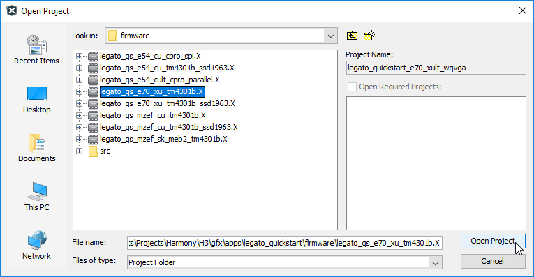

2.	Launch the **MPLAB Harmony Configurator (MHC)**

3.	In MHC, launch Legato Graphics Composer.

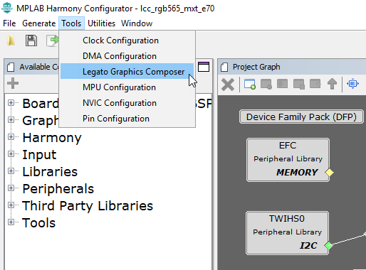

4.	In Composer, open the **Assets -> Font window** and add a new font. In the case of this tutorial, import the **NotoSans_BoldItalic.ttf** font.

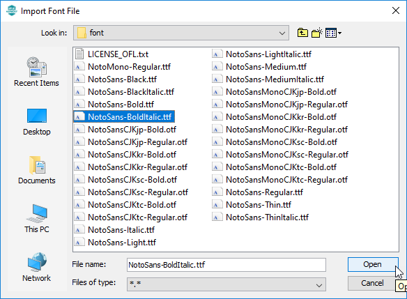

5.	In the **Font Assets** window, select the **NotoSans_BoldItalic** font and set the following properties:

a.	Set **Size** to *60* and check **Antialias**

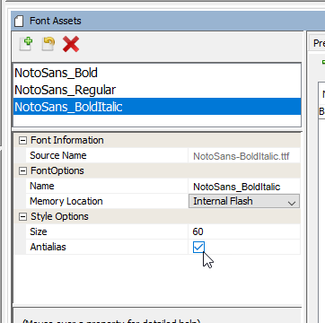

b.	Under the **Glyphs** tab, add a **Glyph Range** and set the **Starting Character** to **32** and **Ending Character** to **127**. This adds the glyphs for the basic alphanumeric ASCII characters to the Font Asset.

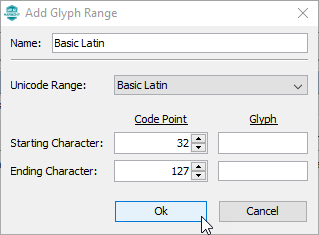

6.	In **Composer**, click **Assets -> Strings** to open the Strings Window and Add a new string.

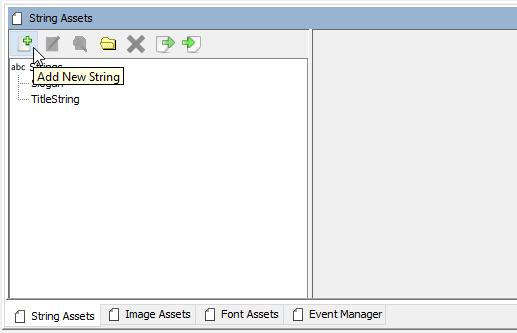

7.	Set the String Asset **Name** to **CounterString**, click **Create** to create the String Asset

8.	In the String Assets Window, set the **CounterString** value to **0** and the Font to **NotoSans_BoldItalic**

9.	In Composer, add a **Label** Widget from the Tool Box to the Screen Designer.

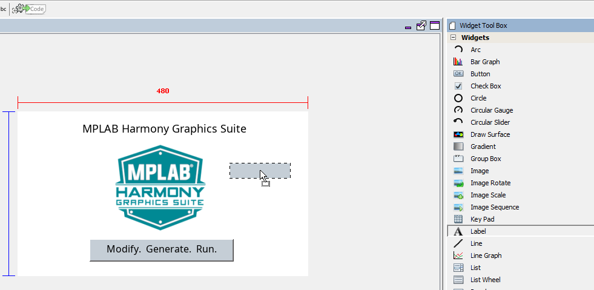

10.	In the Widget Properties, set the Label Widget Properties as shown below:

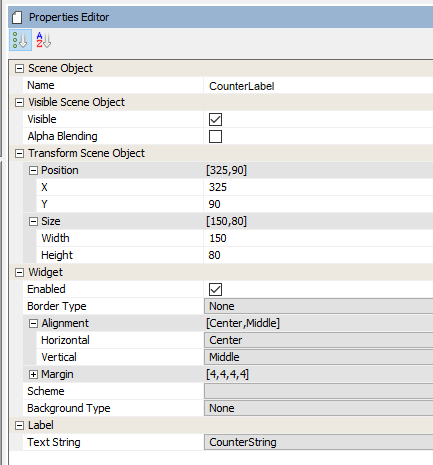

11.	The design should now look like the one below:

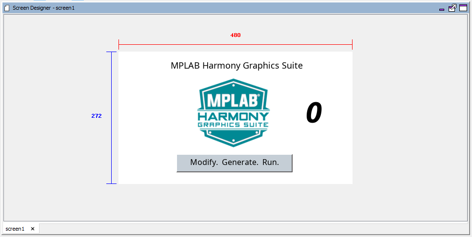

12.	Now we’ll enable the events callback function that will get called when the button on the screen is pressed.
13.	In Composer, select the SloganButton widget (**Modify. Generate. Run.**) 

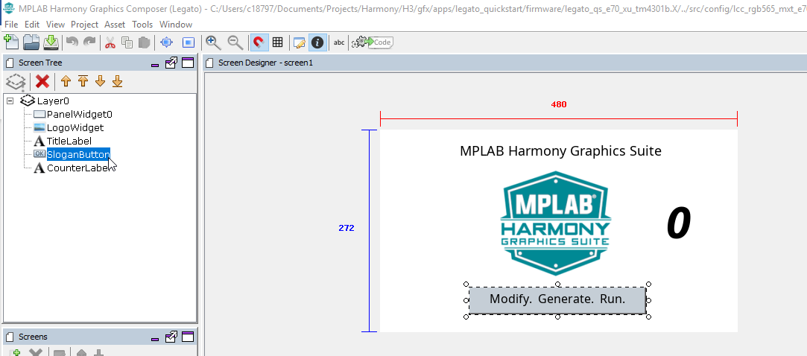

14.	In the Button Properties window, do the following:
a.	Check the **Pressed** checkbox.

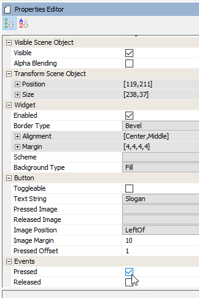

b.	Click the **…** button to the right of the checkbox to open the Event Editor window.

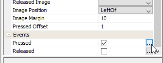

c.	Set Generate Mode to **Declare Only**. This will declare the button’s event handler function in the generated code, but we will define the function in the application code.

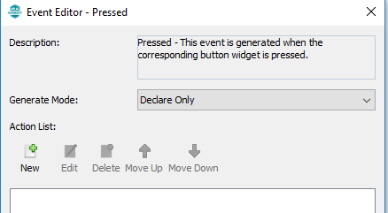

d.	Click **OK** to close the Event Editor dialog box.

15.	Go back to MHC and click the **Generate Code** button to regenerate the project with the Composer changes.

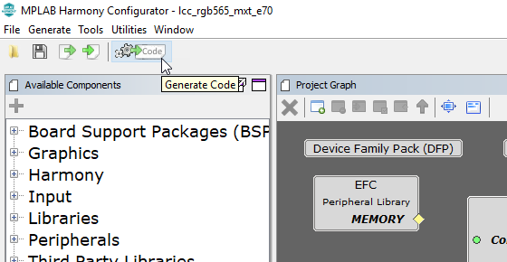

16.	After regeneration, let’s add the Legato graphics library API calls to change the text in CounterLabel widget.
17.	In MPLABX open the file app.c.

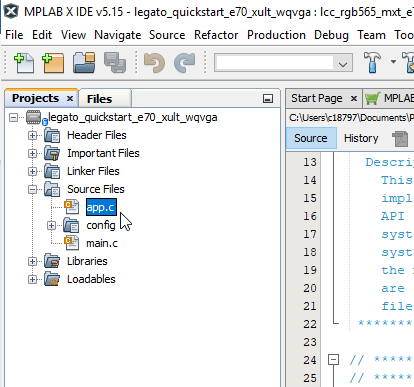

18.	Add the following lines of code to app.c:

a.	Include the relevant header file(s):

    #include <stdio.h>
    #include "gfx/legato/generated/le_gen_init.h"

b.	Declare the highlighted variables below:

    //Counter value variable
    static unsigned int counter = 0;
    
    //C character buffer
    static char cCharBuffer[8];

    //Legato Char buffer
    static leChar legatoCharBuffer[8] = {0};

    //Legato string object
    static leFixedString counterString;

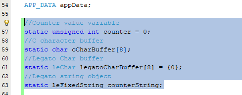

c.	Define the button press event callback function.

void SloganButton_OnPressed(leButtonWidget* btn)
{
    //Increment the counter when button is pressed
    counter = (counter < 1000) ? counter + 1 : 0;

    
d.	In the **APP_Tasks()** function, add the following code to allocate the temporary counter string object during initialization

    //Create and initialize a legato string object, this string object will be used
    //to construct the string that will be used by the label object for showing on the 
    //screen
    leFixedString_Constructor(&counterString, legatoCharBuffer, 16);

    //Assign a font to the string object. The font must contain all the glyphs/characters
    //that will be used in the dynamic string. In the case of a numeric counter, it needs
    //to have all the numbers (0-9)
    counterString.fn->setFont(&counterString, leStringTable_GetStringFont(leGetState()->stringTable, stringID_CounterString, 0));            

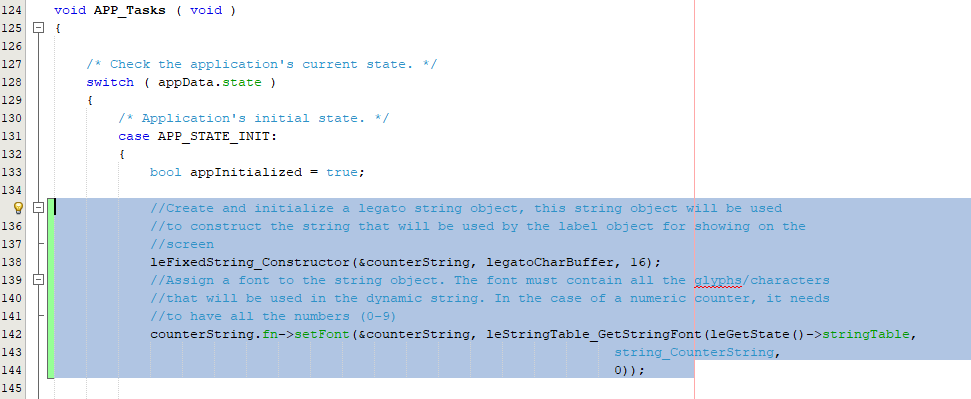

e.	In the **APP_Tasks()** function inside the **APP_STATE_SERVICE_TASKS** case statement, add the following code to update the string on the **CounterLabel** widget when the counter value changes

    static unsigned int oldCounterValue = 0;
            
    if (oldCounterValue != counter)
    {
    //create the c character array string counter value
            sprintf(cCharBuffer, "%u", counter); 

            //convert the character string to leFixedString object
            counterString.fn->setFromCStr(&counterString, cCharBuffer);    

            //Set counterString string to label
            CounterLabel->fn->setString(CounterLabel, (leString*)&counterString);   
    }

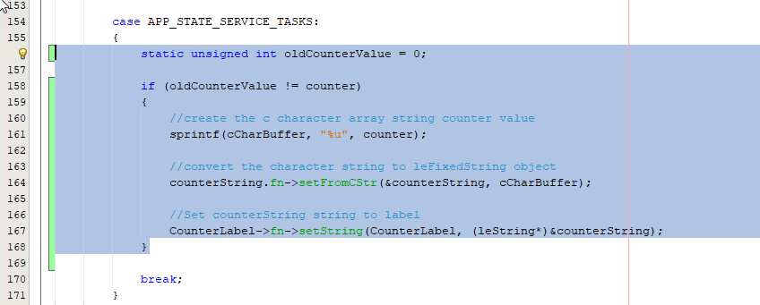

f.	In the case of this application, the counterString object is only allocated once and is persistent so we don’t need to call the string destructor to free any allocations. 

In other use cases where the string object can go in and out of scope, allocation may need to be freed by calling the string destructor function. This is needed to prevent any memory leaks. 

19.	Build and run the program on the target board for the legato_quickstart_e70_xult_wqvga project. It should show a counter that increments every time the button is pressed.

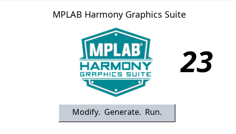

***

If you are new to MPLAB Harmony, you should probably start with these tutorials:

* [MPLAB® Harmony v3 software framework](https://microchipdeveloper.com/harmony3:start) 
* [MPLAB® Harmony v3 Configurator Overview](https://microchipdeveloper.com/harmony3:mhc-overview)
* [Create a New MPLAB® Harmony v3 Project](https://microchipdeveloper.com/harmony3:new-proj)

***

**Is this page helpful**? Send [feedback](https://github.com/Microchip-MPLAB-Harmony/gfx/issues)