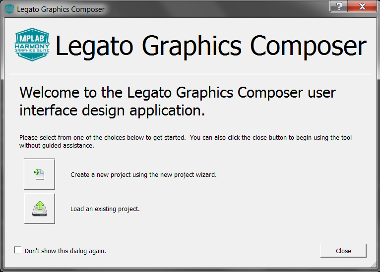

#  How to Create a Simple Design Using the Project Wizard

## New Project Wizard

Creating a new design in Legato composer is made simple by using the **New Project Wizard** which guides you step-by-step through the project creation process. The wizard prompts you to enter the settings needed and help to establish the necessary project parameters. The wizard can also create a basic UI that you can use as starting point, otherwise you can create a design from scratch.

The New Project Wizard panel is launched by selecting **File -> New** from  Legato composer main menu bar. 

#  

Alternatively, you can use the **Create New Design**  icon. 

Lastly, the wizard can also be launched from the **Welcome** dialog. The welcome dialog is displayed immediately after Legato composer is launched when there is no design file to associate with the current configuration. Select **Create a new project design using the new project wizard**.

#  

## In this tutorial

In this tutorial, we will use the new project wizard to create a basic UI design. We will add to the basic UI design in the next tutorial.

When you have completed the steps, Legato composer automatically establishes the screen designer based upon the settings defined by the wizard.

1. Select **File -> New**. Select **Yes** when prompted to **Create New Design?**. Follow the instructions of the wizard.

## Display Configuration

The wizard supports a **display configuration** input to set the display resolution. You can you one of the available **Presets** or enter **Width** and **Height** values individually. For this tutorial, we will use **HVGA** preset to set 480x320.

2. Click **Presets** drop-down and select **HVGA**. Click **Apply** to automatically set Width and Height fields.  Click **Next**

## Color Mode

The wizard supports a **Color Mode** setting. For this tutorial we will use colormode **RGB_565** which is 16bits per pixel. The size of a single frame buffer is displayed to provide an estimate of the amount of video memory required to support display rendering.

3. Select option **RGB_565**. Click **Next**

## Memory Profile

The wizard supports a **Memory Profile** setting.  This setting can be board specific. The Variable Heap is a Legato-managed pool used exclusively used in the Legato Graphics Library.  It is separate from the heap specified in MPLABX and are not connected. For more information see: [How to Manage Memory](./How-to-Manage-Memory).

The table below lists the memory settings for each profile.

| Memory | Default | M0 | M4 | M7 | MZEF/MZDA (WQVGA) | MZDA WVGA | MPU |
| ------ | ------- | -- | -- | -- | ----------------- | --------- | --- | 
| Scratch Buffer Size (kb) | 16 | 20 | 16 | 16 | 16 |128 | 256 |
| Variable Heap (bytes) | 4096 | 512 | 4096 | 4096 | 4096 | 131072 | 262144 |

For this tutorial we will use the default memory profile.

4. Select option **Default**. Click **Next**
 

## Project Template

The wizard supports a **Project Template** setting. When selected, this setting automatically populates the screen designer window with a basic quickstart design UI. The image below is the basic quickstart design template.

For this tutorial we will use the basic quickstart template UI which is similar to the design used in legato_quickstart application. This design has one interface (screen0). Later in this tutorial, we will create another interface (screen1).

5. Select **Start with a basic quickstart project template**. Click **Next**

6. Click **Finish** to finalize your new project. 

You will notice that this project has:

* Screen - base interface
    * Layer - display interface
        * Widgets - input and display objects
* Schemes - color layouts
* Assets - images, strings, fonts

7. Click **File > Save** to finalize your new design addition. The project defaults to **NewGraphocsProject.zip**

## Legato Graphics File guidelines

Legato graphics project files are generated via MHC generate button. These are stored in the project space. There is no need for modification. 

Applicaton project files are not generated. We recommend to store customer (application) specific files outside the generated project space.

See table for recommendations:

| Files | Location | Example | User Editable? |
| ------| --- | ---- | ---- |
| Generated Files | firmware/src/config/default/gfx/legato/generated | le_gen_screen_Screen0.h le_gen_screen_Screen0.c | No |
| User files | firmware/src | app.h app.c app_Screen0.h app_Screen0.c app_Screen1.h app_Screen2.h | Yes |

***

# Next Step

In this guide, you learned how to use the **New Project Wizard** to create a template based UI design. We also learn that this design has one Screen and several Widgets. This is a simple design. We will have to add more to the design support additional screens, widgets, user interactions and transitions. At this point, you’re ready to start adding a new Screen. Go to the next guide in this tutorial: [How to Add a New Screen](./How-to-Add-a-New-Screen).

***

If you are new to MPLAB Harmony, you should probably start with these tutorials:

* [MPLAB® Harmony v3 software framework](https://microchipdeveloper.com/harmony3:start) 
* [MPLAB® Harmony v3 Configurator Overview](https://microchipdeveloper.com/harmony3:mhc-overview)
* [Create a New MPLAB® Harmony v3 Project](https://microchipdeveloper.com/harmony3:new-proj)

***

**Is this page helpful**? Send [feedback](https://github.com/Microchip-MPLAB-Harmony/gfx/issues)