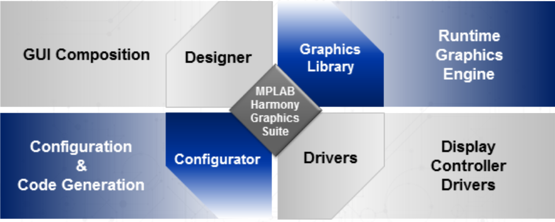

#  MPLAB Harmony Graphics Suite

MPLAB Harmony Graphics Suite is not just a User Interface (UI) builder. It is a rich integrated development environment which shortens your time to market. It contains a graphics library written in C language, MPLAB Harmony drivers and hardware abstraction code, a Graphical User Interface (GUI) designer, and a application configurator. The suite produces efficient code that runs on Microchip PIC32 PIC and SAM devices.

## Key Features

Designer

MPLAB Harmony Graphics Suite has its own integrated GUI design tool, [MPLAB Harmony Graphics Composer (MHGC)](https://github.com/Microchip-MPLAB-Harmony/Microchip-MPLAB-Harmony.github.io/wiki).  It is used to design and build graphical user interfaces (GUIs) from widgets contain in the graphics library. With its what-you-see-what-you-get (WYSWYG) editor, a complete layout can be created and managed. 
MHGC contains a number of integrated tools which support the collaboration workflow between designers and developers to help create quick to market solutions. MHGC is tightly coupled with the graphics library to facilitate rapid prototyping and optimization of the application's graphical user interface (GUI). MPLAB Harmony Graphics Suite's MHGC tool contains the following GUI designer features:

* Widget Layouts
* Asset and Image management
* Language Localization
* Strings and Fonts
* Event Management
* Palette Management 
* Heap Estimation

Graphics Library

Graphics rendering is made available through the [graphics library](https://github.com/Microchip-MPLAB-Harmony/gfx/tree/master/doc). The graphics library is a 2-Dimensional (2D) raster paint engine which support the drawing of a complete UI design on display modules using specific display controllers. The graphics library is specifically built to run in low-powered low-resource environments. The library contains the following components:

* Images
The graphics library supports reading, decompression, and rendering of JPEG, PNG, and RAW, image formats.

* Internationalization
The graphics library supports Unicode for the encoding of displayable text strings. It supports the adaptation of text to different language using an internal translation method not requiring re-engineering.

* Layers
The graphics library supports multi-layer hardware platforms. The graphics library contain infrastructure that help separate UI components onto individual layers of a display controller.

* Acceleration
The graphics library supports a Graphics Processor Unit (GPU) platforms. The graphics library employs a hardware abstraction layer that helps to integrate hardware acceleration into applications.

Drivers

MPLAB Harmony Graphics Suite provides capability to create custom [graphics drivers](https://github.com/Microchip-MPLAB-Harmony/Microchip-MPLAB-Harmony.github.io/wiki)for low-level hardware communication. The suite contains the following drivers:

* Display Controller Driver
MPLAB Harmony Graphics Suite Drivers supports a wide range of displays, with a focus on LCDs. From QVGA to WVGA. It supports multi-layer display controller, OLED, SPI, and parallel interfaces.

* GPU Driver 
MPLAB Harmony Graphics Suite Drivers provides support for the PIC32MZ DA 2DGPU and the SAM GFX2D peripheral graphics accelerator.

* Touch Screen Driver
MPLAB Harmony Graphics Suite Drivers provides support for single, two finger-touch, and gesture support for 2D maXTouch  Touch Screen controllers.

Configurator

MPLAB Harmony Graphics Suite supports the configuration and generation of the code from the designer, graphics library, and drivers through [graphics configurator](https://github.com/Microchip-MPLAB-Harmony/gfx/wiki/Configurator). It produces custom code specific to the needs of a project. It provides a data setting environment to help bind modules, peripherals, widgets, memory, assets together into a final application for compilation.

Example Applications

MPLAB Harmony Graphics Suite comes with a set of examples that exercises both MHGS software and [Microchip Development Kits](https://www.microchip.com/design-centers/graphics/development-boards). The apps are meant to be either a quickstart solution, demonstration of features, best practices, or a signature UI illustration. These apps provide functionality that customers can use immediately in their solution.

Apps included in a release have no special status other than to run on Microchip family of MCUs and MPUs. So a third-party app from other graphics toolkits may also be provided in the suite.

## Graphic Suite Tutorials

* [Getting started with Application Essentials](https://github.com/Microchip-MPLAB-Harmony/gfx/wiki/Application-Essentials)
* [Getting started with Configurator](https://github.com/Microchip-MPLAB-Harmony/gfx/wiki/Configurator)
* [Getting started with Composer](https://github.com/Microchip-MPLAB-Harmony/gfx/wiki/Composer)
* [Getting started with Graphics Library](https://github.com/Microchip-MPLAB-Harmony/gfx/wiki/Graphics-Library)
* [Getting started with Display Manager](https://github.com/Microchip-MPLAB-Harmony/gfx/wiki/Display-Manager)

***

If you are new to MPLAB Harmony, you should probably start with these tutorials:

* [MPLAB® Harmony v3 software framework](https://microchipdeveloper.com/harmony3:start) 
* [MPLAB® Harmony v3 Configurator Overview](https://microchipdeveloper.com/harmony3:mhc-overview)
* [Create a New MPLAB® Harmony v3 Project](https://microchipdeveloper.com/harmony3:new-proj)

***

**Is this page helpful**? Send [feedback](https://github.com/Microchip-MPLAB-Harmony/gfx/issues).
