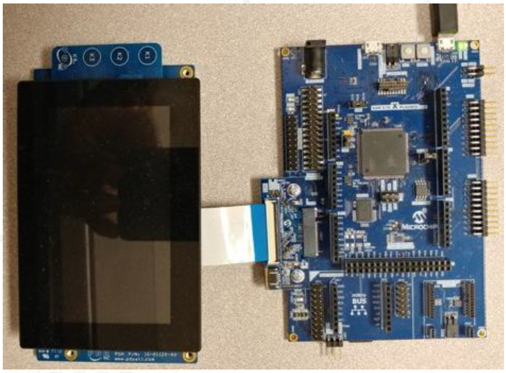
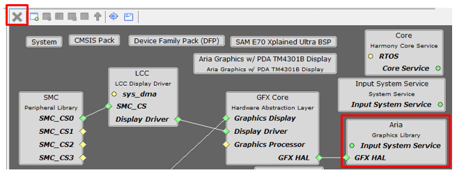

#  Migrate aria_qs_e70_xu_tm4301b.X Application to Legato

This guide describes the basic steps necessary to migrate v3.6 aria_qs_e70_xu_tm4301b.X to Legato. 

#### Who should use this guide.

This guide is intended for developers who want to migrate an Aria graphics library based application to use the Legato graphics library on a custom SAME54 board similar to or the same as the [SAM E70 Xplained Ultra Evaluation Kit](https://www.microchip.com/DevelopmentTools/ProductDetails/PartNO/DM320113) connected to [WQVGA Display Module](https://www.microchip.com/Developmenttools/ProductDetails/AC320005-4).

#### What you will build

You will build a simple application that displays an image, textm, and touch button. It starts with the creation of a new MPLAB® project and finishes with a graphics application equivalent to legato_quickstart.

The demonstration will render the following image on the display:

# Contents

The following bullets detail the steps necessary to create a solution for your board.

* Get Materials
* Create a new project
* Configure Software with MHC 
* Create UI Design with Legato Composer
* Save Project
* Generate, Build, and Run

## Get Materials

Before you begin this quick start, make sure you have what you will need. The Microchip development documentation and hardware provides a basic foundation that we will use as a reference for your SAM E54 design.

|Documentation|Description|
|----|----|
|[SAM E70 Xplained Ultra User's Guide](http://ww1.microchip.com/downloads/en/DeviceDoc/SAME70_Xplained_Ultra_Evaluation_User's%20Guide_DS70005389B.pdf) | User Guide with Schematics|

|Hardware|Description|
|----|----|
|[SAM E70 Xplained Ultra Evaluation Kit](https://www.microchip.com/DevelopmentTools/ProductDetails/PartNO/DM320113)| Development Board |
|[WQVGA Display Module (AC320005-4)](https://www.microchip.com/Developmenttools/ProductDetails/AC320005-4). | High-Performance 4.3" WQVGA Display Module |
| Standard USB A to micro-B cable| PC debugging connector. |

> **_NOTE:_** The SAM E54 Xplained Ultra Evaluation Kit includes an on-board Embedded Debugger (EDBG), which requires no additional hardware to get started. For programming/debugging, the EDBG connects to the host PC through the USB micro-B connector on the SAM E54 Xplained Ultra Evaluation Kit.

|Software|Description|Install|
|----|----|----|
| [MPLAB® X Integrated Development Environment ](https://www.microchip.com/mplab/mplab-x-ide)| v5.15 or later| [Install MPLAB IDE](https://microchipdeveloper.com/install:mplabx) |
| [MPLAB® XC32/32++ C Compiler](https://www.microchip.com/mplab/compilers) | v2.20 or later | [Install Compiler](https://microchipdeveloper.com/install:xc32)|
| [MPLAB® Harmony 3 ](https://github.com/Microchip-MPLAB-Harmony/mhc/wiki)| v3.5 or later | [Install Harmony v3](https://microchipdeveloper.com/harmony3:mhc-overview#install)|

> **_NOTE:_** This project has been verified to work with the following versions of software tools:
MPLAB X IDE v5.20, MPLAB XC32 Compiler v2.20, MPLAB Harmony v3.6.0

> **_NOTE:_** Because we regularly update our tools, occasionally you may discover an issue while using the newer versions. If you suspect that to be the case, we recommend that you use the same versions that the project was tested with.

### Hardware Setup

Configure the hardware as follows: 

If your WQVGA display cable is connected to a interposer board, following these steps:

* Disconnect the ribbon cable that connects the display to the interposer board.  The board is for the MEB 2 only, and not used with the SAM E54 Xplained Ultra Evaluation Kit.

* Release the ribbon cable from the interposer board. 
* Release the black clamp on the J2 connector and turn the display over. 
* Insert the ribbon cable into J2 and close the clamp.

 The board and display are powered by a Micro B – USB A cable from PC to the “USB Debug” port on the SAM E54 Xplained Ultra Evaluation Kit.

SAM E70 Xplained Ultra Evaluation Kit is connected to the display using the display ribbon cable. Programming is a board to PC link using a standard USB A to micro-B cable. The connection, illustrated below, provides power and debug communication.

 
If your WQVGA display cable is connected to a interposer board, following these steps:

* Disconnect the ribbon cable that connects the display to the interposer board.  The board is for the MEB 2 only, and not used with the SAM E70 Xplained Ultra Evaluation Kit.

* Release the ribbon cable from the interposer board.
* Release the black clamp on the J2 connector and turn the display over. 
* Insert the ribbon cable into J2 and close the clamp.

 The board and display are powered by a Micro B – USB A cable from PC to the “USB Debug” port on the SAM E70 Xplained Ultra Evaluation Kit.

> **_NOTE:_** This project has been verified to work with the following versions of software tools:
MPLAB X IDE v5.20, MPLAB XC32 Compiler v2.20, MPLAB Harmony v3.5.0

> **_NOTE:_** Because we regularly update our tools, occasionally you may discover an issue while using the newer versions. If you suspect that to be the case, we recommend that you use the same versions that the project was tested with.

## Setup

1. **Run MPLABX**

Launch the MPLAB X IDE. From the File pull-down menu, select **Open Project**.
This will display the **Open Project** dialog window. Navigate to
<C:\<YourHarmonyRoot3\gfx\apps\aria_quickstart\firmware>
Select **aria_qs_e70_xu_tm4301b.X** and click **Open**.

2. **Launch MHC**

# Aria to Legato Migration Tutorial

1. **Remove Aria Graphics Library** component

Select the **Aria Graphics Library** component, click **X** to remove

Select **Yes** when prompted "Are you sure you want to decativate these components?".

Select the **GFX Core** component, click **X** to remove.

Select the **LCC Display Driver** component, click **X** to remove.

Add **Legato Graphics Library** component to the project graph view. Expand **Available Components**
expand **Graphics/Middleware** and select **Legato**.

Connect **Legato Graphics Library** component to **LE LCC Display Driver** component. Right click
Display Driver on the **Legato Graphics Library** component. Expand **Satisfiers**, select
**LE LCC**.

Select **Yes** when prompted "Are you sure you want to activate these components?".

Connect **Legato Graphics Library** component to **PDA TM4301B** component. Right click
**Graphics Display** on the **Legato Graphics Library** component. Expand **Satisfiers**, select
**PDA TM4301B**.

Connect **LE LCC** component to **SMC** component. Right click
**SMC_SC** on the **LE LCC** component. Expand **Satisfiers**, select
**SMC**.

Configure backlight settings for the **LE LCC** component. Set Peripheral, Instance and Channel
as illustrated below:

Connect **LE LCC** component to **TMR 1** component. Right click
**TMR** on the **LE LCC** component. Expand **Satisfiers**, select
**TC1**.

Configure channel0 settings for the **TMR** component. Enable **Channel 0**
and set **Operating Mode** as illustrated below:

The completed project view is illustrated below:

## Generate Source Code
1. Before generating code, click the **Save** icon as shown below.

2. Save the configuration in its default location when prompted.

3. Click on the **Code Generate** button as shown below to start generating code.

4. Click on the **Generate** button in the **Generate Project** window, keeping the default settings as shown below.
If prompted for saving the configuration, click **Save**.

MHC will include all the MPLAB Harmony library files and generate the code based on the MHC selections. The generated code would add files and folders to your Harmony project.

## Program Device

1. Clean and build your application by clicking on the **Clean and Build** button as shown below.

2. Program your application to the device, by clicking on the **Make and Program** button as shown below.

## Migration resources

Review the following before you migrate your app from earlier versions of the MPLAB Harmony Graphics Suite 2.06:

* See **Versions and Dependencies** to understand the MPLAB Harmony version underlying each version of the MPLAB Harmony Graphics and to review guidelines for targeting your apps successfully.

* Review **Application Compatibility** to find out about runtime and retargeting changes that might affect your app and how to handle them.

* Review **What's Obsolete or Deprecated** in the suite to determine any types or members in your code that have been made obsolete, and the recommended alternatives.

* See **What's New** for descriptions of new features that you may want to add to your app.

**Is this page helpful**? Send [feedback](issues).
