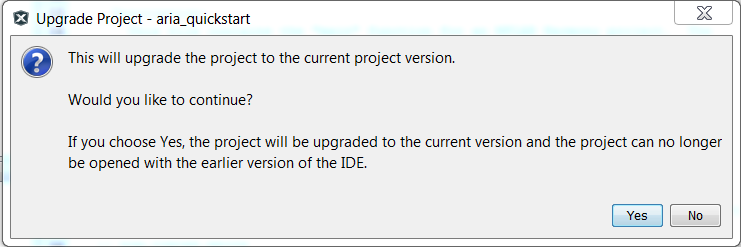
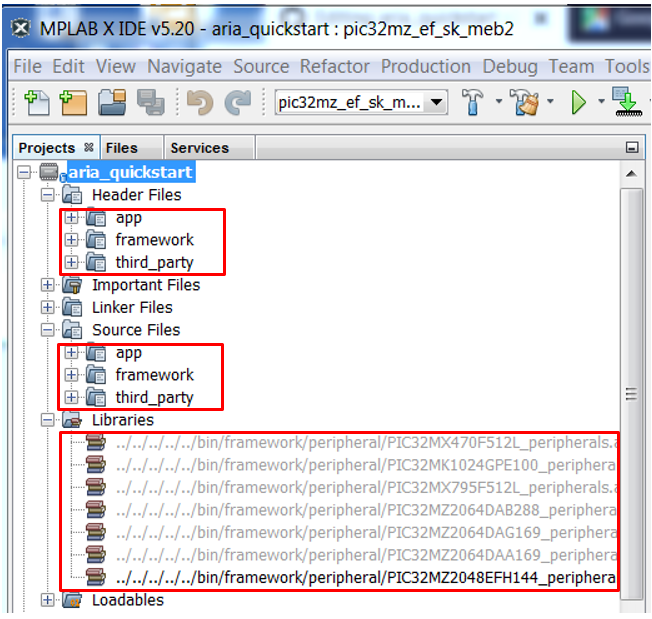
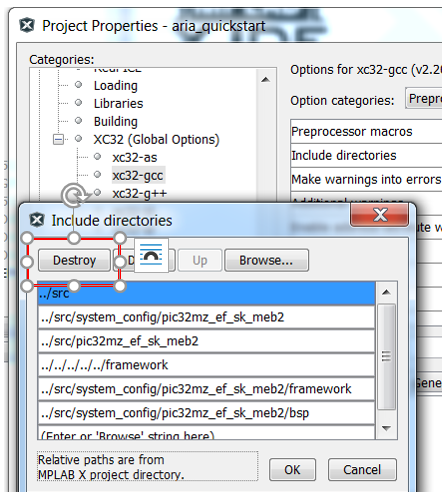
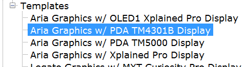

#  Migrate aria_quickstart v2.06 to 3.04 pic32mz_ef_sk_meb2

This guide is to help migrate the graphics application configuration pic32mz_ef_sk_meb2 from MPLAB Harmony v2.06 to MPLAB Harmony v3.04. MPLAB Harmony v3 introduces new features and APIs of which aria_quickstart pic32mz_ef_sk_meb2 application and configuration can take advantage. This document gives you an overview of the steps to migrate your apps to MPLAB Harmony v3.

## Hardware Requirements and Setup
This section gives a brief description hardware requirements and setup information.

### Requirements
* [PIC32MZ Embedded Connectivity with FPU (EF) Starter Kit](https://www.microchip.com/DevelopmentTools/ProductDetails/dm320007#additional-summary)
* [Multimedia Expansion Board II](https://www.microchip.com/DevelopmentTools/ProductDetails/PartNO/DM320005-5)

### Hardware Setup

* Set Jumper J9 on MEB-II board. Make sure (J9) jump-er is closed.
* Plug the PIC32MZ DA Starter kit onto the 168-pin Hirose connector
* Connect the power supply to the 9V-15V DC connector
* Connect the Real ICE

</h2>

## Software Requirements and Setup
* MPLAB X IDE -  Ensure the MPLAB X
IDE version v5.20 or higher is used
* MPLAB Harmony Configurator (MHC) plug-in. MPLAB Harmony Configurator (MHC) is a MPLAB X IDE plug-in. This plug-in is menudriven graphical user interface which makes the use of Harmony framework much easier.
* MPLAB Harmony - MPLAB Harmony is a flexible, abstracted, fully integratedfirmware development platform for PIC32

## Essential Migration Steps

#### 1. Upgrade your existing project directory

* **Create** a harmony.prj file for the existing configuration `pic32mz_ef_sk_meb2`. The system_config folder will no longer be needed. The harmony.prj is required for the MPLAB Harmony 3.

* **Insert** the following data into the harmony.prj file. We will reuse the previous configuration name: pic32mz_ef_sk_meb2.

```<?xml version="1.0" encoding="UTF-8" standalone="no"?>
<Configuration>
  <Configurator>
    <Name dnOrder="0" value="pic32mz_ef_sk_meb2"/>
    <Processor dnOrder="1" value="PIC32MZ2048EFM144"/>
    <Harmony dnOrder="2" path="../../.."/>
  </Configurator>
</Configuration>
```

* **Delete** the following directory folders and files
```
 aria_quickstart\firmware\aria_quickstart.X\nbproject\private
 aria_quickstart\firmware\aria_quickstart.X\private\Makefile*
 aria_quickstart\firmware\aria_quickstart.X\private\Package*
```

#### 2. Upgrade aria_quickstart v2.06 project to the current version

* In MPLABX IDE, **Open** project:

* When prompted to upgrade the project, **select**  *Yes*



* Under Projects, right click and **remove** the following project folders in MPLABX. See illustration below



* Using project properties, **delete** all include file paths



* **Update** your app.h and app.c files.
* **Remove** in app.h
> #include "system_config.h" and "system_definitions.h" 

* **Insert** in app.h
> #include "configuration.h"

* **Remove** in app.c
> #include "system/debug/sys_debug.h"

* **Insert** in main.c
> #include "system/common/sys_module.h"

#### 3. Launch MHC and Select Components
* **Launch** MHC. You will be prompted to reconfigure the Harmony paths

* Using the MPLAB Harmony Launcher, **select** Reconfigure Paths button to point v2.06 aria_quickstart to Harmony v3.4. Then **select** MPLAB Harmony Project Path
* Upon display of the Configuration Database Setup panel, **select** Launch
* Using the Project Graph and Available Components, **select** PIC32MZ EF Starter Kit BSP


* Also under Available Components/Graphics/Templates **select** Aria Graphics w/PDA TM4301B Display



* When prompted for RTOS **select** no. Otherwise, **select**, yes for all other prompts


#### 4. Generate Harmony 3 Build files

* **Set** aria_quickstart as Main Application
* **Generate** application files

#### 5. Build and Run Project on hardware


## Migration resources

Review the following before you migrate your app from earlier versions of the MPLAB Harmony Graphics Suite 2.06:

* See **Versions and Dependencies** to understand the MPLAB Harmony version underlying each version of the MPLAB Harmony Graphics and to review guidelines for targeting your apps successfully.

* Review **Application Compatibility** to find out about runtime and retargeting changes that might affect your app and how to handle them.

* Review **What's Obsolete or Deprecated** in the suite to determine any types or members in your code that have been made obsolete, and the recommended alternatives.

* See **What's New** for descriptions of new features that you may want to add to your app.


[Send Feedback](https://github.com/Microchip-MPLAB-Harmony/gfx/issues)
