# Summary

This topic describes the basic steps to create a graphics-enabled application from scratch using
[SAM E70 Xplained Ultra Evaluation Kit](https://www.microchip.com/DevelopmentTools/ProductDetails/PartNO/DM320113). It starts with a blank MPLAB® project and finishes with a graphics application equivalent to aria_quickstart.

# Description

The instructions in this tutorial assume that you have already installed following software:

* [MPLAB® X Integrated Development Environment](https://www.microchip.com/mplab/mplab-x-ide) v5.15 or later
* [MPLAB® XC32/32++ C Compiler](https://www.microchip.com/mplab/compilers) v2.20 or later
* [MPLAB® Harmony 3 Configurator](https://github.com/Microchip-MPLAB-Harmony/mhc/wiki)

The instructions also assume that you have acquired following hardware:

* [SAM E70 Xplained Ultra Evaluation Kit](https://www.microchip.com/DevelopmentTools/ProductDetails/PartNO/DM320113) 
* Display Module (choose one)
    *   [High-Performance 4.3" WQVGA Display Module (AC320005-4)](https://www.microchip.com/Developmenttools/ProductDetails/AC320005-4). 
    *   [Display Module from MEB II](https://www.microchip.com/Developmenttools/ProductDetails/DM320005-2). 
* Standard USB A to micro-B cable.

# Getting Started

To get started with this tutorial, you should:
1. Install MHC.
2. Configure hardware.
3. Run MPLABX.

## Install MHC
To install MHC, follow the [Harmony V3 MHC installation guide](https://github.com/Microchip-MPLAB-Harmony/mhc/wiki). Upon completion, proceed to **Configure Hardware** steps below.

## Configure Hardware

SAM E70 Xplained Ultra board configuration is simply a board to PC connection using a standard USB A to micro-B cable. The connection provides power and debug communication. The connection is illustrated in the image below: 

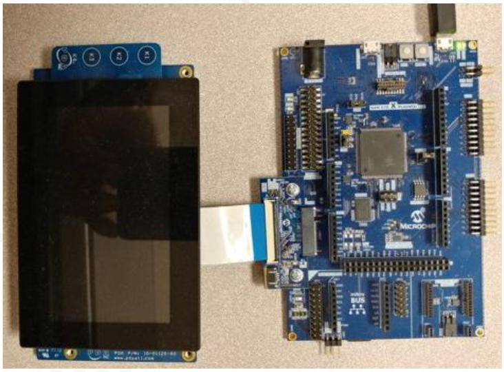
 
### Configure the 4.3” WQVGA Display 
* Disconnect the ribbon cable that connects the display to the interposer board.  The board is for the MEB 2 only, and not used on the SAM E70 Xplained Ultra kit.

* Release the ribbon cable from the interposer board. 
* Release the black clamp on the E70’s J2 connector and turn the display over. 
* Insert the ribbon cable into J2 and close the clamp.

 The board and display are powered by a Micro B – USB A cable from PC to the “Debug USB” port on the E70 board.

## Run MPLABX

* **Launch the MPLAB X IDE**. 
    * From the File pull-down menu, select **New Project**. This will display the New Project dialog window. 
    * Proceed to **Creating New Project Tutorial Steps**

# Creating New Project Tutorial Steps

**Choose Project.**

* In Categories: window, Click **Microchip Embedded**
* In Projects window, Click **32-bit MPLAB Harmony Project**
* Click **Next**. 

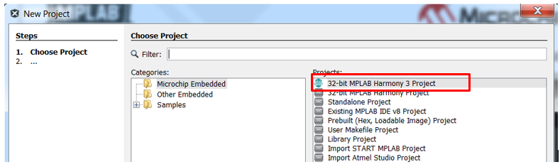

 If **32-bit MPLAB Harmony Project** is not visible repeat software installation steps **Install MHC** above.

**Framework Selection.** 
* Set **Framework Path:** to your Harmony v3 root installation directory. This path is not set by default. You must enter the path used at installation. 
* Select **Convert to Relative Path for Configuration**
* Click **Next**.

 The Launch Framework Downloader button is used to download or configure a local framework. Because you have already installed H3, this button click is not required.

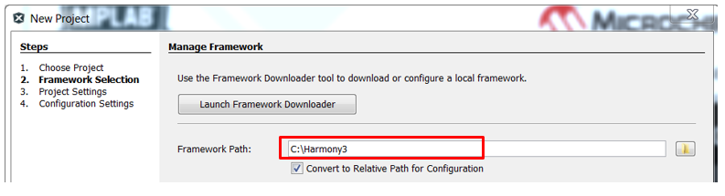

**Project Settings.**  
* The **Location:** field is set by default, it is not recommended to change this setting for this tutorial.
* Set **Folder:** field to `sam_e70`. This will be the name of the MPLAB X project folder configured for SAM E70. 
* Set **Name:** field to `new_app`. This will be the name of your application displayed in MPLAB X. 
* Click **Next**.

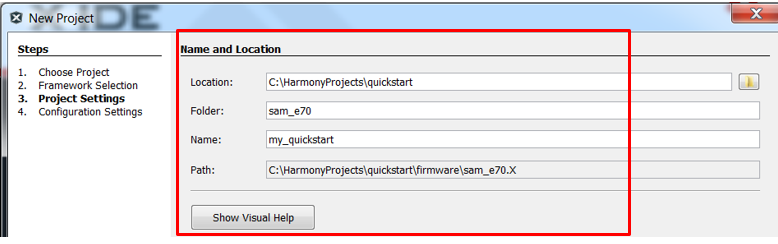

**Configuration Settings.** 
* Set **Name:** field to `sam_e70`. This will create a sam_e70 folder for configuration settings.
* Select for **Device Family:** drop down, `ATSAM`. 
* Select for **Device Filter:** `same70`. This optional step helps narrow the possible device target selections to only this family.
* Select for **Target Device:** drop down, `ATSAME70Q21B`. 
* Click **Finish**.

 The selection of Target Device `ATSAME70Q21B` is required. The device name will enable the listing of the supported BSP specific for this board later in this tutorial. Using a different device may not give any selections for the BSP.

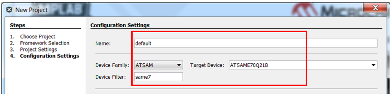

* When **Finish** is clicked, the following message may be displayed while the configuration database setup dialog is loaded.

**Configuration Database Setup.** 
* Select the following packages to load into the project:  `gfx`, `core`, and `bsp`.
* Deselect all other packages.
* Click **Launch**.

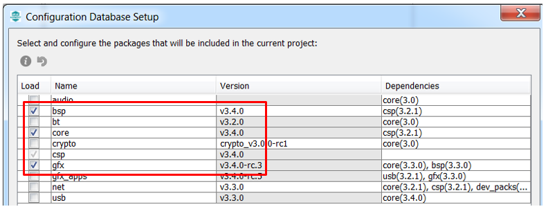

* **Launching MPLAB Harmony Configurator**. The following message will be displayed while the project is loaded into MPLAB X.

* **Initial Project Graph**. The following will be displayed after project is loaded into MPLAB X.

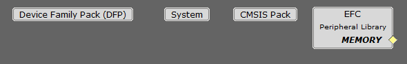

**Available Components BSP.**  
* Expand **Board Support Packages (BSPs)**. 
* Double-click **SAM E70 Xplained Ultra BSP** component.

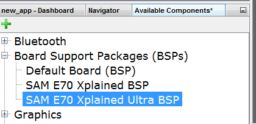

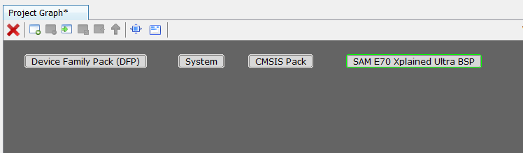

**Available Components Template.** 
* Expand **Graphics/Templates**. 
* Double-click the **Aria Graphics w/ PDA TM4301B Display** template component. 

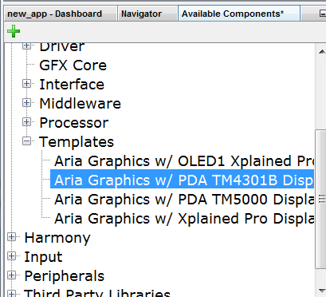

* Several dialogs will be displayed during the process. When prompted to:
   * "...activate these components?", select Yes. 
   * "...automatically make these connections?", select Yes. 
   * "...deactivate these components?", select Yes.

* **Project Graph**. The following will be displayed after all components are loaded into MPLAB X.

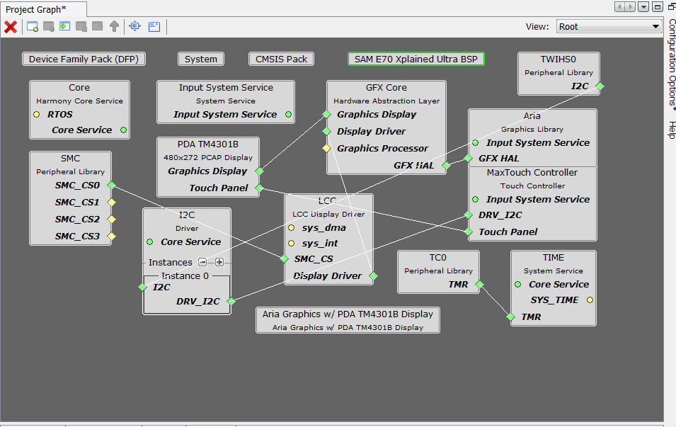

**Graphics Composer**

Launch the **Graphics Composer** from the MHC/Tools Menu:

* When MHGC’s Welcome Dialog is displayed. Click the **Create a new project using the new project wizard** button.

 If the Welcome Dialog does not appear, it is because it had been disabled previously.  The Welcome Dialog can be re-enabled by using MHGC’s File > Settings > General menu:

* In the MPLAB Harmony Graphics Composer (MHGC) screen use the left-most icon to create a new graphics design.

In the New Project Wizard, for the **Color Mode** step, 
* Select `RGB_565` 
* Click **NEXT**.

**Memory Size**

For the **Memory Size** step, accept the default Flash Memory Size and click **NEXT**. It is not recommended to change this setting for this tutorial.

**Project Type**

For the **Project Type** step, chose the second option **create a new project using a basic template** and click **NEXT**.

The MHGC window will display the following image:

**Generate Code**

Generate the application’s code for the first time. Select the **Generate Code** button of MHC’s window:

Save the project’s configuration. Enter for **File name:** `sam_e70`.

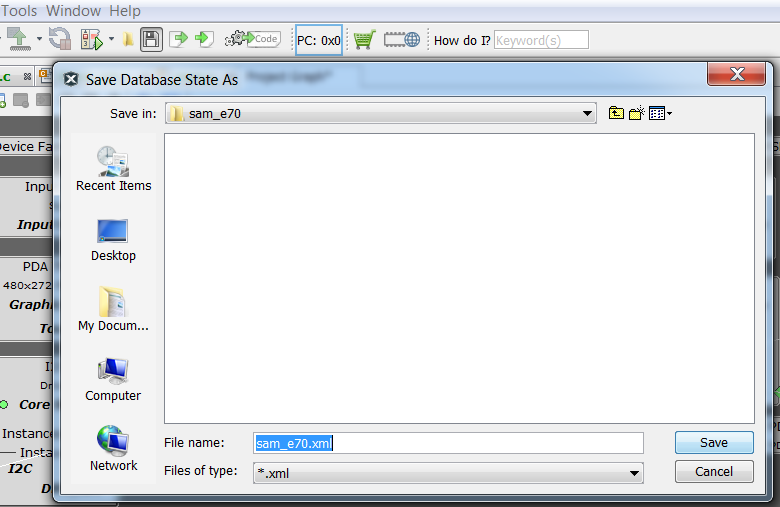

Select `USER_ALL` as the Merge Strategy : 

Click Generate: 

Now the project’s initial software has been configured.

**NOTE**: Here is a brief explanation of the different merge strategies that are available:
* **ALL**: The user will be prompted with a merge window for all generated files. This includes files that have no user modifications but are changed because of changes in MHC configuration or component updates. (This choice is always the safest.)
* **USER_ALL**: The user will always be prompted with a merge window for all generated files that contain user modifications.
* **USER_RECENT**: The user will be prompted with a merge window for all generated files that contain recent user modifications.
* **OVERWRITE**: All generated file content will be replaced by the contents of this generate operation. All user changes will be overwritten.

**Project Properties dialog.**

Right mouse click on the project’s name and bring up the Project Properties dialog

* Under **Hardware Tool**, select `EDBG`. 
* Under **Compiler Toolchain**, select XC32 compiler `V2.20`. 
* Click OK.

**Run Main Project**

Select **Run Main Project**. This button will build, program, and run the application.

**UI Display**

The following image should appear on the display:

Next Steps
* Learn how to add events to the project: [Adding Event to a Graphics Application ](https://github.com/Microchip-MPLAB-Harmony/gfx/wiki/Adding-Event-to-a-Graphics-Application)
