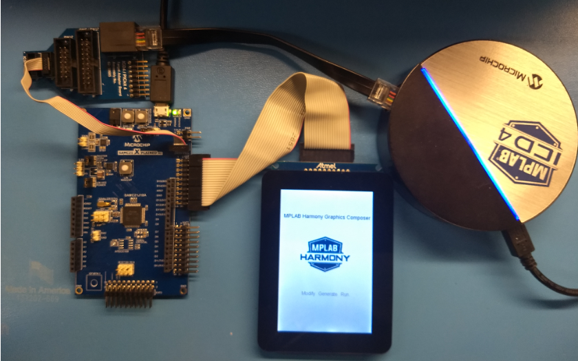
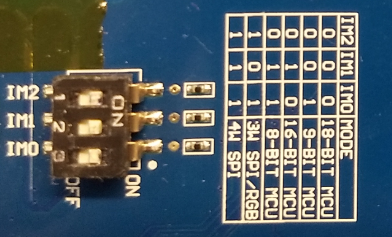
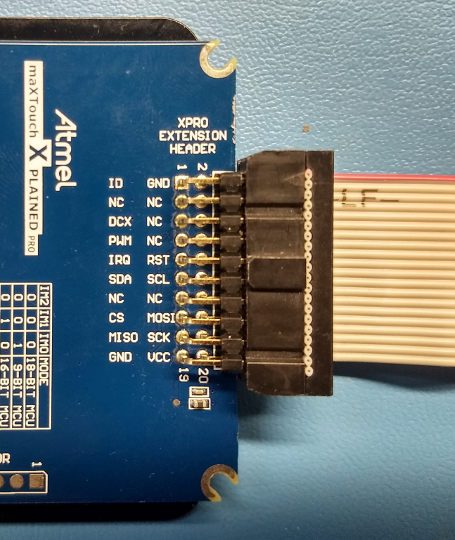
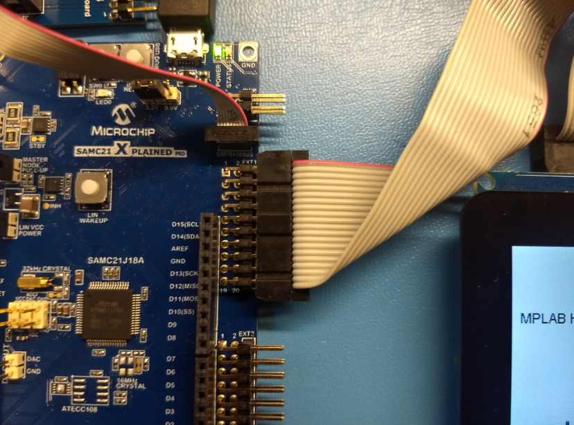

# Summary

This topic describes how to create a quick graphics-enabled application from scratch using
[SAMC21N Xplained Pro Evaluation Kit](https://www.microchip.com/developmenttools/ProductDetails/atsamc21n-xpro). It starts with a blank MPLAB® project and finishes with a graphics application equivalent to aria_quickstart.

# Description

The instructions in this tutorial assume that you have already installed following software:

* [MPLAB® X Integrated Development Environment](https://www.microchip.com/mplab/mplab-x-ide)
* [MPLAB® XC32/32++ C Compiler](https://www.microchip.com/mplab/compilers)
* [MPLAB® Harmony 3 Configurator](https://github.com/Microchip-MPLAB-Harmony/mhc/wiki)

The instructions also assume that you have acquired following hardware:

* [SAMC21N Xplained Pro Evaluation Kit](https://www.microchip.com/DevelopmentTools/ProductDetails/PartNO/ATSAMC21N-XPRO)
* [High-Performance 4.3" WQVGA Display Module](https://www.microchip.com/Developmenttools/ProductDetails/AC320005-4)
* [MPLAB® ICD4 In-Circuit Debugger](https://www.microchip.com/Developmenttools/ProductDetails/DV164045)
* [ICD4/PICKit Adapter Board](https://www.microchip.com/DevelopmentTools/ProductDetails/AC102015)

# Getting Started

To get started with this tutorial, you should:
1. Install MHC.
2. Configure hardware.
3. Run MPLABX.

## Install MHC
To install MHC, follow the [Harmony V3 MHC installation guide](https://github.com/Microchip-MPLAB-Harmony/mhc/wiki). Upon completion, proceed to **Configure Hardware** steps below.

## Configure Hardware

The final setup should be:

**Set** the IM switches on the maXTouch Xplained Pro Display to IM[2:0] = 111b.

**Connect** the Cable to the XPRO EXTENSION HEADER on the maXTouch Xplained Pro Display.

Connect the other end of the cable to the EXT1 header on the SAM C21 Xplained Pro board.

 The board and display are powered by a Micro B – USB A cable from PC to the “Debug USB” port on the E70 board. The ICD4 Debugger and ICD4/PICKit4 Adapter Board are connected as shown above.

## Run MPLABX

* **Launch the MPLAB X IDE**.
    * From the File pull-down menu, select **New Project**. This will display the New Project dialog window.
    * Proceed to **Creating New Project Tutorial Steps**

# Creating New Project Tutorial Steps

1. **Choose Project.**

* In Categories: window, Click **Microchip Embedded**
* In Projects window, Click **32-bit MPLAB Harmony Project**
* Click **Next**.

 If **32-bit MPLAB Harmony Project** is not visible repeat software installation steps **Install MHC** above.

2. **Framework Selection.**
* Set **Framework Path:** to you Harmony v3 root installation directory. This path is not set by default.
* Select **Convert to Relative Path for Configuration**
* Click **Next**.

 The Launch Framework Downloader button is used to download or configure a local framework. Because you have already installed H3, this button click is not required.

3. **Project Settings.**
* **Location:** field is set by default, it is not recommended to change this setting for this tutorial.
* Set **Folder:** field to `sam_c21n`. This will be the name of the MPLAB X project folder configured for SAM E70.
* Set **Name:** field to `new_app`. This will be the name of your application displayed in MPLAB X.
* Click **Next**.

4. **Configuration Settings.**
* Set **Name:** field to `sam_c21n`. This will create a sam_c21n0 folder for configuration settings.
* Select for **Device Family:** drop down, `ATSAM`.
* Select for **Device Filter:** `samc21n`.
* Select for **Target Device:** drop down, `ATSAMC21N18A`.
* Click **Finish**.

 The selection of Target Device `ATSAMC21N18A` is required for this tutorial.

* When **Finish** is clicked, the following message may be displayed while the configuration database setup dialog is loaded.

5. **Configuration Database Setup.**
* Select the following packages to load into the project:  `gfx`, `core`, and `bsp`.
* Deselect all other packages.
* Click **Launch**.

* **Launching MPLAB Harmony Configurator**. The following message will be displayed while the project is loaded into MPLAP X.

* **Initial Project Graph**. The following will be displayed after project is loaded into MPLAP X.

6. **Available Components BSP.**
* Expand **Board Support Packages (BSPs)**.
* Double-click **SAM C21N Xplained Pro BSP** component.

7. **Available Components Template.**
* Expand **Graphics/Templates**.
* Double-click the **Aria Graphics w/ Xplained Pro Display** template component.

* Several dialogs will be displayed during the process. When prompted to:
   * "...activate these components?", select Yes.
   * "...automatically make these connections?", select Yes.
   * "...deactivate these components?", select Yes.

* **Project Graph**. The following will be displayed after all components are loaded into MPLAP X.

8. Launch the **Graphics Composer** from the MHC/Tools Menu:

* When MHGC’s Welcome Dialog is displayed. Click the **Create a new project using the new project wizard** button.

 If the Welcome Dialog does not appear, it is because it had been disabled previously.  The Welcome Dialog can be re-enabled by using MHGC’s File > Settings > General menu:

* In the MPLAB Harmony Graphics Composer (MHGC) screen use the left-most icon to create a new graphics design.

9. In the New Project Wizard, for the Color Mode step,
* Select RGB_565
* Click **NEXT**.

10. For the Memory Size step, accept the default Flash Memory Size and click**NEXT**. It is not recommended to change this setting for this tutorial.

11. For the Project Type step, chose the second option to create a new project using a basic template:

The MHGC window should now show:

12. Launch the Pin Configuration tool and verify that the display is correctly setup:

13. Generate the application’s code for the first time. Select the Generate Code button of MHC’s window:

Save the project’s configuration. Enter `sam_e70`.

Select `USER_ALL` as the Merge Strategy :

Click Generate:

Now the project’s initial software has been configured.

**NOTE**: Here is a brief explanation of the different merge strategies that are available:
* **ALL**: The user will be prompted with a merge window for all generated files. This includes files that have no user modifications but are changed because of changes in MHC configuration or component updates. (This choice is always the safest.)
* **USER_ALL**: The user will always be prompted with a merge window for all generated files that contain user modifications.
* **USER_RECENT**: The user will be prompted with a merge window for all generated files that contain recent user modifications.
* **OVERWRITE**: All generated file content will be replaced by the contents of this generate operation. All user changes will be overwritten.

14. **Project Properties dialog.**  Right mouse click on the project’s name and bring up the Project Properties dialog

* Select the debugger: `ICD 4`)
* XC32 compiler `V2.20`.
* Click OK.

If you are using the Embedded Debugger (EDBG):

15. Build and run the project:

16. The following image should appear on the display:

Next Steps
* Learn how to add events to the project: [Adding Event to a Graphics Application ](https://github.com/Microchip-MPLAB-Harmony/gfx/wiki/Adding-Event-to-a-Graphics-Application)
