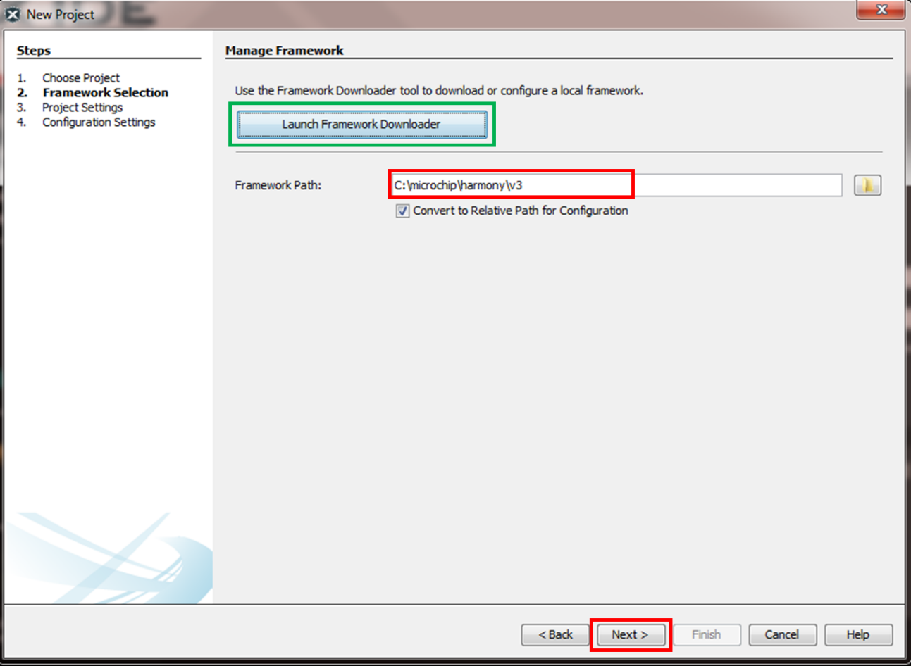
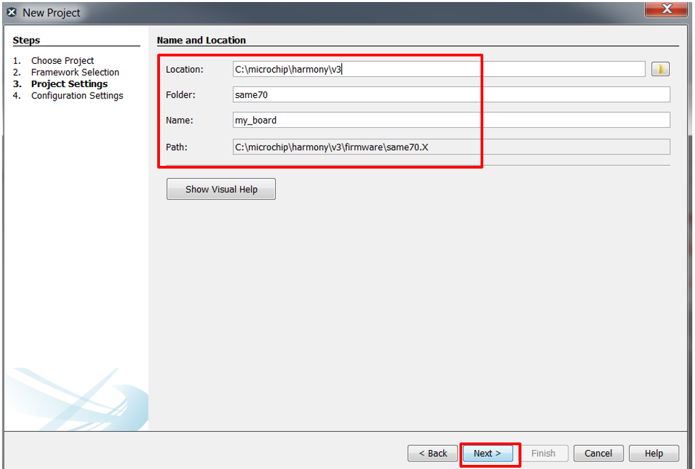
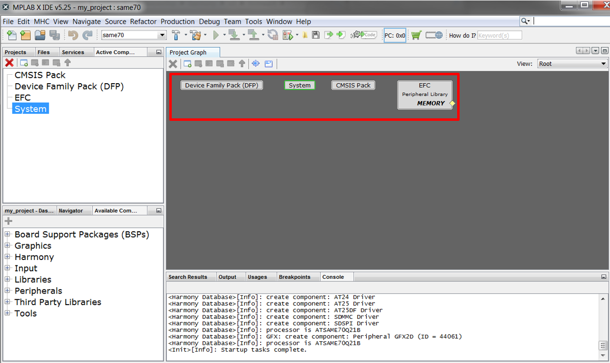
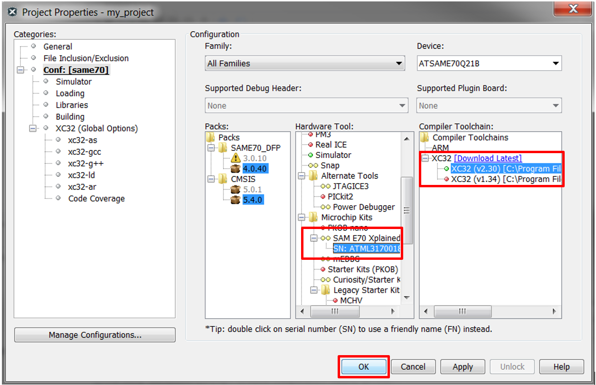
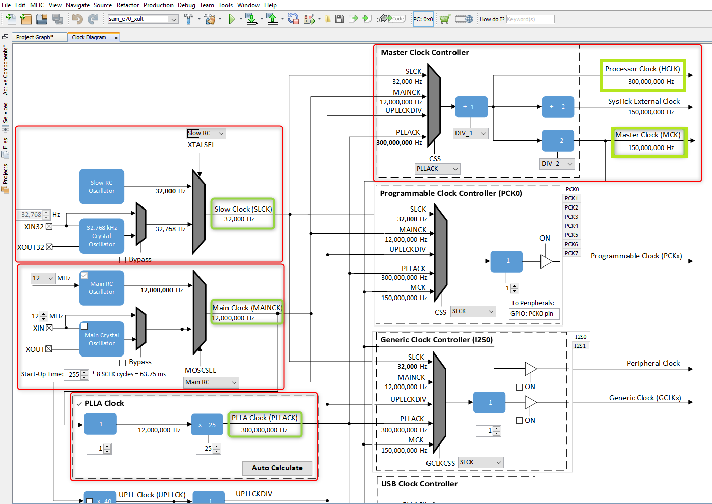
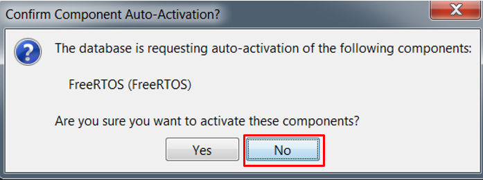
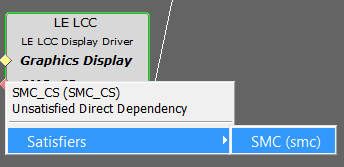
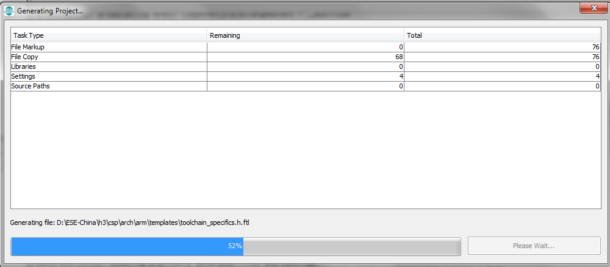

#  QuickStart SAM E70 Xplained Ultra Evaluation Kit

This guide describes the basic steps to create a graphics-enabled application using the
[SAM E70 Xplained Ultra Evaluation Kit](https://www.microchip.com/DevelopmentTools/ProductDetails/PartNO/DM320113) connected to a  [WQVGA](https://www.microchip.com/Developmenttools/ProductDetails/AC320005-4) display. 

#### <b>What you will build</b>

You will build a simple application that displays an image, text, and touch button. It starts with the creation of a new MPLAB® project and finishes with a graphics application equivalent to legato_quickstart.

### <b>What you will see</b>

The demonstration will render the following image on the display:

# Contents

The following bullets detail the steps necessary to create a solution for your board.

* Get Materials
* Create a new project
* Configure Software with MHC 
* Create UI Design with Legato Composer
* Save Project
* Generate, Build, and Run

## Get Materials

Before you begin this quick start, make sure you have what you will need. The Microchip development documentation and hardware provides a basic foundation that we will use as a reference for your SAM E70 design.

|Documentation|Description|
|----|----|
|[SAM E70 Xplained Ultra User's Guide](http://ww1.microchip.com/downloads/en/DeviceDoc/SAME70_Xplained_Ultra_Evaluation_User's%20Guide_DS70005389B.pdf) | User Guide with Schematics|

|Hardware|Description|
|----|----|
| [SAM E70 Xplained Ultra Evaluation Kit](https://www.microchip.com/DevelopmentTools/ProductDetails/PartNO/DM320113)|Development Board |
| [ WQVGA Display Module (AC320005-4)](https://www.microchip.com/Developmenttools/ProductDetails/AC320005-4). | High-Performance 4.3" WQVGA Display Module |
| Standard USB A to micro-B cable| PC debugging connector. |

> **_NOTE:_** The SAM E70 Xplained Ultra Evaluation Kit includes an on-board Embedded Debugger (EDBG), which requires no additional hardware to get started. For programming/debugging, the EDBG connects to the host PC through the USB micro-B connector on the SAM E70 Xplained Ultra Evaluation Kit.

|Software|Description|Install|
|----|----|----|
| [MPLAB® X Integrated Development Environment ](https://www.microchip.com/mplab/mplab-x-ide)| v5.15 or newer| [Install MPLAB IDE](https://microchipdeveloper.com/install:mplabx) |
| [MPLAB® XC32/32++ C Compiler](https://www.microchip.com/mplab/compilers) | v2.20 or newer | [Install Compiler](https://microchipdeveloper.com/install:xc32)|
| [MPLAB® Harmony 3 ](https://github.com/Microchip-MPLAB-Harmony/mhc/wiki)| gfx v3.5 (and dependencies) or newer | [Install Harmony v3](https://microchipdeveloper.com/harmony3:mhc-overview#install)|

> **_NOTE:_** This project has been verified to work with the following versions of software tools:
MPLAB X IDE v5.40, MPLAB XC32 Compiler v2.41, [Harmony Graphics v3.7.0](https://github.com/Microchip-MPLAB-Harmony/gfx/blob/v3.7.0/release_notes.md)

> **_NOTE:_** Because we regularly update our tools, occasionally you may discover an issue while using the newer versions. If you suspect that to be the case, we recommend that you use the same versions that the project was tested with.

### Hardware Setup

Configure the hardware as follows: 

If your WQVGA display cable is connected to a interposer board, following these steps:

* Disconnect the ribbon cable that connects the display to the interposer board.  The board is for the MEB 2 only, and not used with the SAM E70 Xplained Ultra Evaluation Kit.

* Release the ribbon cable from the interposer board. 
* Release the black clamp on the J2 connector and turn the display over. 
* Insert the ribbon cable into J2 and close the clamp.

 The board and display are powered by a Micro B – USB A cable from PC to the “USB Debug” port on the SAM E70 Xplained Ultra Evaluation Kit.

SAM E70 Xplained Ultra Evaluation Kit is connected to the display using the display ribbon cable. Programming is a board to PC link using a standard USB A to micro-B cable. The connection, illustrated below, provides power and debug communication.

 
If your WQVGA display cable is connected to a interposer board, following these steps:

* Disconnect the ribbon cable that connects the display to the interposer board.  The board is for the MEB 2 only, and not used with the SAM E70 Xplained Ultra Evaluation Kit.

* Release the ribbon cable from the interposer board. 
* Release the black clamp on the J2 connector and turn the display over. 
* Insert the ribbon cable into J2 and close the clamp.

 The board and display are powered by a Micro B – USB A cable from PC to the “USB Debug” port on the SAM E70 Xplained Ultra Evaluation Kit.

## Create a new project

1. Launch the **New Project** wizard. Select **File > New Project** from the main IDE menu.

2. In the **Categories** pane of the **New Project** dialog, select **Microchip Embedded**. In the **Projects** pane, select **32-bit MPLAB Harmony 3 Project**, then click **Next**.

> **_NOTE:_** If **32-Bit MPLAB Harmony 3 Project** selection is not displayed, [Download MPLAB Harmony Framework](https://microchipdeveloper.com/harmony3:mhc-overview#download).

3. In the **Framework Path** edit box, browse to the folder you downloaded the framework to. If you haven't done this, or want to download it to a different folder, click the **Launch Framework Downloader** button, then click **Next**.

> **_NOTE:_**  For more information on the framework downloader, see the, [Download MPLAB Harmony Framework](https://microchipdeveloper.com/harmony3:mhc-overview#download) section of the "MPLAB® Harmony Configurator Overview" page.

4. In the **Project Settings** window, apply the following settings:

    * **Location**: Indicates the path to the root folder of the new project. All project files will be placed inside this folder. The project location can be any valid path, for example: C:\microchip\harmony\v3.
    * **Folder**: Indicates the name of the MPLABX .X folder. Enter “**same70**” to create a **same70.X** folder.
    * **Name**: Enter the project’s logical name as “**my_board**”. This is the name that will be shown from within the MPLAB X IDE.
    * Click **Next** to proceed to Configuration Settings.

> **_NOTE:_** **Folder** must be a valid directory name for your operating system. The **Path** box is read-only. It will update as you make changes to the other entries.

5. Follow the steps below to set the project’s Configuration Settings.

    * **Name**: Enter the configuration name as “same70”.
    * **Target Device**: Select “**ATSAME70Q21B**” as the target device.
    * Click **Finish** to launch the MHC.

> **_NOTE:_** You can select the Device Family or enter a partial device name to filter the list in Target Device in order to make it easier to locate the desired device.

> **_NOTE:_** The **New Project Wizard** opens a Configuration Database Setup window to allow you to review the packages that will be used by the current project.

6. While the MHC tool launches, it will ask for the packages to be loaded. In the **Load** checkboxes list, select the **gfx**, **core**, and **bsp** packages and unselect all other packages.

Click **Launch** to launch the MHC Configurator tool with the selected packages.

* **Launching MPLAB Harmony Configurator**. The following message will be displayed while the project is loaded into MPLAB X.

7. The MHC plugin’s main window for the project will be displayed. This is the initial project graph.

8. Before proceeding, set up the compiler toolchain. Click on the **Projects** tab on the top left pane. Right click on the project name **my_board** and go to **Properties**.

Make sure that XC32 (v2.20) is selected as the Compiler Toolchain for XC32. Click on **Apply** and then click on **OK**.

## Verify Clock Settings

1. Launch **Clock Diagram** by going to **MHC** tab in MPLABX IDE and then select **Tools > Clock Configuration**.

A new tab, **Clock Diagram**, is opened in the project’s main window.

2. Click on the **Clock Diagram** tab, scroll to the right and verify that the **Processor Clock (HCLK)** and **Master Clock (MCK)** is set to 300 MHz and 150 MHz, respectively.

## Configure Software with MHC

* Configure pins 
    * Connect to external graphics communication
* Create a UI design
* Save Project
* Generate, Build, and Run

### Load Software Components

1. This is a Harmony based application, therefore,  you will need to use the **Harmony Core Service** Component.

Under the bottom left tab, **Available Components**, expand **Harmony**.
Double click or drag and drop **Core** to add the **Harmony Core Service** to the project graph. When prompted to activate **FreeRTOS**, click **No**.

2. You will also need the **Time System Service**.  

> **_NOTE:_** Harmony components lists Current Consumers and Available Consumers when a right click occurs on the circle icons. 

* On the **Harmony Core Service** component, right click the Core Service icon on Harmony Core Service component, select **Available Consumers**, then select **TIME**.

* On the **Time System Service** component, right click the **TMR** icon, select **CORE_TIMER(core_timer)**.

Because this is a GFX enabled application, you will need to select a graphics library. For this tutorial, we will use **Legato**.

3. Under the bottom left tab, **Available Components**, expand **Graphics>Middleware**. Double click or drag and drop **Legato** to add the Legato graphics library to the project graph.

4. On the Legato component, right click the **LE Display Driver**, select **Satisfiers**, and select **LE LCC**.

5. On the **Confirm Component Auto-Activation** dialog, click **Yes** to activate the **GFX Core LE** component.

6. On the **LE LCC** component, right click **SMC_CS** diamond icon, select **Satisfiers**, and select **SMC**.

7. On the **LE LCC** component, right click **Graphics Display** diamond icon, select **Satisfiers**, and select **PDA TM4301B (gfx_disp_pdatm4301b_480x272)**.

8. In the **LE LCC** component, configure **Backlight Settings** with **Peripheral TC**

9. On the **LE LCC** component, right click **TMR** diamond icon, select **Satisfiers**, and select **TC1**.

10. Configure settings in the **TC1** component like this

11. On the **PDA TM4301B** component, right click **Touch Panel** diamond icon, select **Consumers**, and select **MaXTouch Controller (gfx_maxtouch_controller)**.

12. On the MaXTouch Controller component, right click **DRV_I2C** diamond icon, select **Satisfiers**, and select **I2C (drv_i2c)**.

13. On the **MaXTouch Controller** component, right click **Input System Service** circle icon, select **Available Satisfiers**, and select **Input System Service (sys_input)**.

14. On the **I2C Driver** component, right click Input **I2C** diamond icon, select **Satisfiers**, and select **TWIHS0**.

On completion, your **Project Graph** window should look similar to the following image:

If the display needs to be configured, then you will need to launch **Display Manager**.  For this tutorial, Display Managing is not required. See Getting started with Display Manager for more information.

## Configure Hardware

In this step, you will need to configure the pins on the SAM E70 to support the external touch controller and display modules.

1. Open the Pin Configuration tabs by clicking **MHC > Tools > Pin Configuration**.

2. Select the MHC Pin Settings tab and sort the entries by Port names as shown below.

3. Use the table below to establish your Pin Settings

#### Required Pin Settings
| Ball/Pin Number | Pin ID| Name| Function|Direction|Latch|
| --- | --- | --- | --- | --- | --- | 
| 4| PE0| EBI_D8| EBI_D8| | |
| 6| PE1| EBI_D9| EBI_D9|| |
| 7| PE2| EBI_D10| EBI_D10| | |
| 10| PE3| EBI_D11| EBI_D11|| |
| 11| PC0| EBI_D0| EBI_D0| | |
| 15| PC30| GFX_DISP_INTF_PIN_HSYNC| GPIO|Out | High|
| 19| PC11| GFX_DISP_INTF_PIN_RESET| GPIO|Out | High|
| 27| PE4| EBI_D12| EBI_D12| | |
| 28| PE5| EBI_D13| EBI_D13| | |
| 38| PC1| EBI_D1| EBI_D1|| |
| 39| PC2| EBI_D2| EBI_D2| | |
| 40| PC3| EBI_D3| EBI_D3|| |
| 41| PC4| EBI_D4| EBI_D4| | |
| 45| PA16| EBI_D15| EBI_D15| | |
| 48| PC7| EBI_D7| EBI_D7|| |
| 49| PA15| EBI_D14| EBI_D14|| |
| 54| PC6| EBI_D6| EBI_D6| | |
| 58| PC5| EBI_D5| EBI_D5|| |
| 67| PD19| GFX_DISP_INTF_PIN_VSYNC| GPIO|Out | High|
| 71| PD28| BSP_MAXTOUCH_CHG| GPIO|In | |
| 77| PA4| TWIHS0_TWCK0| TWIHS0_TWCK0|||
| 79| PB6| ICE_TMS/SWDIO| TWIHS0_TWD0| | |
| 82| PC8| EBI_NWR0/NWE| EBI_NWR0/NWE|||
| 86| PC9| GFX_DISP_INTF_PIN_BACKLIGHT| GPIO|Out | High|
| 89| PB7| ICE_TCK/SWDCLK| TWIHS0_TWCK0|||
| 91| PA3| TWIHS0_TWD0| TWIHS0_TWD0| | |
| 94| PC30| GFX_DISP_INTF_PIN_DE| GPIO|Out | High|
***
> **_NOTE:_** the drv_maxtouch and drv_gfx_lcc drivers require specific names for its pins. If you do not have the correct pin names a compiler output will display an error along with the expected name.

If you are using the SAM E70 Xplained Ultra Evaluation Kit, you may refer to the  SAM E70 Xplained Ultra Evaluation Kit schematic obtained from the [SAM E70 Xplained Ultra User's Guide](http://ww1.microchip.com/downloads/en/DeviceDoc/SAME70_Xplained_Ultra_Evaluation_User's%20Guide_DS70005389B.pdf). 
> **_NOTE:_** If you are using a schematic for your custom board, map the required graphics pins to your board.

##  Create UI Design with Legato Graphics Composer

Next you will need to create a basic design using the Legato Graphics Composer

Launch **Legato Graphics Composer** from the **MHC->Tools->Legato Graphics Composer** Menu:

On the **Welcome Dialog**, select **Create a new project using the new project wizard**. Follow the step-by-step guided menus. 

Create a template design by following the steps in the [How to Create a Simple Design Using the Project Wizard](How-to-Use-New-Project-Wizard) guide.
Make sure to set display resolution to **Width**: **480** and **Height**: **320**, **Color Mode**: **RGB565**, **Memory Profile**: **M7**.  

Click **Start with a basic quickstart project template** to automatically create a UI design. 

## Save and Generate Legato Composer Design

1. Save the Legato Composer UI Configuration. Click **File -> Save**.

2. When done, Generate Legato composer project files. Click **File -> Generate Code** as shown below.  This will generate the UI design and the necessary Legato Graphics files.  Harmony files such as peripheral libaries, system services, and drivers are generated via the MHC code generate in the steps to follow.

## Save and Generate Harmony Project

1. When done, before generating code, click **Save MHC State** as shown below.

2. Save the configuration in its default location when prompted.

3. Generate the code as shown below.

Click on the Generate button in the Generate Project window, keeping the default settings as shown below. If prompted for saving the configuration, click Save.

4. As the code is generated, MHC displays the progress as shown below.

5. Examine the generated code.

MHC will include all the MPLAB Harmony library files and generate the code based on the MHC selections. The generated code would add files and folders to your Harmony project

6. Navigate to the Projects tab to view the project tree structure.

## Build, program and observe outputs

Power up the board by connecting the power adapter to power connector or a powered USB cable to the DEBUG USB port on the board. 
1. Connect the Type-A male to mini-B USB cable to micro-B DEBUG USB port to power and debug the SAM E70 board.

2. Go to **File > Project Properties** and make sure that the EDBG is selected as the debugger under the **Hardware Tools** and XC32 (v2.20 or later) is selected as the **Compiler Toolchain** for XC32.

3. Clean and build your application by clicking on the **Clean and Build** button as shown below.

4. Program your application to the device, by clicking on the **Make and Program** button as shown below.

The application should build and program successfully.

# Review

You have successfully created an application using MPLAB Harmony v3 on SAM E70. Your application used all the fundamental elements that go in building a graphics application. Your application successfully rendered a UI to the High-Performance 4.3" WQVGA Display Module. The application also took user from the display module.

Specifically, you used MPLAB® Harmony Configurator (MHC) to configure SAM E70. You used MHC to add and connect components. You used Pin Configurator to set up the pins for display and maxTouch controller.

# Summary

This guide provided you training of configuring and using all the fundamental components needed to build a graphics application on a SAM E70 Development Board with MPLAB Harmony v3 Framework. As a next step, you may customize this application and reconfigure some of the components used in this tutorial. You could also add new components (PLIBs, etc.) to enhance this application to realize your end application.

***
**Is this page helpful**? Send [feedback](issues).
