#  QuickStart on Multimedia Expansion Board II with PIC32MZ DA WQVGA

This guide describes the basic steps to create a graphics-enabled application using the [Multimedia Expansion Board II](https://www.microchip.com/DevelopmentTools/ProductDetails/PartNO/DM320005-5) with [PIC32MZ Embedded Graphics with Stacked DRAM (DA) Starter Kit](https://www.microchip.com/DevelopmentTools/ProductDetails/DM320010). You will build a simple application that displays an image and touch button. It starts with the creation of a new MPLAB® project and finishes with a graphics application equivalent to aria_quickstart.

The demonstration will render the following image on the display:

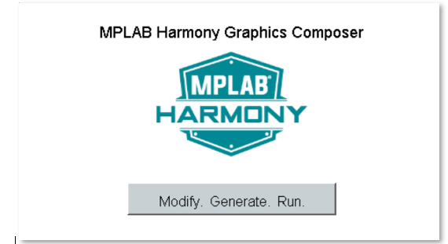

Who should use this guide

This guide is intended for developers who are building applications on a custom PIC32MZ DA setup similar to or the same as components on the [Multimedia Expansion Board II](https://www.microchip.com/DevelopmentTools/ProductDetails/PartNO/DM320005-5) and [PIC32MZ Embedded Graphics with Stacked DRAM (DA) Starter Kit](https://www.microchip.com/DevelopmentTools/ProductDetails/DM320010). 

What this guide contains

You will build a simple application that displays an image and touch button. It starts with the creation of a new MPLAB® project and finishes with a graphics application equivalent to aria_quickstart. Here are the primary steps to create a graphics application for your PIC32MZ DA hardware:

1. Create a new project and configure clock for PIC32MZ DA.
    *  Create MPLAB Harmony v3 Project using MPLAB X IDE
    *  Verify Clock Settings
2. Configure Harmony components for graphics middleware and drivers
3. Configure pins for external graphics communication
4. Generate Code
5. Add application code to project
6. Build, program and observe outputs

Materials you will need

## Documentation

|Documentation|Description|
|----|----|
|[Multimedia Expansion Board II (MEB II) User's Guide](http://ww1.microchip.com/downloads/en/DeviceDoc/70005148B.pdf) | Board User Guide with Schematics|
|[PIC32MZ DA Family Starter Kit User's Guide](http://ww1.microchip.com/downloads/en/DeviceDoc/70005311A.pdf) | MCU User Guide with Schematics|

## Hardware 

|Hardware|Description|
|----|----|
| [Multimedia Expansion Board II](https://www.microchip.com/DevelopmentTools/ProductDetails/PartNO/DM320005-5)|Development Board |
[PIC32MZ Embedded Graphics with Stacked DRAM (DA) Starter Kit](https://www.microchip.com/DevelopmentTools/ProductDetails/DM320010)
| Standard USB A to mini-B cable| PC debugging connector. |

> **_NOTE:_** The PIC32 Starter Kit includes an on-board debugger, which requires no additional hardware to get started. For programming/debugging, the debug port connects to the host PC through the USB mini-B connector on the PIC32 Starter Kit.

Hardware Setup

On the MEB II, the EBIWE and LCD_PCLK (J9) must be jumpered to use the internal SRAM for graphics frame buffer. The J9 jumper is located on the bottom of the MEB II board, beneath where the starter kit is plugged into the board. Refer to the following figure for the exact location. 

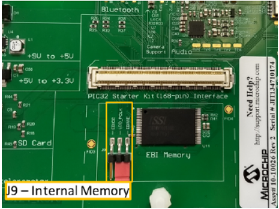

> **_NOTE:_** The board and display are powered by a Mini-B – USB A cable from PC to the “USB Debug” port on the MEB II board.

## Software

|Software|Description|Install|
|----|----|----|
| [MPLAB® X Integrated Development Environment ](https://www.microchip.com/mplab/mplab-x-ide)| v5.15 or later| [Install MPLAB IDE](https://microchipdeveloper.com/install:mplabx) |
| [MPLAB® XC32/32++ C Compiler](https://www.microchip.com/mplab/compilers) | v2.20 or later | [Install Compiler](https://microchipdeveloper.com/install:xc32)|
| [MPLAB® Harmony 3 ](https://github.com/Microchip-MPLAB-Harmony/mhc/wiki)| v3.5 or later | [Install Harmony v3](https://microchipdeveloper.com/harmony3:mhc-overview#install)|

> **_NOTE:_** This project has been verified to work with the following versions of software tools:
MPLAB X IDE v5.20, MPLAB XC32 Compiler v2.20, MPLAB Harmony v3.5.0

> **_NOTE:_** Because we regularly update our tools, occasionally you may discover an issue while using the newer versions. If you suspect that to be the case, we recommend that you use the same versions that the project was tested with.

# QuickStart steps

## Create a new MPLAB Harmony v3 project

1. Select **File > New Project** from the main IDE menu.

2. In the **Categories** pane, select **Microchip Embedded**. In the **Projects** pane, select **32-bit MPLAB Harmony 3 Project**, then click **Next**.

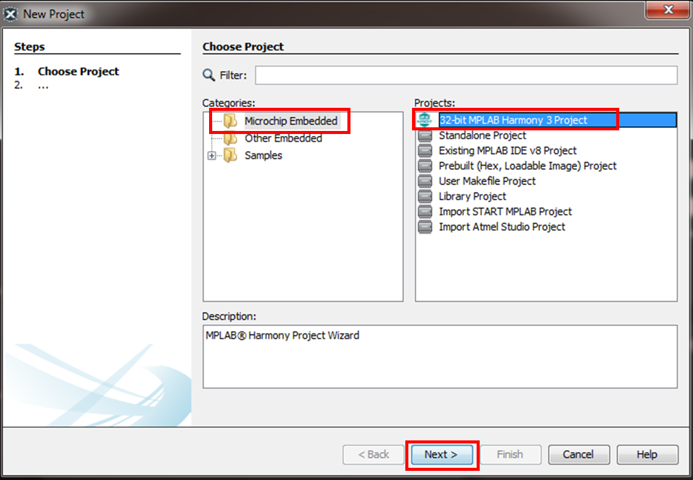

> **_NOTE:_** If **32-Bit MPLAB Harmony 3 Project** selection is not displayed, [Download MPLAB Harmony Framework](https://microchipdeveloper.com/harmony3:mhc-overview#download).

3. In the **Framework Path** edit box, browse to the folder you downloaded the framework to. If you haven't done this, or want to download it to a different folder, click the **Launch Framework Downloader** button, then click **Next**.

> **_NOTE:_**  For more information on the framework downloader, see the, [Download MPLAB Harmony Framework](https://microchipdeveloper.com/harmony3:mhc-overview#download) section of the "MPLAB® Harmony Configurator Overview" page.

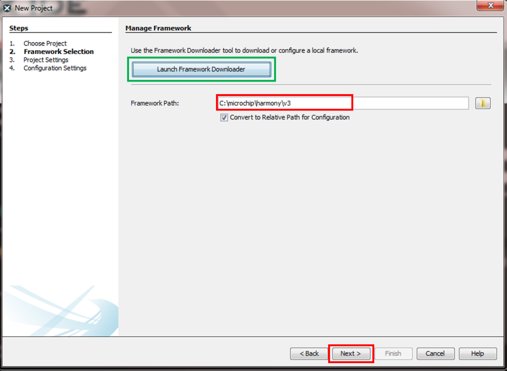

4. In the **Project Settings** window, apply the following settings:

    * **Location**: Indicates the path to the root folder of the new project. All project files will be placed inside this folder. The project location can be any valid path, for example: **C:\microchip\harmony\v3**.
    * **Folder**: Indicates the name of the MPLABX .X folder. Enter “**pic32_mzda**” to create a **pic32_mzda.X** folder.
    * **Name**: Enter the project’s logical name as “**my_board**”. This is the name that will be shown from within the MPLAB X IDE.
    * Click **Next** to proceed to Configuration Settings.

> **_NOTE:_** **Folder** must be a valid directory name for your operating system. The **Path** box is read-only. It will update as you make changes to the other entries.

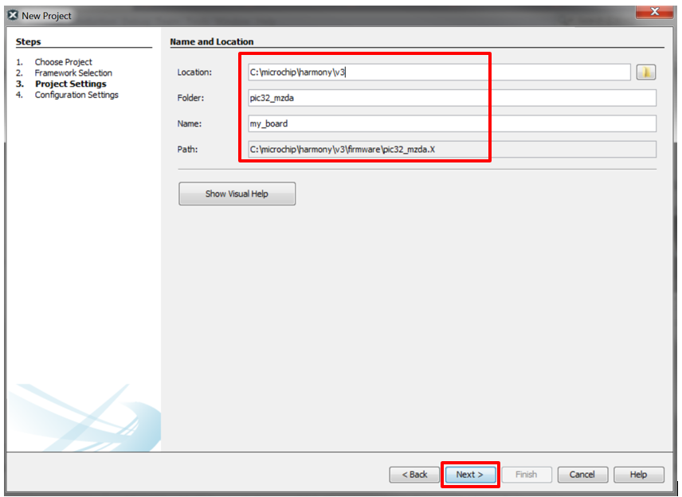

5. Follow the steps below to set the project’s Configuration Settings.

    * **Name**: Enter the configuration name as “pic32_mzda”.
    * **Target Device**: Select “**PIC32MZ2064DAR169**” as the target device.
    * Click **Finish** to launch the MHC.

> **_NOTE:_** You can select the **Device Family** or enter a **Device Filter** to filter the list in **Target Device** in order to make it easier to locate the desired device.

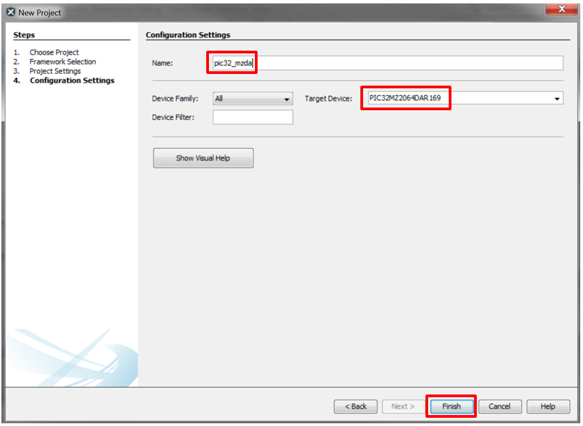

* When **Finish** is clicked, the following message may be displayed while the configuration database setup dialog is loaded.

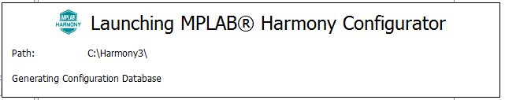

6. **Configuration Database Setup.**
* Click **Launch**.

* **Launching MPLAB Harmony Configurator**. The following message will be displayed while the project is loaded into MPLAB X.

7. The MHC plugin’s main window for the project will be displayed. This is the initial project graph.

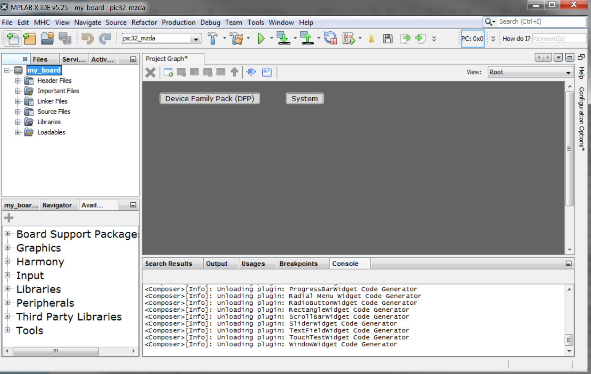

8. Before proceeding, set up the compiler toolchain. Click on the **Projects** tab on the top left pane. Right click on the project name **my_board** and go to **Properties**.

Make sure that XC32 (v2.20) is selected as the Compiler Toolchain for XC32. Click on **Apply** and then click on **OK**.

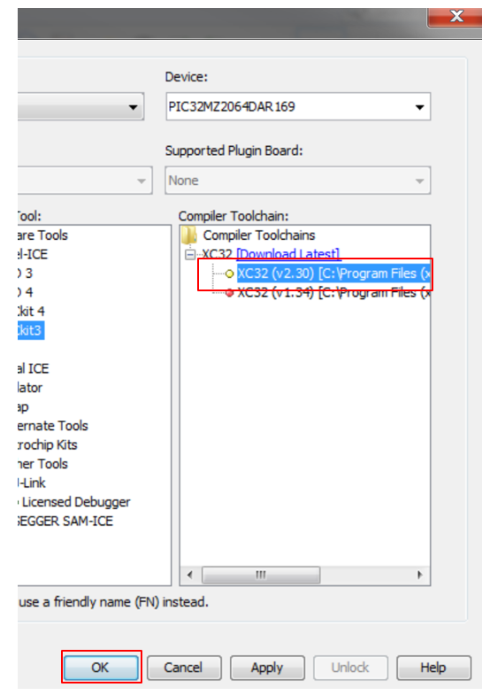

### Verify Clock Settings

1. Launch **Clock Diagram** by going to **MHC** tab in MPLABX IDE and then select **Tools > Clock Configuration**.

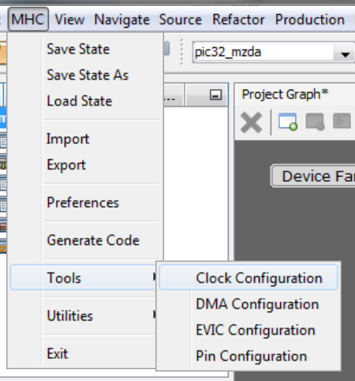

A new tab, **Clock Diagram**, is opened in the project’s main window.

2. Click on the **Clock Diagram** tab, scroll to the right and verify that **SYSCLK** is set to 200 MHz. Verify that **REFCLK5** is ON and set to 200000000 Hz

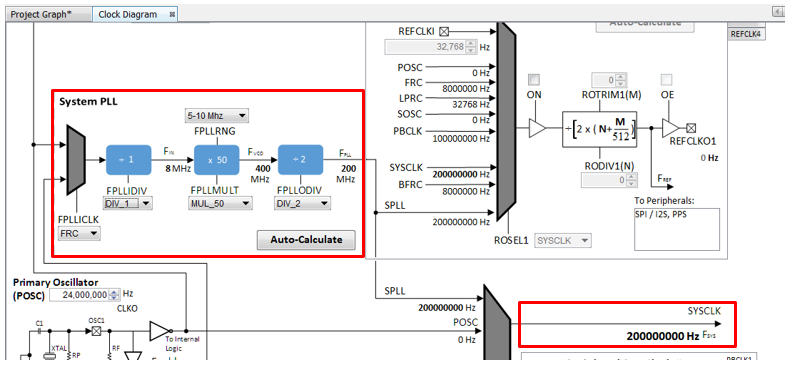

3. Verify that GLCD **REFCLK5** is ON and set to 200000000 Hz. The REFCLK5 setting effects the **Pixel Clock (Hz)** via the Pixel Clock Divider. By default, the **Pixel Clock Divider** is set to 4 which produces a Pixel Clock of 50Hz when REFCLK5 is set to 200000000 Hz.

> **_NOTE:_** If your display requires a different pixel clock, you can change the divider using **GLCD** Configuration Options menu. This is illustrated below.

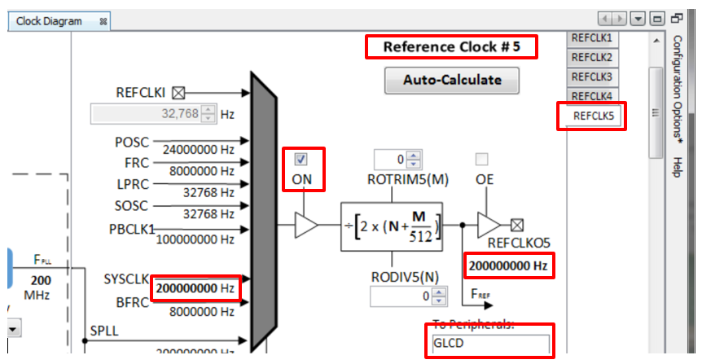

## Configure Software

### Make Core Component Connections 

1. Because this is a Harmony based application, you will need to use the Harmony Core Service Component. 

Under the bottom left tab, **Available Components**, expand **Harmony**.
Double click or drag and drop **Core** to add the Harmony Core Service to the project graph. When prompted to activate FreeRTOS, click **No**.

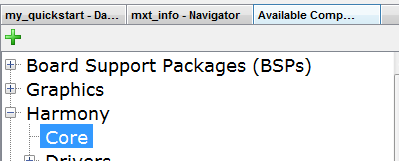

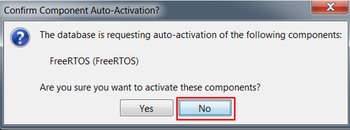

2. You will also need the **Time System Service**.  

> **_NOTE:_** Harmony components lists Current Consumers and Available Consumers when a right click occurs on the circle icons. 

* On the **Harmony Core Service** component, right click the **Core Service** icon, select **Available Consumers**, then select **TIME(sys_time)**.

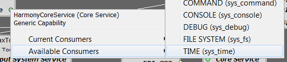

* On the **Time System Service** component, right click the **TMR** diamond icon, select **CORE_TIMER(core_timer)**.

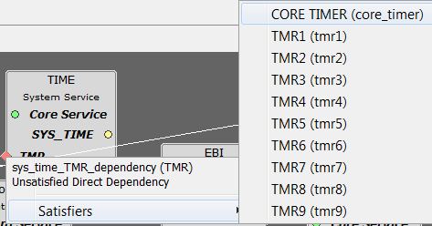

Because this is a GFX enabled application, you will need to select a graphics library. For this tutorial, we will use **Aria**. 

3. Under the bottom left tab, **Available Components**, expand **Graphics>Middleware**. Double click or drag and drop **Aria** to add the Aria graphics library to the project graph.

4. On the **Aria** component, right click the **GFX HAL** diamond icon, select **Satisfiers**, and select **GFX Core**.

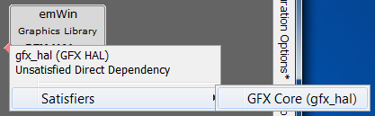

5. On the **GFX Core** component, right click the **Display Driver** diamond icon icon, select **Satisfiers**, and select **GLCD**.

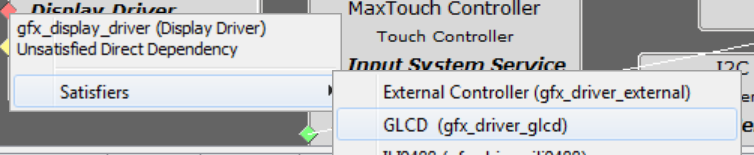

6. On the **GFX Core** component, right click **Graphics Display** diamond icon, select **Satisfiers**, and select **PDA TM4301B (gfx_disp_pdatm4301b_480x272)**.

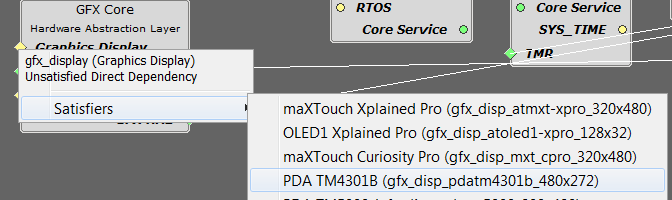

7. On the **PDA TM4301B** component, right click **Touch Panel** diamond icon, select **Consumers**, and select **MaXTouch Controller (gfx_maxtouch_controller)**.

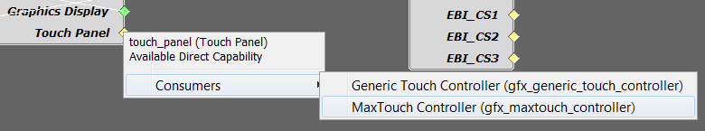

8. On the MaXTouch Controller component, right click **DRV_I2C** diamond icon, select **Satisfiers**, and select **I2C (drv_i2c)**.

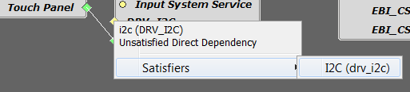

9. On the **MaXTouch Controller** component, right click **Input System Service** circle icon, select **Available Satisfiers**, and select **Input System Service (sys_input)**.

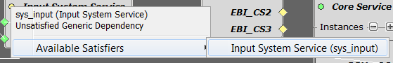

10. On the **I2C Driver** component, right click Input **I2C** diamond icon, select **Satisfiers**, and select **I2C1 (i2c1)**.

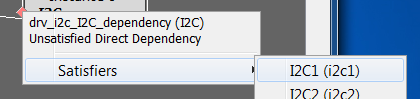

11.  Under the bottom left tab, **Available Components**, expand **Peripherals**. Double click or drag and drop **DDR** to add the DDR Peripheral Library to the project graph.

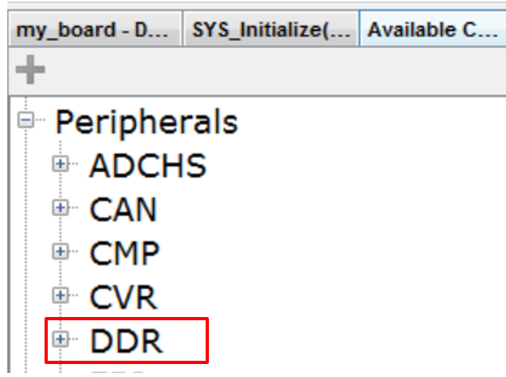

On completion, your **Project Graph** window should look similar to the following image:

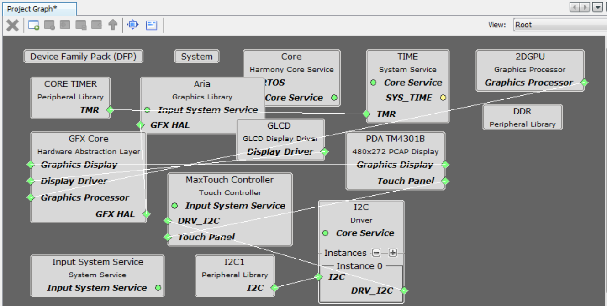

### Verify GLCD Settings

1. Select **GLCD ** component, then select **Configuration Options**.

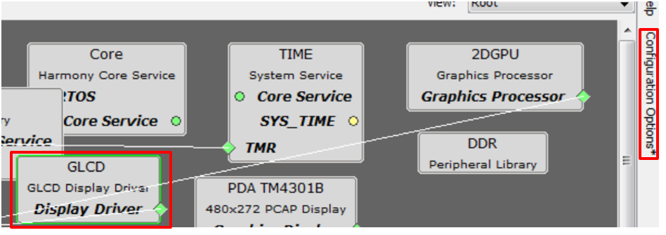

A new window, **Confoguration Options**, is opened in the project’s main window.

2. Verify that **Pixel Clock Divider** is set to 6. This will produce a Pixel Clock of 33MHz.

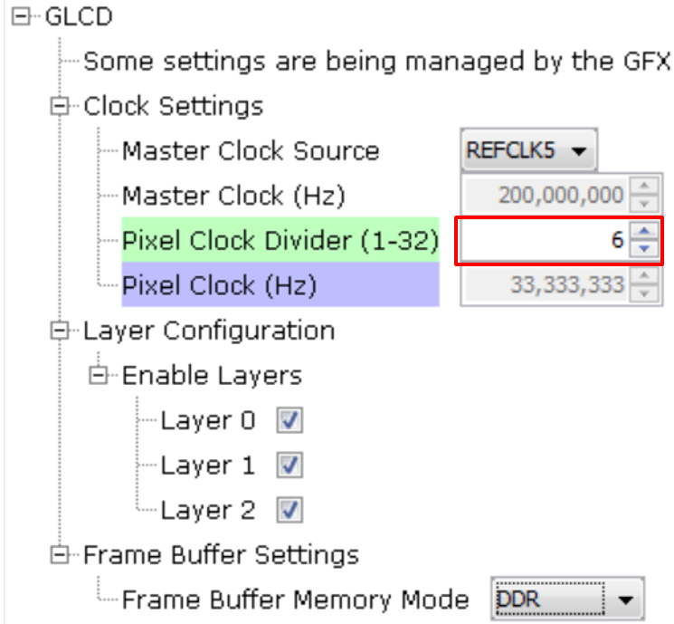

> **_NOTE:_** If your display requires a different pixel clock, you can change the divider using GLCD Configuration Options menu.

If the display timing needs to be configured, then you will need to launch **Display Manager**.  For this tutorial, Display Managing is not required. See Getting started with Display Manager for more information.

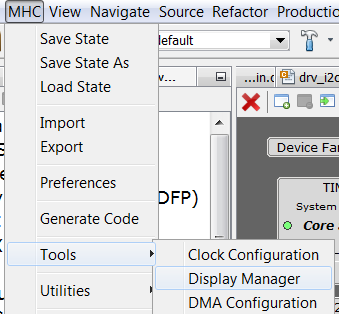

## Configure Hardware

In this step, you will need to connect the PIC32MZ DA to the external touch controller and display modules.

If you are using the MEB II board, please reference the Multimedia Expansion Board II schematics obtained from the [Multimedia Expansion Board II (MEB II) User's Guide](http://ww1.microchip.com/downloads/en/DeviceDoc/70005148B.pdf) and [PIC32MZ DA Family Starter Kit User's Guide](http://ww1.microchip.com/downloads/en/DeviceDoc/70005311A.pdf). 

> **_NOTE:_** If you are using a schematic for your custom board, map the required graphics pins to your board.

> **_NOTE:_** If you are using a schematic for your custom board, map the required graphics pins to your board.

The pin mapping table below is made available for convenience.

#### Required Pin Settings
| Ball/Pin Number | Pin ID| Name| Function|Direction|Latch|
| --- | --- | --- | --- | --- | --- | 
| B9| RB1 | BSP_MAXTOUCH_CHG | GPIO | In| |
| M11| RA14 | SCL1 | SCL1 ||
| N11| RA15 | SDA1 | SDA1 ||
| M3 | RE3| TM4301B_BACKLIGHT| GPIO| OUT| High|

1. Open the Pin Configuration tabs by clicking **MHC > Tools > Pin Configuration**.

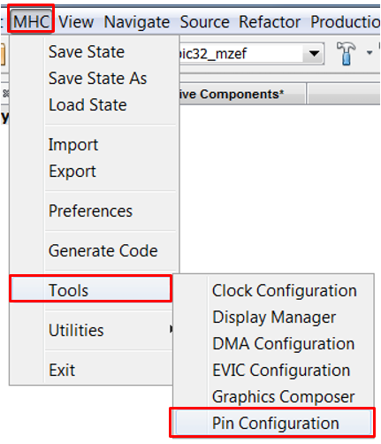

2. Select the MHC Pin Settings tab and sort the entries by Port names as shown below.

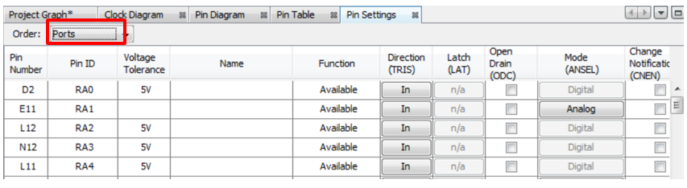

3. Use the table above to establish your Pin Settings.

##  Add application UI code to project

MPLAB Harmony Graphics Suite contains a **pre-build UI design** for verification purposes. Use **Graphics Composer** to insert the **Pre-Build UI Design** into your project.

Launch the **Graphics Composer** from the MHC/Tools Menu:

* When MHGC’s Welcome Dialog is displayed. Click the **Create a new project using the new project wizard** button.

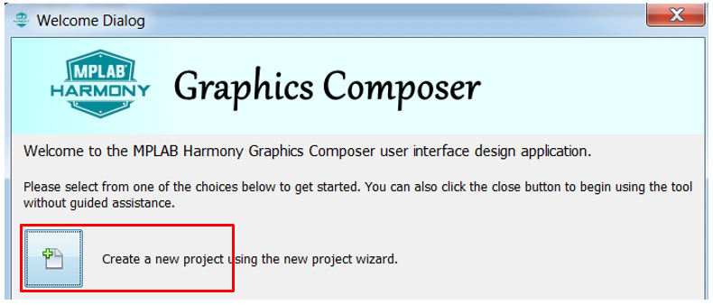

 If the Welcome Dialog does not appear, it is because it had been disabled previously.  The Welcome Dialog can be re-enabled by using MHGC’s File > Settings > General menu:

* In the MPLAB Harmony Graphics Composer (MHGC) screen use the left-most icon to create a new graphics design.

In the New Project Wizard, for the **Color Mode** step, 
* Select `RGB_565` 
* Click **NEXT**.

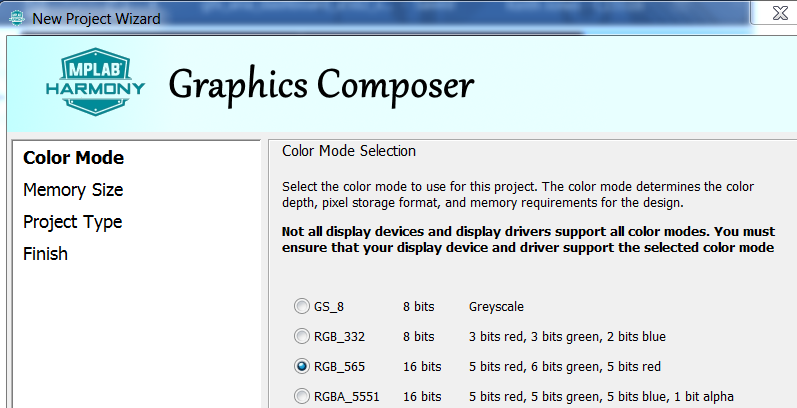

**Memory Size**

For the **Memory Size** step, accept the default Flash Memory Size and click **NEXT**. It is not recommended to change this setting for this tutorial.

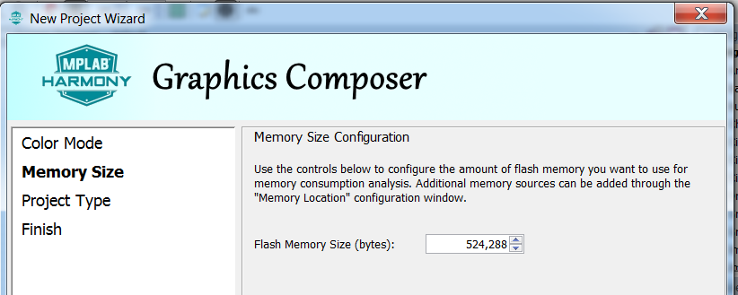

**Project Type**

For the **Project Type** step, chose the second option **create a new project using a basic template** and click **NEXT**.

The MHGC window will display the following image:

## Generate Code

1. When done, before generating code, click Save MHC State as shown below.

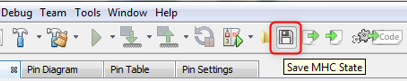

2. Save the configuration in its default location when prompted.

3. Generate the code as shown below.

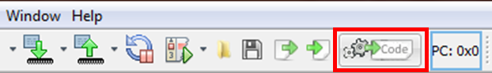

4. Click on the Generate button in the Generate Project window, keeping the default settings as shown below. If prompted for saving the configuration, click Save.

5. As the code is generated, MHC displays the progress as shown below.

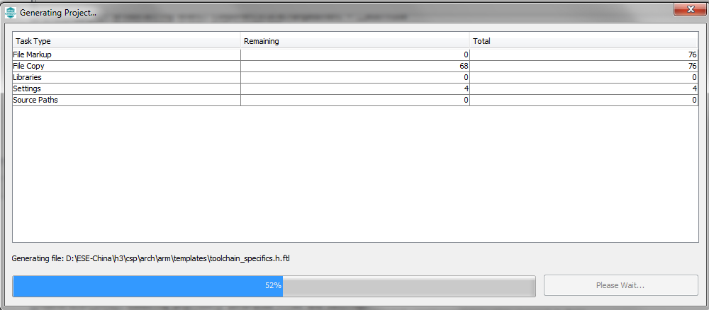

6. Examine the generated code.

MHC will include all the MPLAB Harmony library files and generate the code based on the MHC selections. The generated code would add files and folders to your Harmony project

7. Navigate to the Projects tab to view the project tree structure.

## Build, program and observe outputs

1. Connect the Type-A male to mini-B USB cable to micro-B DEBUG USB port to power and debug the PIC32MZ DA Starter Kit.

2. Go to **File > Project Properties** and make sure that the EDBG is selected as the debugger under the **Hardware Tools** and XC32 (v2.20) is selected as the **Compiler Toolchain** for XC32.

3. Clean and build your application by clicking on the **Clean and Build** button as shown below.

4. Program your application to the device, by clicking on the **Make and Program** button as shown below.

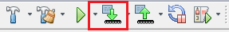

The application should build and program successfully. A compilation error could occur if a pin name is undefined. For example: 
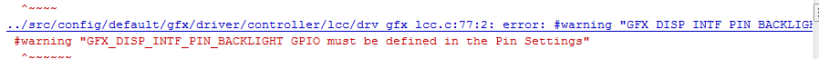 

The demonstration will display the following UI:

## Observations

You observed that the application displayed the home screen. You were able to change screens and control widgets.

## Review

You have successfully created an application using MPLAB Harmony v3 on PIC32MZ DA WQVGA. Your application used all the fundamental elements that go in building a graphics application. Your application successfully rendered a UI to the High-Performance 4.3" WQVGA Display Module. The application also took user from the display module.

In this application, you used MPLAB® Harmony Configurator (MHC) to configure PIC32MZ DA WQVGA. You used MHC to add and connect components. You used Pin Configurator to set up the pins for display and maxTouch controller.

## Summary

This guide provided you training of configuring and using all the fundamental components needed to build a graphics application on a Multimedia Expansion Board II with PIC32MZ DA WQVGA using MPLAB Harmony v3 Framework. As a next step, you may customize this application and reconfigure some of the components used in this tutorial. You could also add new components (PLIBs, etc.) to enhance this application to realize your end application.

***

**Is this page helpful**? Send [feedback](issues).
