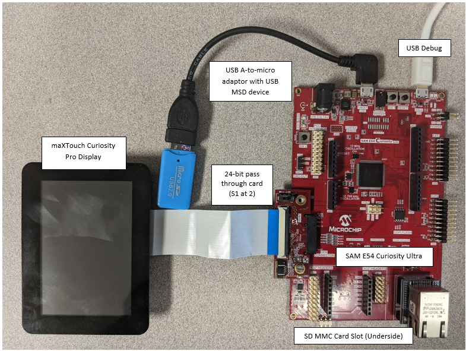
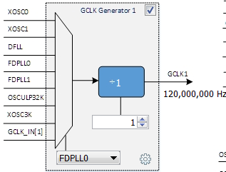
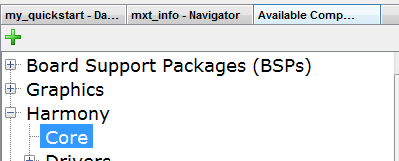
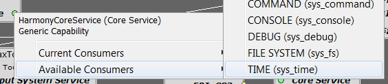
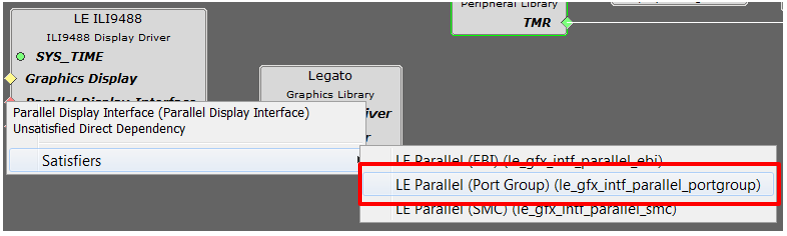
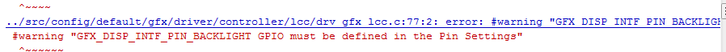
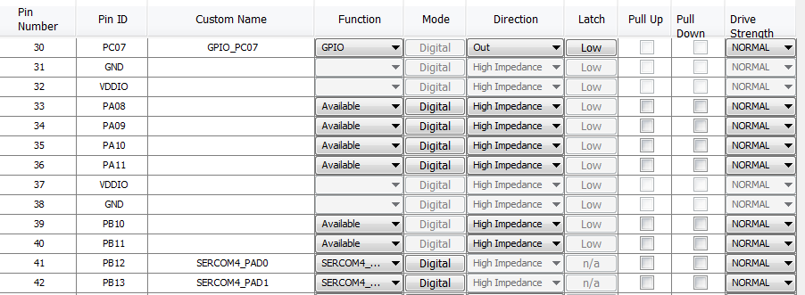
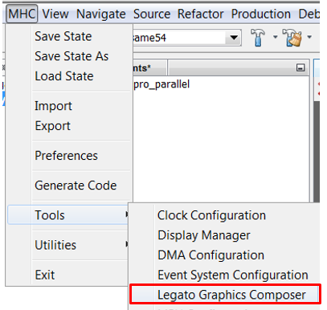
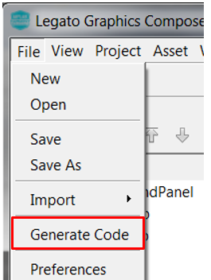
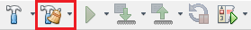

#  QuickStart on SAM E54 Curiosity Ultra Evaluation Kit with Curiosity Pro Board

This guide describes the basic steps to create a graphics-enabled application.

### <b>Who should use this guide</b>

This guide is intended for developers who are building applications on a custom SAM E54 board similar to or the same as the [SAM E54 Curiosity Ultra Evaluation Kit](https://www.microchip.com/Developmenttools/ProductDetails/DM320210) and the [ maxTouch Curiosity Pro (AC320007)](https://www.microchip.com/Developmenttools/ProductDetails/AC320007) display.

### <b>What you will build</b>

You will build a simple application that displays an image, text, and touch button. It starts with the creation of a new MPLAB® project and finishes with a graphics application equivalent to legato_quickstart.

### <b>What you will see</b>

The demonstration will render the following image on the display:

# Contents

The following bullets detail the steps necessary to create a solution for your board.

* Get Materials
* Create a new project
* Configure Software with MHC 
* Create UI Design with Legato Composer
* Save Project
* Generate, Build, and Run

## Get Materials

Before you begin this quick start, make sure you have what you will need. The Microchip development documentation and hardware provides a basic foundation that we will use as a reference for your SAM E54 design.

|Hardware|Description|
|----|----|
| [SAM E54 Curiosity Ultra Evaluation Kit](https://www.microchip.com/Developmenttools/ProductDetails/DM320210)| Development Board |
| [maxTouch Curiosity Pro (AC320007)](https://www.microchip.com/Developmenttools/ProductDetails/AC320007) | maXTouch® Curiosity Pro |
| Standard USB A to micro-B cable| PC debugging connector |

|Documentation|Description|
|----|----|
|[SAM E54 Curiosity Ultra User's Guide](http://ww1.microchip.com/downloads/en/DeviceDoc/SAME54_Curiosity_Ultra_Users_Guide_DS70005405A.pdf) | User Guide with Schematics|
|[maXTouch Curiosity Pro Users Guide](http://ww1.microchip.com/downloads/en/DeviceDoc/maXTouch_Curiosity_Pro_Users_Guide_DS70005414B.pdf)|User Guide with Schematics|

> **_NOTE:_** The SAM E54 Curiosity Ultra Evaluation Kit includes an on-board Embedded Debugger (EDBG), which requires no additional hardware to get started. For programming/debugging, the EDBG connects to the host PC through the USB micro-B connector on the SAM E54 Curiosity Ultra Evaluation Kit.

|Software|Description|Install|
|----|----|----|
| [MPLAB® X Integrated Development Environment ](https://www.microchip.com/mplab/mplab-x-ide)| v5.15 or later| [Install MPLAB IDE](https://microchipdeveloper.com/install:mplabx) |
| [MPLAB® XC32/32++ C Compiler](https://www.microchip.com/mplab/compilers) | v2.20 or later | [Install Compiler](https://microchipdeveloper.com/install:xc32)|
| [MPLAB® Harmony 3 ](https://github.com/Microchip-MPLAB-Harmony/mhc/wiki)| v3.5 or later | [Install Harmony v3](https://microchipdeveloper.com/harmony3:mhc-overview#install)|

> **_NOTE:_** This project has been verified to work with the following versions of software tools:
MPLAB X IDE v5.40, MPLAB XC32 Compiler v2.41, MPLAB Harmony Graphics v3.7.0

> **_NOTE:_** Because we regularly update our tools, occasionally you may discover an issue while using the newer versions. If you suspect that to be the case, we recommend that you use the same versions that the project was tested with.

### Hardware Setup

Configure the hardware as follows: 

* Attach the **24-bit pass through card** to the **GFX Connector** on the **SAM E54 Curiosity Ultra board**. 
* Connect the **ribbon cable** from the **maXTouch Curiosity Pro Display** to the **ribbon connector** on the **24-bit pass through card**. Make sure that the **S1 switch** on the **24-bit pass through card** is set to **2**. 
* On the backside of the maXTouch Curiosity Pro display, set the **IM[2:0]** switches to **011** for 8-bit MCU mode. 
* Connect a **USB cable** from the host computer to the **DEBUG USB port** on the **SAM E54 Curiosity Ultra** board. This USB connection is used for power, code download and debugging. 
* Optionally, connect **5.5V power supply** to the **SAM E54 Curiosity Ultra board**.  

The final hardware setup should be (ignore USB MSD and SD MMC): 

## Create a new project

1. Launch the **New Project** wizard. Select **File > New Project** from the main IDE menu.

2. In the **Categories** pane of the **New Project** dialog, select **Microchip Embedded**. In the **Projects** pane, select **32-bit MPLAB Harmony 3 Project**, then click **Next**.

> **_NOTE:_** If **32-Bit MPLAB Harmony 3 Project** selection is not displayed, [Download MPLAB Harmony Framework](https://microchipdeveloper.com/harmony3:mhc-overview#download).

3. In the **Framework Path** field, browse to the folder you downloaded the framework. If you haven't done this, or want to download it to a different folder, click the **Launch Framework Downloader** button, then click **Next**.

> **_NOTE:_**  For more information on the framework downloader, see the, [Download MPLAB Harmony Framework](https://microchipdeveloper.com/harmony3:mhc-overview#download) section of the "MPLAB® Harmony Configurator Overview" page.

4. In the **Project Settings** window, apply the following settings:

    * Set **Location** field. This field idicates the path to the root folder of the new project. All project files will be placed inside this folder. The project location can be any valid path, for example: **C:\microchip\harmony\v3**.
    * Set **Folder** field: This field indicates the name of the MPLABX .X folder. Enter **same54** to create a **same54.X** folder.
    * Set **Name** field: Enter the project’s logical name as **my_board**. This is the name that will be shown from within the MPLAB X IDE.
    * Click **Next** to proceed to Configuration Settings.

> **_NOTE:_**  This must be a valid directory name for your operating system. The Path box is read-only. It will update as you make changes to the other entries.

5. Follow the steps below to set the project’s **Configuration Settings**.

    * Set **Name** field: Enter the configuration name as **same54**.
    * Set **Target Device** field: Select **ATSAME54P20A** as the target device.
    * Click **Finish** to launch the MHC.

> **_NOTE:_** You can select the Device Family or enter a partial device name to filter the list in Target Device in order to make it easier to locate the desired device.

* When **Finish** is clicked, the following message may be displayed while the configuration database setup dialog is loaded.

6. **Configuration Database Setup.**
* Click **Launch**.

7. The MHC plugin’s main window for the project will be displayed. This is the initial project graph.

8. Before proceeding, set up the compiler toolchain. Click on the **Projects** tab on the top left pane. Right click on the project name **my_board** and go to **Properties**.

Make sure that XC32 (v2.20) is selected as the Compiler Toolchain for XC32. Click on **Apply** and then click on **OK**.

### Verify Clock Settings

1. Launch **Clock Diagram** by going to **MHC** tab in MPLABX IDE and then select **Tools > Clock Configuration**.

A new tab, **Clock Diagram**, is opened in the project’s main window. Click on the **Clock Easy View** tab.

2. Verify that the **Main Clock** is set to 120MHz.

3. Verify that **GCLK1** is set to 120MHz.

## Configure Software with MHC

* Configure pins 
    * Connect to external graphics communication
* Create a UI design
* Save Project
* Generate, Build, and Run

### Load Software Components

1. Because this is a Harmony based application, you will need to use the **Harmony Core Service** Component.

Under the bottom left tab, **Available Components**, expand **Harmony**.
Double click or drag and drop **Core** to add the **Harmony Core Service** to the project graph. When prompted to activate **FreeRTOS**, click **No**.

2. You will also need the **Time System Service**. Two timers will be used for maXTouch and display interface.

> **_NOTE:_** Harmony components lists Current Consumers and Available Consumers when a right click occurs on the circle icons.

* On the **Harmony Core Service** component, right click the Core Service icon on Harmony Core Service component, select **Available Consumers**, then select **TIME**.

* On the **Time System Service** component, right click the **TMR** icon, select **TC0 (tc0)**.This will automatically spawn the peripheral timer component **TC0** onto the graph.

* Under the bottom left tab, **Available Components**, expand **Peripherals/TC**. Double click or drag and drop **TC4** to add the **TC4** peripheral timer to the project graph.

Because this is a GFX enabled application, you will need to select a graphics library. For this tutorial, we will use **Legato**.

3. Under the bottom left tab, **Available Components**, expand **Graphics>Middleware**. Double click or drag and drop **Legato** to add the Legato graphics library to the project graph.

4. On the Legato component, right click the **LE Display Driver**, select **Satisfiers**, and select **LE External Controller**.

5. On the **Confirm Component Auto-Activation** dialog, click **Yes** to activate the **GFX Core LE** component.

6. On the **LE External Controller** component, right click **Parallel Display Interface**, select **Satisfiers**, and select **LE Parallel (Port Group)**.

7. On the **LE Parallel (Port Group)** component, right click

8. On the **LE External Controller** component, right click **Graphics Display**, select **Satisfiers**, and select **maXTouch Curiosity Pro**.

9. On the **maXTouch Curiosity Pro** component, right click **Touch Pane**l diamond icon, select **Consumers**, and select **MaXTouch Controller (gfx_maxtouch_controller)**.

10. On the MaXTouch Controller component, right click **DRV_I2C** diamond icon, select **Satisfiers**, and select **I2C (drv_i2c)**.

11. On the **MaXTouch Controller** component, right click **Input System Service** circle icon, select **Available Satisfiers**, and select **Input System Service (sys_input)**.

12. On the **I2C Driver** component, right click Input **I2C** diamond icon, select **Satisfiers**, and select **SERCOM4(sercom4)**.

13. Under the bottom left tab, **Available Components**, expand **Peripherals>CCL**. Double click or drag and drop **CCL** to add the **CCL** component to the project graph.

On completion, your **Project Graph** window should look similar to the following image:

## Configure Software Components

### NVMCTRL

Click on **NVMCTRL** component to view the Configuration Options. Use the default options.

Click on **EVSYS** component to view the Configuration Options. Ensure **EVSYS MODULE SETTINGS** and **EVSYS User SETTINGS** options are set as follows:

Click on **System** component to view the Configuration Options. Ensure **DMA(DMAC)** options are set as follows:

Click on **CCL** component to view the Configuration Options. Ensure **CCL** options are set as follows:

Click on **LE External Controller** component to view the **Configuration Options**. Set he options to change **Base Driver** to **ILI9488**. Ensure **LE External Controller** options are set as follows:

Click on **TC0** component to view the Configuration Options. Ensure **TC0** options are set as follows:

Click on **LE Parallel** component to view the Configuration Options. Ensure **LE Parallel** options are set as follows:

Click on **TC1** component to view the Configuration Options. Ensure **TC1** options are set as follows:

Click on **TC4** component to view the Configuration Options. Ensure **TC4** options are set as follows:

Click on **SERCOM4** component to view the Configuration Options. Ensure **SERCOM4** options are set as follows:

## Configure Software/Hardware Pins

If you are using the SAM E54 Curiosity Ultra Evaluation Kit, please reference the Curiosity SAM E54 Curiosity Ultra Evaluation Kit schematic obtained from the [SAM E54 Curiosity Ultra User's Guide](http://ww1.microchip.com/downloads/en/devicedoc/70005321a.pdf).

> **_NOTE:_** If you are using a schematic for your custom board, map the required graphics pins to your board.

> **_NOTE:_** the drivers require specific names for its pins. If you do not have the correct pin names a compiler output will display an error along with the expected name.

The pin mapping table below is made available for convenience.

 A compilation error could occur if a pin name is undefined. For example:
. 

1. Open the Pin Configuration tabs by clicking **MHC > Tools > Pin Configuration**.

2. Use the images below to establish your Pin Settings.

##  Create UI Design with Legato Composer

Launch **Legato Graphics Composer** from the **MHC->Tools->Legato Graphics Composer** Menu:

On the **Welcome Dialog**, select **Create a new project using the new project wizard**. Follow the step-by-step guided menus. 

Create a template design by following the steps in the [How to Create a Simple Design Using the Project Wizard](How-to-Use-New-Project-Wizard) guide.
Make sure to set display resolution to **Width**: **320** and **Height**: **480**, **Color Mode**: **RGB565**, **Memory Profile**: **M4**.  

Click **Start with a basic quickstart project template** to automatically create a UI design. 

Reposition the widgets to match the screen orientation.

## Save and Generate Legato Composer Design

1. Save the Legato Composer UI Configuration. Click **File -> Save**.

2. When done, Generate Legato composer project files. Click **File -> Generate Code** as shown below.  This will generate the UI design and the necessary Legato Graphics files.  Harmony files such as peripheral libaries, system services, and drivers are generated via the MHC code generate in the steps to follow.

## Save and Generate Harmony Project

1. When done, before generating code, click **Save MHC State** as shown below.

2. Save the configuration in its default location when prompted.

3. Generate the code as shown below.

Click on the Generate button in the Generate Project window, keeping the default settings as shown below. If prompted for saving the configuration, click Save.

4. As the code is generated, MHC displays the progress as shown below.

5. Examine the generated code.

MHC will include all the MPLAB Harmony library files and generate the code based on the MHC selections. The generated code would add files and folders to your Harmony project

6. Navigate to the Projects tab to view the project tree structure.

## Build, program and observe outputs

Power up the board by connecting the power adapter to power connector or a powered USB cable to the DEBUG USB port on the board. 
1. Connect the Type-A male to mini-B USB cable to micro-B DEBUG USB port to power and debug the SAM E54 board.

2. Go to **File > Project Properties** and make sure that the EDBG is selected as the debugger under the **Hardware Tools** and XC32 (v2.20 or later) is selected as the **Compiler Toolchain** for XC32.

3. Clean and build your application by clicking on the **Clean and Build** button as shown below.

4. Program your application to the device, by clicking on the **Make and Program** button as shown below.

The application should build and program successfully.

The demonstration will display the following UI:

## Troubleshooting

If you do not see an image on the  display, review the tutorials steps. Take time to inspect the component Configuration Options and Pin Settings.

## Review

In this tutorial, you used MPLAB® Harmony Configurator (MHC) to create a new MPLABX project and configure it for the SAM E54 with Curiosity Ultra Board. You used MHC to add and connect components. You used Pin Configurator to set up the pins for display and maxTouch controller. You also used Legato composer to create a simple UI design.

## Summary

In this guide you learn the fundamental steps to create a graphics solution for your SAM E54 board using MPLAB Harmony V3 Framework. You learned how to access documentation and reference development boards, how to create a new project, how to use MHC to load and configure software, and how use Legato composer to create a UI design.

***

**Is this page helpful**? Send [feedback](issues).