#  QuickStart on SAME54 Xplained Pro Evaluation Kit with Curiosity Pro Board

This guide describes the basic steps to create a graphics-enabled application using the
[SAM E54 Xplained Ultra Evaluation Kit](https://www.microchip.com/developmenttools/ProductDetails/PartNO/ATSAME54-XPRO) connected to a [maxTouch Curiosity Pro](https://www.microchip.com/Developmenttools/ProductDetails/AC320007) display. You will build a simple application that displays an image and touch button. It starts with the creation of a new MPLAB® project and finishes with a graphics application equivalent to legato_quickstart.

The demonstration will render the following image on the display:

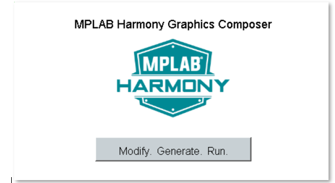

Who should use this guide

This guide is intended for developers who are building applications on a custom SAME54 board similar to or the same as the [SAM E54 Xplained Ultra Evaluation Kit](https://www.microchip.com/developmenttools/ProductDetails/PartNO/ATSAME54-XPRO) and the [ maxTouch Curiosity Pro (AC320007)](https://www.microchip.com/Developmenttools/ProductDetails/AC320007).

What this guide contains

You will build a simple application that displays an image and touch button. It starts with the creation of a new MPLAB® project and finishes with a graphics application equivalent to legato_quickstart. Here are the primary steps to create a graphics application for your SAME54 hardware:

1. Create a new project and configure clock for SAME54 .
    *  Create MPLAB Harmony v3 Project using MPLAB X IDE
    *  Verify Clock Settings
2. Configure Harmony components for graphics middleware and drivers
3. Configure pins for external graphics communication
4. Generate Code
5. Add application code to project
6. Build, program and observe outputs

Materials you will need

## Documentation

|Documentation|Description|
|----|----|
|[SAM E54 Xplained Ultra User's Guide](http://ww1.microchip.com/downloads/en/devicedoc/70005321a.pdf) | User Guide with Schematics|
|[maXTouch Curiosity Pro Users Guide](http://ww1.microchip.com/downloads/en/DeviceDoc/maXTouch_Curiosity_Pro_Users_Guide_DS70005414B.pdf)|User Guide with Schematics|

## Hardware

|Hardware|Description|
|----|----|
| [SAM E54 Xplained Ultra Evaluation Kit](https://www.microchip.com/DevelopmentTools/ProductDetails/PartNO/DM320113)| Development Board |
| [maxTouch Curiosity Pro (AC320007](https://www.microchip.com/Developmenttools/ProductDetails/AC320007) | maXTouch® Curiosity Pro |
| Standard USB A to micro-B cable| PC debugging connector |

> **_NOTE:_** The SAM E54 Xplained Ultra Evaluation Kit includes an on-board Embedded Debugger (EDBG), which requires no additional hardware to get started. For programming/debugging, the EDBG connects to the host PC through the USB micro-B connector on the SAM E54 Xplained Ultra Evaluation Kit.

Hardware Setup

SAM E54 Xplained Ultra Evaluation Kit is connected to the display using the display ribbon cable. Programming is a board to PC link using a standard USB A to micro-B cable. The connection, illustrated below, provides power and debug communication.

 The board and display are powered by a Micro B – USB A cable from PC to the “USB Debug” port on the SAM E54 Xplained Ultra Evaluation Kit.

## Software

|Software|Description|Install|
|----|----|----|
| [MPLAB® X Integrated Development Environment ](https://www.microchip.com/mplab/mplab-x-ide)| v5.15 or later| [Install MPLAB IDE](https://microchipdeveloper.com/install:mplabx) |
| [MPLAB® XC32/32++ C Compiler](https://www.microchip.com/mplab/compilers) | v2.20 or later | [Install Compiler](https://microchipdeveloper.com/install:xc32)|
| [MPLAB® Harmony 3 ](https://github.com/Microchip-MPLAB-Harmony/mhc/wiki)| v3.5 or later | [Install Harmony v3](https://microchipdeveloper.com/harmony3:mhc-overview#install)|

> **_NOTE:_** This project has been verified to work with the following versions of software tools:
MPLAB X IDE v5.20, MPLAB XC32 Compiler v2.20, MPLAB Harmony v3.6.0

> **_NOTE:_** Because we regularly update our tools, occasionally you may discover an issue while using the newer versions. If you suspect that to be the case, we recommend that you use the same versions that the project was tested with.

# QuickStart steps

## Create a new MPLAB Harmony v3 project

1. Select **File > New Project** from the main IDE menu.

2. In the **Categories** pane of the **New Project** dialog, select **Microchip Embedded**. In the **Projects** pane, select **32-bit MPLAB Harmony 3 Project**, then click **Next**.

> **_NOTE:_** If **32-Bit MPLAB Harmony 3 Project** selection is not displayed, [Download MPLAB Harmony Framework](https://microchipdeveloper.com/harmony3:mhc-overview#download).

3. In the **Framework Path** edit box, browse to the folder you downloaded the framework to. If you haven't done this, or want to download it to a different folder, click the **Launch Framework Downloader** button, then click **Next**.

> **_NOTE:_**  For more information on the framework downloader, see the, [Download MPLAB Harmony Framework](https://microchipdeveloper.com/harmony3:mhc-overview#download) section of the "MPLAB® Harmony Configurator Overview" page.

4. In the **Project Settings** window, apply the following settings:

    * **Location**: Indicates the path to the root folder of the new project. All project files will be placed inside this folder. The project location can be any valid path, for example: `C:\microchip\harmony\v3`.
    * **Folder**: Indicates the name of the MPLABX .X folder. Enter `same54` to create a **same54.X** folder.
    * **Name**: Enter the project’s logical name as `my_board`. This is the name that will be shown from within the MPLAB X IDE.
    * Click **Next** to proceed to Configuration Settings.

> **_NOTE:_**  This must be a valid directory name for your operating system. The Path box is read-only. It will update as you make changes to the other entries.

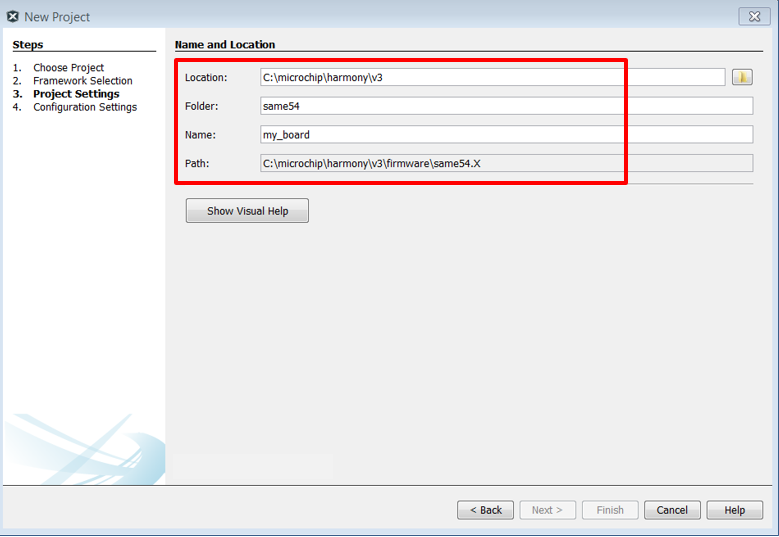

5. Follow the steps below to set the project’s Configuration Settings.

    * **Name**: Enter the configuration name as `same54`.
    * **Target Device**: Select `ATSAME54P20A` as the target device.
    * Click **Finish** to launch the MHC.

> **_NOTE:_** You can select the Device Family or enter a partial device name to filter the list in Target Device in order to make it easier to locate the desired device.

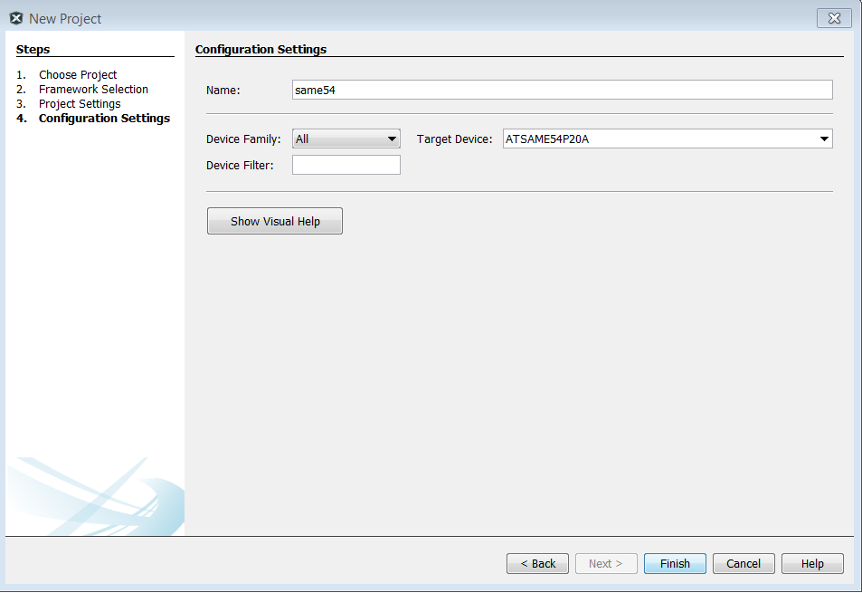

* When **Finish** is clicked, the following message may be displayed while the configuration database setup dialog is loaded.

6. **Configuration Database Setup.**
* Click **Launch**.

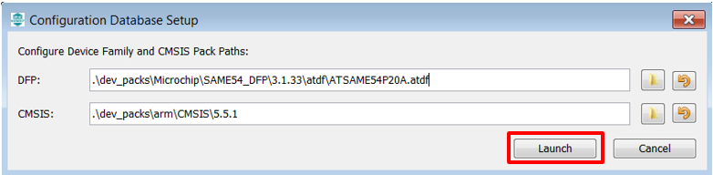

* **Launching MPLAB Harmony Configurator**. The following message will be displayed while the project is loaded into MPLAB X.

7. The MHC plugin’s main window for the project will be displayed. This is the initial project graph.

8. Before proceeding, set up the compiler toolchain. Click on the **Projects** tab on the top left pane. Right click on the project name **my_board** and go to **Properties**.

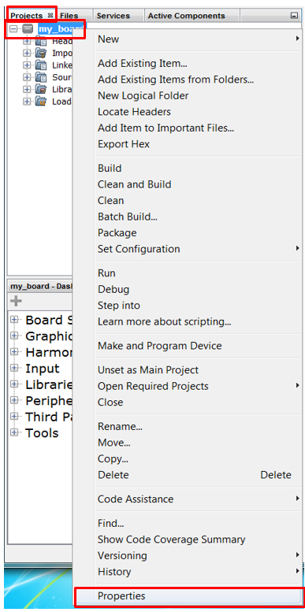

Make sure that XC32 (v2.20) is selected as the Compiler Toolchain for XC32. Click on **Apply** and then click on **OK**.

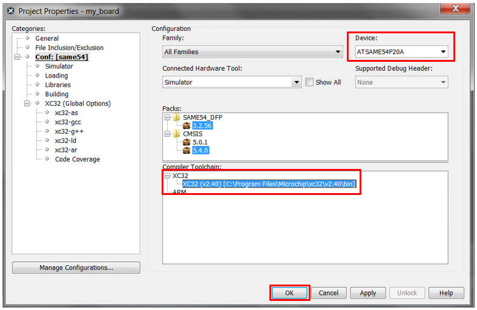

## Verify Clock Settings

1. Launch **Clock Diagram** by going to **MHC** tab in MPLABX IDE and then select **Tools > Clock Configuration**.

A new tab, **Clock Diagram**, is opened in the project’s main window. Click on the **Clock Easy View** tab

2. Verify that the **Main Clock** is set to 120MHz.

3. Verify that **GCLK1** is set to 120MHz.

## Configure Software

1. Because this is a Harmony based application, you will need to use the **Harmony Core Service** Component.

Under the bottom left tab, **Available Components**, expand **Harmony**.
Double click or drag and drop **Core** to add the **Harmony Core Service** to the project graph. When prompted to activate **FreeRTOS**, click **No**.

2. You will also need the **Time System Service**. Two timers will be used for maXTouch and display interface.

> **_NOTE:_** Harmony components lists Current Consumers and Available Consumers when a right click occurs on the circle icons.

* On the **Harmony Core Service** component, right click the Core Service icon on Harmony Core Service component, select **Available Consumers**, then select **TIME**.

* On the **Time System Service** component, right click the **TMR** icon, select **CORE_TIMER(core_timer)**.

* Under the bottom left tab, **Available Components**, expand **Peripherals/TC**. Double click or drag and drop **TC4** to add the **TC4** peripheral to the project graph.

Because this is a GFX enabled application, you will need to select a graphics library. For this tutorial, we will use **Legato**.

3. Under the bottom left tab, **Available Components**, expand **Graphics>Middleware**. Double click or drag and drop `Legato` to add the **Legato** graphics library to the project graph.

4. On the Legato component, right click the **LE Display Driver**, select **Satisfiers**, and select **LE ILI9488**.

5. On the **Confirm Component Auto-Activation** dialog, click **YES** to activate the **GFX Core LE** component.

6. On the **LE ILI9488** component, right click **Parallel Display Interface**, select **Satisfiers**, and select **LE Parallel (Port Group)**.

7. On the **LE ILI9488** component, right click **Graphics Display**, select **Satisfiers**, and select **maXTouch Curiosity Pro**.

8. On the **maXTouch Curiosity Pro** component, right click **Touch Pane**l diamond icon, select **Consumers**, and select **MaXTouch Controller (gfx_maxtouch_controller)**.

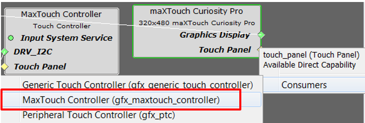

9. On the MaXTouch Controller component, right click **DRV_I2C** diamond icon, select **Satisfiers**, and select **I2C (drv_i2c)**.

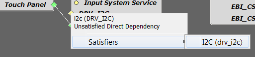

10. On the **MaXTouch Controller** component, right click **Input System Service** circle icon, select **Available Satisfiers**, and select **Input System Service (sys_input)**.

11. On the **I2C Driver** component, right click Input **I2C** diamond icon, select **Satisfiers**, and select **SERCOM4(sercom4)**.

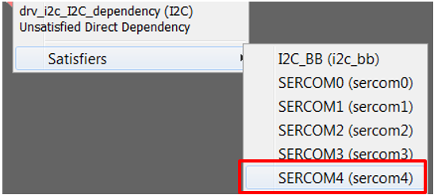

12. Under the bottom left tab, **Available Components**, expand **Peripherals>CCL**. Double click or drag and drop **CCL** to add the **CCL** component to the project graph.

On completion, your **Project Graph** window should look similar to the following image:

## Configure Components

### NVMCTRL

Click on **NVMCTRL** component to view the Configuration Options. Use the default options.

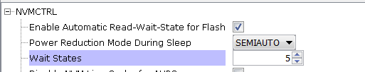

Click on **EVSYS** component to view the Configuration Options. Ensure **EVSYS MODULE SETTINGS** and **EVSYS User SETTINGS** options are set as follows:

Click on **System** component to view the Configuration Options. Ensure **DMA(DMAC)** options are set as follows:

Click on **CCL** component to view the Configuration Options. Ensure **CCL** options are set as follows:

Click on **LE ILI9488** component to view the Configuration Options. Ensure **LE ILI9488** options are set as follows:

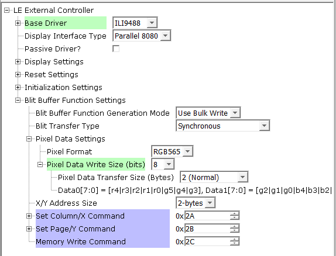

Click on **TC4** component to view the Configuration Options. Ensure **TC4** options are set as follows:

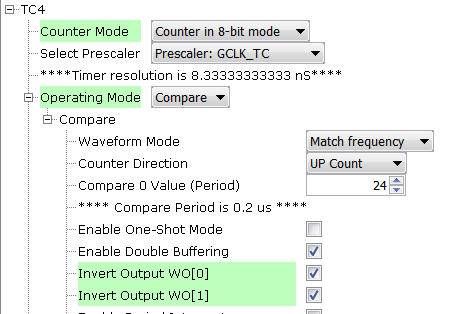

Click on **LE Parallel** component to view the Configuration Options. Ensure **LE Parallel** options are set as follows:

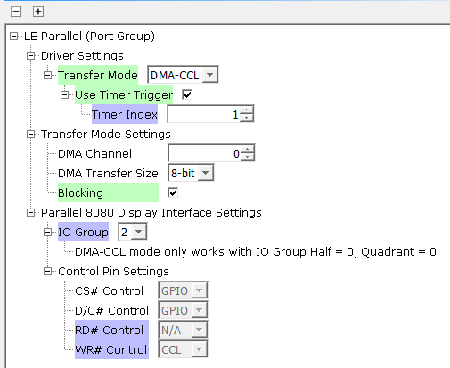

Click on **SERCOM4** component to view the Configuration Options. Ensure **SERCOM4** options are set as follows:

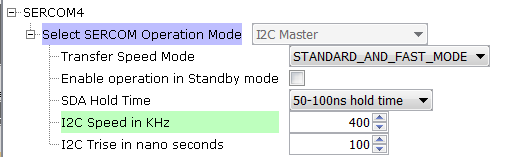

## Configure Pins

If you are using the SAME54 Xplained Pro Evaluation Kit, please reference the Curiosity SAME54 Xplained Pro Evaluation Kit schematic obtained from the [SAM E70 Xplained Ultra User's Guide](http://ww1.microchip.com/downloads/en/DeviceDoc/SAME70_Xplained_Ultra_Evaluation_User's%20Guide_DS70005389B.pdf).

> **_NOTE:_** If you are using a schematic for your custom board, map the required graphics pins to your board.

> **_NOTE:_** the drv_maxtouch and drv_ili94888 drivers require specific names for its pins. If you do not have the correct pin names a compiler output will display an error along with the expected name.

The pin mapping table below is made available for convenience.

1. Open the Pin Configuration tabs by clicking **MHC > Tools > Pin Configuration**.

2. Use the images below to establish your Pin Settings.

##  Add application UI code to project

Launch **Legato Graphics Composer** from the MHC/Tools Menu:

On the **Welcome Dialog**, select `Load`

Use the existing design at the following location:

*  <_harmony_root_>`\gfx\apps\legato_quickstart\firmware\src\config\ili9488_rgb565_e54_cult_parallel\ili9488_rgb565_e54_cult_parallel_design.zip`

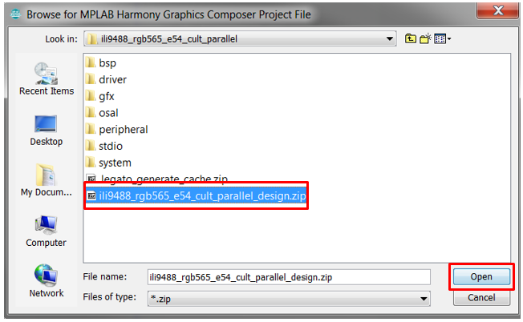

## Generate Code

1. When done, before generating code, click **Save MHC State** as shown below.

2. Save the configuration in its default location when prompted.

3. Generate the code as shown below.

4. Click on the Generate button in the Generate Project window, keeping the default settings as shown below. If prompted for saving the configuration, click Save.

5. As the code is generated, MHC displays the progress as shown below.

6. Examine the generated code.

MHC will include all the MPLAB Harmony library files and generate the code based on the MHC selections. The generated code would add files and folders to your Harmony project

7. Navigate to the Projects tab to view the project tree structure.

## Build, program and observe outputs

1. Connect the Type-A male to mini-B USB cable to micro-B DEBUG USB port to power and debug the SAME54 board.

2. Go to **File > Project Properties** and make sure that the EDBG is selected as the debugger under the **Hardware Tools** and XC32 (v2.20) is selected as the **Compiler Toolchain** for XC32.

3. Clean and build your application by clicking on the **Clean and Build** button as shown below.

4. Program your application to the device, by clicking on the **Make and Program** button as shown below.

The application should build and program successfully. A compilation error could occur if a pin name is undefined. For example:

The demonstration will display the following UI:

## Observations

You observed that the application displayed the home screen. You were able to change screens and control widgets.

## Review

You have successfully created an application using MPLAB Harmony v3 on SAME54 with Curiosity Pro Board. Your application used all the fundamental elements that go in building a graphics application. Your application successfully rendered a UI to the Curiosity Pro Board. The application also took user from the display module.

In this application, you used MPLAB® Harmony Configurator (MHC) to configure SAME54 with Curiosity Pro Board. You used MHC to add and connect components. You used Pin Configurator to set up the pins for display and maxTouch controller.

## Summary

This guide provided you training of configuring and using all the fundamental components needed to build a graphics application on a SAME54 with Curiosity Pro Boardusing MPLAB Harmony v3 Framework. As a next step, you may customize this application and reconfigure some of the components used in this tutorial. You could also add new components (PLIBs, etc.) to enhance this application to realize your end application.

***

**Is this page helpful**? Send [feedback](https://github.com/Microchip-MPLAB-Harmony/gfx/issues).
