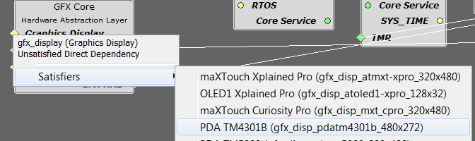
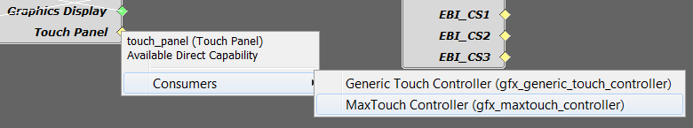

#  **Quickstart Board Support Application**

A MPLAB Harmony Graphics Suite board support application is a application or project that contains software that is configured to run on a specific hardware graphics platform. Every graphics hardware platform has a display. The software established using MPLAB Harmony Configurator.

## What is board support?

For Harmony graphics, board support is a combination of the required hardware-specifc macros, middleware, drivers, libraries and pin configuration sufficient enough to render graphics onto the display.

For applications running on Microchip [supported graphics development boards](https://github.com/Microchip-MPLAB-Harmony/gfx/wiki/Supported-Development-Boards), **Board Support Packages (BSPs)** and **Templates** components are used to automatically establish a board support. These components are designed requiring minimal user input to configure the project specific to the supported graphics development board schematic.

The schematic used to create the BSP and Template for the SAM E70 Xplained Ultra Evaluation kit is found in the [SAM E70 Xplained Ultra User's Guide](http://ww1.microchip.com/downloads/en/DeviceDoc/SAME70_Xplained_Ultra_Evaluation_User's%20Guide_DS70005389B.pdf).

## When is a board support needed?

A board support is needed after creating a new or modifying an existing hardware design. Our developers create a BSP and graphics template for any new graphics development kit or display. Whether you're creating or modifying a board you will need to use MHC along with a schematic to establish the support and generate the appropriate code.

## What if I am using my custom board?

If you are using a non-supported board (your custom board), you will need to create your board support manually using your schematic. Schematics are the key to designing, building, and troubleshooting your graphics board support application. Understanding how to read and follow schematics is required when creating your board support.

> **_NOTE:_** Please reference a hardware platform in [Build New Application](Build-a-New-Application) to understand how Microchip applications establishes a board support without using a BSP or graphics template.
 
## Requirements

Before you begin you must have the following tools:

* [MPLAB X IDE](https://microchipdeveloper.com/mplabx:installation)
* [XC32 C compiler](https://microchipdeveloper.com/xc32:installation)
* [MPLAB® Harmony v3](https://microchipdeveloper.com/harmony3:mhc-overview)
* [Development board](Supported-Development-Boards)

## Tutorial 1: Automatically Create a Board Support Application Using Harmony BSP and Graphics Templates

Step 1: Create a new MPLAB Harmony v3 project

1. Select **File > New Project** from the main IDE menu.

2. In the **Categories** pane of the **New Project** dialog, select **Microchip Embedded**. In the **Projects** pane, select **32-bit MPLAB Harmony 3 Project**, then click **Next**.

> **_NOTE:_** If **32-Bit MPLAB Harmony 3 Project** selection is not displayed, [Download MPLAB Harmony Framework](https://microchipdeveloper.com/harmony3:mhc-overview#download).

3. In the **Framework Path** edit box, browse to the folder you downloaded the framework to. If you haven't done this, or want to download it to a different folder, click the **Launch Framework Downloader** button, then click **Next**.

> **_NOTE:_**  For more information on the framework downloader, see the, [Download MPLAB Harmony Framework](https://microchipdeveloper.com/harmony3:mhc-overview#download) section of the "MPLAB® Harmony Configurator Overview" page.

4. In the **Project Settings** window, apply the following settings:

    * **Location**: Indicates the path to the root folder of the new project. All project files will be placed inside this folder. The project location can be any valid path, for example: C:\microchip\harmony\v3.
    * **Folder**: Indicates the name of the MPLABX .X folder. Enter “**same70**” to create a **same70.X** folder.
    * **Name**: Enter the project’s logical name as “**my_board**”. This is the name that will be shown from within the MPLAB X IDE.
    * Click **Next** to proceed to Configuration Settings.

> **_NOTE:_** **Folder** must be a valid directory name for your operating system. The **Path** box is read-only. It will update as you make changes to the other entries.

5. Follow the steps below to set the project’s Configuration Settings.

    * **Name**: Enter the configuration name as “same70”.
    * **Target Device**: Select “**ATSAME70Q21B**” as the target device.
    * Click **Finish** to launch the MHC.

> **_NOTE:_** You can select the Device Family or enter a partial device name to filter the list in Target Device in order to make it easier to locate the desired device.

> **_NOTE:_** The **New Project Wizard** opens a Configuration Database Setup window to allow you to review the packages that will be used by the current project.

6. While the MHC tool launches, it will ask for the packages to be loaded. In the **Load** checkboxes list, select the **gfx**, **core**, and **bsp** packages and unselect all other packages.

Click **Launch** to launch the MHC Configurator tool with the selected packages.

* **Launching MPLAB Harmony Configurator**. The following message will be displayed while the project is loaded into MPLAB X.

7. The MHC plugin’s main window for the project will be displayed. This is the initial project graph.

8. Before proceeding, set up the compiler toolchain. Click on the **Projects** tab on the top left pane. Right click on the project name **my_board** and go to **Properties**.

Make sure that XC32 (v2.20) is selected as the Compiler Toolchain for XC32. Click on **Apply** and then click on **OK**.

## Step 2: Verify Clock Settings

1. Launch **Clock Diagram** by going to **MHC** tab in MPLABX IDE and then select **Tools > Clock Configuration**.

A new tab, **Clock Diagram**, is opened in the project’s main window.

2. Click on the **Clock Diagram** tab, scroll to the right and verify that the **Processor Clock (HCLK)** and **Master Clock (MCK)** is set to 300 MHz and 150 MHz, respectively.

Step 2: Create using MHC Board Support Packages (BSPs) and Graphics Templates

### Automatic PIN configuration

A Board Support Package Component automatically adds to the Pin Settings table:

|Pin|Name|Function| Direction | Latch | Description |
|----|----|----|----|----|----|
|PA11| Switch| SWITCH_AL| Out | Low|    From the schematic pin PA11 is mapped to SW1. Latch is active low|
|PA5| LED1| LED_AH/GPIO| Out | Low|     From the schematic pin PA5 is mapped to led1. Latch is active low|
|Pb8| LED2| LED_AH/GPIO| Out | Low|     From the schematic pin PA5 is mapped to led1. Latch is active low |

> **_NOTE:_** When the project is generated, MHC will add bsp.h and bsp.c to the project. The add LED and SWITCH macros as well as BSP_Initialize() API. When called, BSP_Initialize() switch off LEDs.

1. Under the bottom left Available Components tab, expand **Board Support Packages**.
Double click or drag and drop **SAM E70 Xplained Ultra BSP** to add the board support component the SAM E70 development kit to the project graph.

## Step 4: Graphics Templates Board Support 

A Graphics Template Component automatically adds subtending graphics components specific to a display module to the project graph. Just like the SAM E70 Xplainded Ultra BSP, the activities can be performed automatically or manually. The display module we will use Aria Graphics w/PDA TM4301B.

### Automatic Component and Pin configuration

Under the bottom left tab, **Available Components**, expand **Graphics**. Double click or drag and drop **Aria Graphics w/PDS TM4301B Display** to add the Harmony Core Service to the project graph. When prompted to activate these components, click **Yes**. When prompted to activate FreeRTOS, click **No**. When prompted to automatically make these connections, click **Yes**. When prompted to deactivate these components, click **Yes**. When prompted to activate these components, click **Yes**.

|Pin|Name|Function| Direction | Latch | Description |
|----|----|----|----|----|----|
|PA3| TWIHS0_TWD0| TWIHS0_TWD0| n/a| n/a|    From the schematic pin PA3 touch controller I2C.|
|PA4| TWIHS0_TWCK0| TWIHS0_TWCK0| n/a| n/a|  From the schematic pin PA4 touch controller I2C.|
|PC0| EBI_D0| EBI_D0| n/a| n/a|     From the schematic pin PC0 is mapped to display rgb pin 0.  |
|PA16| EBI_D15| EBI_D15| n/a| n/a|     From the schematic pin PA16is mapped to display rgb pin 15. |
|PC8| EBI_NWR0/NWE| EBI_NWR0/NWE| n/a| n/a|     From the schematic pin PC8 is mapped to display  pixel clock. |
|PC11| GFX_DISP_INTF_PIN_DE| GPIO| n/a| n/a|     From the schematic pin PC11 is mapped to display data enable. |
|PC13| GFX_DISP_INTF_PIN_RESET| GPIO| n/a| n/a|     From the schematic pin PC13 is mapped to display data enable. |
|PC30| GFX_DISP_INTF_PIN_HSYNC| GPIO| Out| High|     From the schematic pin PC13 is mapped to display data enable. |
|PC19| GFX_DISP_INTF_PIN_VSYNC| GPIO| Out| High|     From the schematic pin PC13 is mapped to display data enable. |
|PD28| GFX_DISP_INTF_PIN_VSYNC| GPIO| In| n/a|     From the schematic pin PD28 is mapped to touch controller interrupt |

Step 3: Generate Code

1. When pin configuration is done, before generating code, click Save MHC State as shown below.

2. Save the configuration in its default location when prompted.

3. Click on the Code Generate button as shown below to start generating code.

4. Click on the Generate button in the Generate Project window, keeping the default settings.
If prompted for saving the configuration, click Save.

5. As the code is generated, the MPLAB® Harmony Configurator (MHC) displays the progress as shown below.

6.  Examine the generated code .

The MHC will include all the MPLAB® Harmony library files and generate the code based on the MHC selections. The generated code would add files and folders to your Harmony project.

7. Navigate to the Projects tab to view the project tree structure.

8. Build the code by clicking on the Clean and Build icon  and verify that the project builds successfully. At this point, you are ready to start implementing your application code.

## Tutorial 2: Manually Create a Board Support Application

Step 1: Create a new MPLAB Harmony v3 project

1. Select **File > New Project** from the main IDE menu.

2. In the **Categories** pane of the **New Project** dialog, select **Microchip Embedded**. In the **Projects** pane, select **32-bit MPLAB Harmony 3 Project**, then click **Next**.

> **_NOTE:_** If **32-Bit MPLAB Harmony 3 Project** selection is not displayed, [Download MPLAB Harmony Framework](https://microchipdeveloper.com/harmony3:mhc-overview#download).

3. In the **Framework Path** edit box, browse to the folder you downloaded the framework to. If you haven't done this, or want to download it to a different folder, click the **Launch Framework Downloader** button, then click **Next**.

> **_NOTE:_**  For more information on the framework downloader, see the, [Download MPLAB Harmony Framework](https://microchipdeveloper.com/harmony3:mhc-overview#download) section of the "MPLAB® Harmony Configurator Overview" page.

4. In the **Project Settings** window, apply the following settings:

    * **Location**: Indicates the path to the root folder of the new project. All project files will be placed inside this folder. The project location can be any valid path, for example: C:\microchip\harmony\v3.
    * **Folder**: Indicates the name of the MPLABX .X folder. Enter “**same70**” to create a **same70.X** folder.
    * **Name**: Enter the project’s logical name as “**my_board**”. This is the name that will be shown from within the MPLAB X IDE.
    * Click **Next** to proceed to Configuration Settings.

> **_NOTE:_** **Folder** must be a valid directory name for your operating system. The **Path** box is read-only. It will update as you make changes to the other entries.

5. Follow the steps below to set the project’s Configuration Settings.

    * **Name**: Enter the configuration name as “same70”.
    * **Target Device**: Select “**ATSAME70Q21B**” as the target device.
    * Click **Finish** to launch the MHC.

> **_NOTE:_** You can select the Device Family or enter a partial device name to filter the list in Target Device in order to make it easier to locate the desired device.

> **_NOTE:_** The **New Project Wizard** opens a Configuration Database Setup window to allow you to review the packages that will be used by the current project.

6. While the MHC tool launches, it will ask for the packages to be loaded. In the **Load** checkboxes list, select the **gfx**, **core**, and **bsp** packages and unselect all other packages.

Click **Launch** to launch the MHC Configurator tool with the selected packages.

* **Launching MPLAB Harmony Configurator**. The following message will be displayed while the project is loaded into MPLAB X.

7. The MHC plugin’s main window for the project will be displayed. This is the initial project graph.

8. Before proceeding, set up the compiler toolchain. Click on the **Projects** tab on the top left pane. Right click on the project name **my_board** and go to **Properties**.

Make sure that XC32 (v2.20) is selected as the Compiler Toolchain for XC32. Click on **Apply** and then click on **OK**.

## Step 2: Verify Clock Settings

1. Launch **Clock Diagram** by going to **MHC** tab in MPLABX IDE and then select **Tools > Clock Configuration**.

A new tab, **Clock Diagram**, is opened in the project’s main window.

2. Click on the **Clock Diagram** tab, scroll to the right and verify that the **Processor Clock (HCLK)** and **Master Clock (MCK)** is set to 300 MHz and 150 MHz, respectively.

Step 2: Create without MHC Board Support Packages (BSPs) and Graphics Templates

1. Configure SWITCH Button.  

In MPLAB® Harmony Configurator (MHC), select the Pin Settings tab and then scroll down to 64 in the Pin Number column and configure the PORT pin PA11 as a Parallel Input/Output (PIO) interrupt pin for switch functionality as shown below. The internal pull-up is enabled to avoid false edge detection as there is no external pull-up on the SAM E70 Xplained Ultra Evaluation Kit.

2. Configure LED PIN

Select the MHC Pin Settings tab and then scroll down to 73 in the Pin Number column. Configure the PORT pin PA5 as an output pin for LED functionality as shown below.

> **_NOTE:_** The LED on the SAM E70 Xplained Pro board is active low. Configure the LED in default OFF state by configuring the latch value to logic "High".

## Configure Software

1. This is a Harmony based application, therefore,  you will need to use the **Harmony Core Service** Component.

Under the bottom left tab, **Available Components**, expand **Harmony**.
Double click or drag and drop **Core** to add the **Harmony Core Service** to the project graph. When prompted to activate **FreeRTOS**, click **No**.

2. You will also need the **Time System Service**.  

> **_NOTE:_** Harmony components lists Current Consumers and Available Consumers when a right click occurs on the circle icons. 

* On the **Harmony Core Service** component, right click the Core Service icon on Harmony Core Service component, select **Available Consumers**, then select **TIME**.

* On the **Time System Service** component, right click the **TMR** icon, select **CORE_TIMER(core_timer)**.

Because this is a GFX enabled application, you will need to select a graphics library. For this tutorial, we will use **Aria**. 

3. Under the bottom left tab, **Available Components**, expand **Graphics>Middleware**. Double click or drag and drop Aria to add the Aria graphics library to the project graph.

4. On the Aria component, right click the **GFX HAL**, select **Satisfiers**, and select **GFX Core**.

5. On the **GFX Core** component, right click the **Display Driver** icon, select **Satisfiers**, and select **LCC**.

6. On the **LCC** component, right click **SMC_CS** diamond icon, select **Satisfiers**, and select **SMC**.

7. On the **GFX Core** component, right click **Graphics Display** diamond icon, select **Satisfiers**, and select **PDA TM4301B (gfx_disp_pdatm4301b_480x272)**.

8. On the **PDA TM4301B** component, right click **Touch Panel** diamond icon, select **Consumers**, and select **MaXTouch Controller (gfx_maxtouch_controller)**.

9. On the MaXTouch Controller component, right click **DRV_I2C** diamond icon, select **Satisfiers**, and select **I2C (drv_i2c)**.

10. On the **MaXTouch Controller** component, right click **Input System Service** circle icon, select **Available Satisfiers**, and select **Input System Service (sys_input)**.

11. On the **I2C Driver** component, right click Input **I2C** diamond icon, select **Satisfiers**, and select **TWIHS0**.

On completion, your **Project Graph** window should look similar to the following image:

If the display needs to be configured, then you will need to launch **Display Manager**.  For this tutorial, Display Managing is not required. See Getting started with Display Manager for more information.

## Configure Hardware

In this step, you will need to connect the SAME70 to the external touch controller and display modules.

If you are using the SAME70 Xplained Pro Evaluation Kit, please reference the Curiosity SAME70 Xplained Pro Evaluation Kit schematic obtained from the [SAM E70 Xplained Ultra User's Guide](http://ww1.microchip.com/downloads/en/DeviceDoc/SAME70_Xplained_Ultra_Evaluation_User's%20Guide_DS70005389B.pdf). 

> **_NOTE:_** If you are using a schematic for your custom board, map the required graphics pins to your board.

> **_NOTE:_** the drv_maxtouch and drv_gfx_lcc drivers require specific names for its pins. If you do not have the correct pin names a compiler output will display an error along with the expected name.

The pin mapping table below is made available for convenience.

#### Required Pin Settings
| Ball/Pin Number | Pin ID| Name| Function|Direction|Latch|
| --- | --- | --- | --- | --- | --- | 
| 91| PA3| TWIHS0_TWD0| TWIHS0_TWD0| | |
| 77| PA4| TWIHS0_TWCK0| TWIHS0_TWCK0|||
| 79| PB6| ICE_TMS/SWDIO| TWIHS0_TWD0| | |
| 89| PB7| ICE_TCK/SWDCLK| TWIHS0_TWCK0|||
| 49| PA15| EBI_D14| EBI_D14|| |
| 45| PA16| EBI_D15| EBI_D15| | |
| 49| PA15| EBI_D14| EBI_D14|| |
| 11| PC0| EBI_D0| EBI_D0| | |
| 38| PC1| EBI_D1| EBI_D1|| |
| 39| PC2| EBI_D2| EBI_D2| | |
| 40| PC3| EBI_D3| EBI_D3|| |
| 41| PC4| EBI_D4| EBI_D4| | |
| 58| PC5| EBI_D5| EBI_D5|| |
| 54| PC6| EBI_D6| EBI_D6| | |
| 48| PC7| EBI_D7| EBI_D7|| |
| 4| PE0| EBI_D8| EBI_D8| | |
| 6| PE1| EBI_D9| EBI_D9|| |
| 7| PE2| EBI_D10| EBI_D10| | |
| 10| PE3| EBI_D11| EBI_D11|| |
| 27| PE4| EBI_D12| EBI_D12| | |
| 28| PE5| EBI_D13| EBI_D13| | |
| 82| PC8| EBI_NWR0/NWE| EBI_NWR0/NWE|||
| 86| PC9| GFX_DISP_INTF_PIN_BACKLIGHT| GPIO|Out | High|
| 94| PC30| GFX_DISP_INTF_PIN_DE| GPIO|Out | High|
| 19| PC11| GFX_DISP_INTF_PIN_RESET| GPIO|Out | High|
| 15| PC30| GFX_DISP_INTF_PIN_HSYNC| GPIO|Out | High|
| 67| PD19| GFX_DISP_INTF_PIN_VSYNC| GPIO|Out | High|
| 71| PD28| BSP_MAXTOUCH_CHG| GPIO|In | |

1. Open the Pin Configuration tabs by clicking **MHC > Tools > Pin Configuration**.

2. Select the MHC Pin Settings tab and sort the entries by Port names as shown below.

3. Use the table above to establish your Pin Settings.

Step 3: Generate Code

1. When pin configuration is done, before generating code, click Save MHC State as shown below.

2. Save the configuration in its default location when prompted.

3. Click on the Code Generate button as shown below to start generating code.

4. Click on the Generate button in the Generate Project window, keeping the default settings.
If prompted for saving the configuration, click Save.

5. As the code is generated, the MPLAB® Harmony Configurator (MHC) displays the progress as shown below.

6.  Examine the generated code .

The MHC will include all the MPLAB® Harmony library files and generate the code based on the MHC selections. The generated code would add files and folders to your Harmony project.

7. Navigate to the Projects tab to view the project tree structure.

8. Build the code by clicking on the Clean and Build icon  and verify that the project builds successfully. At this point, you are ready to start implementing your application code.

***
## Next Steps
* Learn how to [build new applications](Quickstart-Pre-built-Applications)

***
If you are new to MPLAB Harmony, you should probably start with these tutorials:

* [MPLAB® Harmony v3 software framework](https://microchipdeveloper.com/harmony3:start) 
* [MPLAB® Harmony v3 Configurator Overview](https://microchipdeveloper.com/harmony3:mhc-overview)
* [Create a New MPLAB® Harmony v3 Project](https://microchipdeveloper.com/harmony3:new-proj)

***

**Is this page helpful**? Send [feedback](issues).
