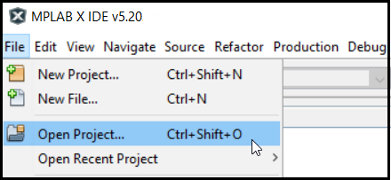

#  Quickstart Prebuilt Applications

Quickstart prebuilt applications lets you get started with MPLAB Harmony Graphics Suite in about 30 seconds. These applications should give you a ready-made starting point for writing your own graphics apps with MPLAB Harmony Graphics Suite.

## Quickstart Examples

The following table below lists quickstart applications and the development boards on which they run. To find a detailed description of these applications, see [Examples and Demonstrations](https://microchip-mplab-harmony.github.io/gfx/00548.html).

| Applications | [SAM D21N Xplained Pro](https://www.microchip.com/DevelopmentTools/ProductDetails/ATSAMD21-XPRO) |[SAM C21N Xplained Pro](https://www.microchip.com/developmenttools/ProductDetails/PartNO/ATSAMC21-XPRO) | [SAM E54 Xplained Pro](https://www.microchip.com/developmenttools/ProductDetails/PartNO/ATSAME54-XPRO) | [SAM E70 Xplained Ultra](https://www.microchip.com/developmenttools/ProductDetails/PartNO/ATSAME70-XPLD) | [SAM A5D2 Xplained Ultra](https://www.microchip.com/developmenttools/ProductDetails/atsama5d2c-xult) | [Multimedia Expansion Board II](https://www.microchip.com/DevelopmentTools/ProductDetails/PartNO/DM320005-5) |SAM 9x60 Evaluation Kit |[Curiosity PIC32MZ EF 2.0](https://www.microchip.com/Developmenttools/ProductDetails/DM320209) |
| --- | --- |--- | --- | --- | --- | --- | --- |--- |
| [aria_quickstart](https://microchip-mplab-harmony.github.io/gfx/00001.html)              | x | x | x | x | x | x | x | x |
| [blank_quickstart](https://microchip-mplab-harmony.github.io/gfx/00002.html)             |   |   |   |   |   | x |   |  |
| [legato_quickstart](https://microchip-mplab-harmony.github.io/gfx/00003.html)            |   |   | x | x |   | x | x | x |

Before you begin you must install the following tools:

* [MPLAB X IDE](https://microchipdeveloper.com/mplabx:installation)
* [XC32 C compiler](https://microchipdeveloper.com/xc32:installation)
* [MPLAB® Harmony v3](https://microchipdeveloper.com/harmony3:mhc-overview)
* [Development board](https://github.com/automaate/GFX_sandbox/wiki/Supported-Development-Boards)

## Step 1: Get the quickstart app

1. Clone the [Harmony v3 GFX](https://github.com/Microchip-MPLAB-Harmony/gfx.git) repository.

> git clone https://github.com/Microchip-MPLAB-Harmony/gfx.git

## Step 2: Import the quickstart app

1. Open the MPLAB X IDE and select **File->Open Project**

2. Navigate to the **`apps`/`aria_quickstart/firmware`** and select one of the [MPLAB X quickstart projects](https://github.com/Microchip-MPLAB-Harmony/gfx/tree/master/apps/aria_quickstart/firmware). Then click **Open Project** button.
3. Under **Projects**, right-click project name, select **Set as Main Project**.

## Step 3: Launch MPLAB Harmony Configurator (MHC)
1. After the project opens, start the MPLAB Harmony Configurator. In the MPLAB X IDE, select **_`Tools->Embedded->MPLAB Harmony Configurator`_**.
2. Select the path to the folder containing the MPLAB Harmony framework and click **Launch**.
3. The Configuration Database Setup window opens. Select **[] gfx**, then click Launch.
4. After MHC is loaded, observe the **Project Graph**.

## Step 4. Generate Source Code
1. When done, before generating code, click the **Save** icon as shown below.

2. Save the configuration in its default location when prompted.

3. Click on the **Code Generate** button as shown below to start generating code.

4. Click on the **Generate** button in the **Generate Project** window, keeping the default settings as shown below.
If prompted for saving the configuration, click **Save**.

MHC will include all the MPLAB Harmony library files and generate the code based on the MHC selections. The generated code would add files and folders to your Harmony project.

## Step 5. Program Device

1. Clean and build your application by clicking on the **Clean and Build** button as shown below.

2. Program your application to the device, by clicking on the **Make and Program** button as shown below.

***
## Next Steps
* Build and decompose our [feature applications](https://github.com/Microchip-MPLAB-Harmony/gfx/wiki/Quickstart-Pre-built-Applications)
* Understand our [board support facilities](https://github.com/Microchip-MPLAB-Harmony/gfx/wiki/Quickstart-Board-Support-Application)
* Learn how to [build a new applications](https://github.com/Microchip-MPLAB-Harmony/gfx/wiki/Build-a-New-Application)

***
If you are new to MPLAB Harmony, you should probably start with these tutorials:

* [MPLAB® Harmony v3 software framework](https://microchipdeveloper.com/harmony3:start) 
* [MPLAB® Harmony v3 Configurator Overview](https://microchipdeveloper.com/harmony3:mhc-overview)
* [Create a New MPLAB® Harmony v3 Project](https://microchipdeveloper.com/harmony3:new-proj)

***

**Is this page helpful**? Send [feedback](https://github.com/Microchip-MPLAB-Harmony/gfx/issues).
