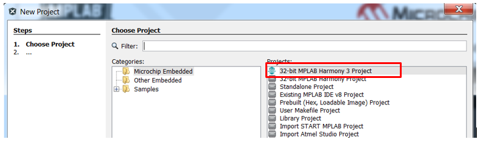
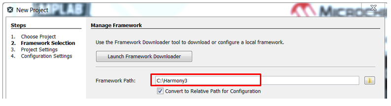

#  Quickstart generate an SSD1963 Display Controller Driver

This guide describes the basic steps necessary to produce a display driver for the SSD1963 display controller. The driver can be used with or without the Legato graphics library.

This guide uses the SAM E70 Xplained Ultra Evaluation Kit connected to a SSD1963 display controller. You will
build a simple application that displays an image and touch button. It starts with the creation
of a new MPLAB® project and finishes with a graphics application equivalent to legato_quickstart.

The demonstration will render the following image on the display:

Who should use this guide

This guide is intended for developers who want to generate a SSD1963 display driver. It creates the file **drv_gfx_exernal_controller.h** as well as the interface abstraction **gfx_driver** so that it can be used with any graphics library.

This driver will be exercised on the [SAM E70 Xplained Ultra Evaluation Kit](https://www.microchip.com/DevelopmentTools/ProductDetails/PartNO/DM320113).

What this guide contains

You will build a simple application and generate a SSD1963 display driver that displays an image and touch button. It starts with the creation of a new MPLAB® project and finishes with a graphics application equivalent to legato_quickstart. Here are the primary steps to create a graphics application and SSD1963 display driver for your SAME70 hardware:

1. Create a new project and configure clock for SAME70
    *  Create MPLAB Harmony v3 Project using MPLAB X IDE
    *  Verify Clock Settings
2. Configure Harmony components for graphics middleware and drivers
3. Configure pins for external graphics communication
4. Generate Code
5. Add application code to project
6. Build, program and observe outputs

Materials you will need

## Documentation

|Documentation|Description|
|----|----|
|[SAM E70 Xplained Ultra User's Guide](http://ww1.microchip.com/downloads/en/DeviceDoc/SAME70_Xplained_Ultra_Evaluation_User's%20Guide_DS70005389B.pdf) | User Guide with Schematics|
|[SSD1963 datasheet](http://www.solomon-systech.com/en/page/datasheet-request/)| Request a Solomon Systech SSD1963 datasheet|
|[High-Performance WQVGA Display Module with maXTouch® Information Sheet](http://ww1.microchip.com/downloads/en/DeviceDoc/50002627B.pdf)|Display Information Sheet|

## Hardware

|Hardware|Description|
|----|----|
|[SAM E70 Xplained Ultra Evaluation Kit](https://www.microchip.com/DevelopmentTools/ProductDetails/PartNO/DM320113)| Development Board |
|[WQVGA Display Module (AC320005-4)](https://www.microchip.com/Developmenttools/ProductDetails/AC320005-4). | High-Performance 4.3" WQVGA Display Module |
|[WQVGA Display Module from MEB II](https://www.microchip.com/Developmenttools/ProductDetails/DM320005-2) |  Alternative High-Performance 4.3" WQVGA Display Module if an MEB-II board is available |
|[SSD1963 LCD Controller Graphics Card](https://www.microchip.com/DevelopmentTools/ProductDetails/PartNO/AC320214)| Graphics Controller|
| Standard USB A to micro-B cable| PC debugging connector. |

> **_NOTE:_** The SAM E70 Xplained Ultra Evaluation Kit includes an on-board Embedded Debugger (EDBG), which requires no additional hardware to get started. For programming/debugging, the EDBG connects to the host PC through the USB micro-B connector on the SAM E70 Xplained Ultra Evaluation Kit.

Hardware Setup

SAM E70 Xplained Ultra Evaluation Kit is connected to the display using the display ribbon cable. Programming is a board to PC link using a standard USB A to micro-B cable. The connection, illustrated below, provides power and debug communication.

 The board and display are powered by a Micro B – USB A cable from PC to the “USB Debug” port on the SAM E70 Xplained Ultra Evaluation Kit.

## Software

|Software|Description|Install|
|----|----|----|
| [MPLAB® X Integrated Development Environment ](https://www.microchip.com/mplab/mplab-x-ide)| v5.15 or later| [Install MPLAB IDE](https://microchipdeveloper.com/install:mplabx) |
| [MPLAB® XC32/32++ C Compiler](https://www.microchip.com/mplab/compilers) | v2.20 or later | [Install Compiler](https://microchipdeveloper.com/install:xc32)|
| [MPLAB® Harmony 3 ](https://github.com/Microchip-MPLAB-Harmony/mhc/wiki)| v3.5 or later | [Install Harmony v3](https://microchipdeveloper.com/harmony3:mhc-overview#install)|

> **_NOTE:_** This project has been verified to work with the following versions of software tools:
MPLAB X IDE v5.20, MPLAB XC32 Compiler v2.20, MPLAB Harmony v3.6.0

> **_NOTE:_** Because we regularly update our tools, occasionally you may discover an issue while using the newer versions. If you suspect that to be the case, we recommend that you use the same versions that the project was tested with.

# Tutorial

To get started with this tutorial, you should:
*  Install MHC
*  Configure Hardware
*  Run MPLABX

1. **Install MHC**
To install MHC, follow the [Harmony V3 MHC installation guide](https://github.com/Microchip-MPLAB-Harmony/mhc/wiki). Upon completion, proceed to **Configure Hardware** steps below.

2. **Configure Hardware**

SAM E70 Xplained Ultra board configuration is simply a board to PC connection using a standard USB A to micro-B cable. The connection provides power and debug communication. The connection is illustrated in the image below:

**Configure the 4.3” WQVGA Display**
* Disconnect the ribbon cable that connects the display to the interposer board.  The board is for the MEB 2 only, and not used on the SAM E70 Xplained Ultra kit.

* Release the ribbon cable from the interposer board.
* Release the black clamp on the E70’s J2 connector and turn the display over.
* Insert the ribbon cable into J2 and close the clamp.

 The board and display are powered by a Micro B – USB A cable from PC to the “Debug USB” port on the E70 board.

3. **Run MPLABX**

* **Launch the MPLAB X IDE**.
    * From the File pull-down menu, select **New Project**. This will display the New Project dialog window.
    * Proceed to **Creating New Project Tutorial Steps**

## Create a New Project

1. **Choose Project**

In the MPLAB X IDE, select **File > New Project**. Select **Microchip Embedded** and select **32-bit MPLAB Harmony 3 Project** and click **Next**.

 If **32-bit MPLAB Harmony Project** is not visible repeat software installation steps **Install MHC** above.

2. **Framework Selection**

Enter the framework path pf your Harmony v3 root installation directory. This path is not set by default. You must enter the path used at installation. Select **Convert to Relative Path for Configuration** and click **Next**.

 The Launch Framework Downloader button is used to download or configure a local framework. Because you have already installed H3, this button selection is not required.

3. **Project Settings**

Choose a location for the MPLAB X IDE project configuration (or just keep the default name). Select the folder and name for your project and click **Next**.

4. **Configuration Settings**

Select the name and target device `ATSAME70Q21B` for your project and click **Finish**.

 Select for **Target Device:** drop down, `ATSAME70Q21B`.

When **Finish** is clicked, your new project will open in the IDE and the MPLAB Harmony Configurator will automatically start. Keep the default values in the Configuration Database Setup window and click the **Launch** button.

5. **Project Graph**

The MHC plugin’s main window for the project will be displayed. This is the initial project graph.

The final project graph must look like the following.

> **_NOTE:_** The LE SSD1963 Display Driver component is not required. If it is displayed on the Project Graphic, you must remove it.

## Create the SSD1963 Display Driver for [High-Performance WQVGA Display Module with maXTouch®](https://www.microchip.com/DevelopmentTools/ProductDetails/PartNO/AC320005-4)

To create a SSD1963 compliant driver set controller and display specific **Configuration Options** using the **LE External Controller** component. See image below. You will need to enter values for:
* Base Driver
* Display Settings
* Initialization Settings
* Blit Buffer Function Settings

> **_NOTE:_** Use default values unless otherwise directed.

1.  **Base Driver**

Use the following image to set your `Base Driver` options.

2. **Display Settings**

Use the following image to set your `Display Settings` options

3. **Reset Settings**

Use the following image to set your `Reset Settings` options

4. **Initialization Settings**

Use the following image to set your `Initialization Settings` options

5. **Init Command Settings**

Use the following images to set your `Init Command Settings` options

.png)
.png)
.png)
.png)

6. **Blit Buffer Function Settings**

Use the following images to set your `Blit Buffer Function Settings` options

##  Add application UI design to project

1. Launch **Legato Graphics Composer** from the MHC/Tools Menu:

2. On the **Welcome Dialog**, select `Load`

Use an existing design at the following location:

*  <_harmony_root_>`\gfx\apps\legato_quickstart\firmware\src\config\ssd1963_rgb565_mxt_e70\ssd1963_rgb565_mxt_e70_design.zip`

## Generate Source Code
1. Before generating code, click the **Save** icon as shown below.

2. Save the configuration in its default location when prompted.

3. Click on the **Code Generate** button as shown below to start generating code.

4. Click on the **Generate** button in the **Generate Project** window, keeping the default settings as shown below.
If prompted for saving the configuration, click **Save**.

MHC will include all the MPLAB Harmony library files and generate the code based on the MHC selections. The generated code would add files and folders to your Harmony project.

## Program Device

1. Clean and build your application by clicking on the **Clean and Build** button as shown below.

2. Program your application to the device, by clicking on the **Make and Program** button as shown below.

***

If you are new to MPLAB Harmony, you should probably start with these tutorials:

* [MPLAB® Harmony v3 software framework](https://microchipdeveloper.com/harmony3:start)
* [MPLAB® Harmony v3 Configurator Overview](https://microchipdeveloper.com/harmony3:mhc-overview)
* [Create a New MPLAB® Harmony v3 Project](https://microchipdeveloper.com/harmony3:new-proj)

***

**Is this page helpful**? Send [feedback](issues).