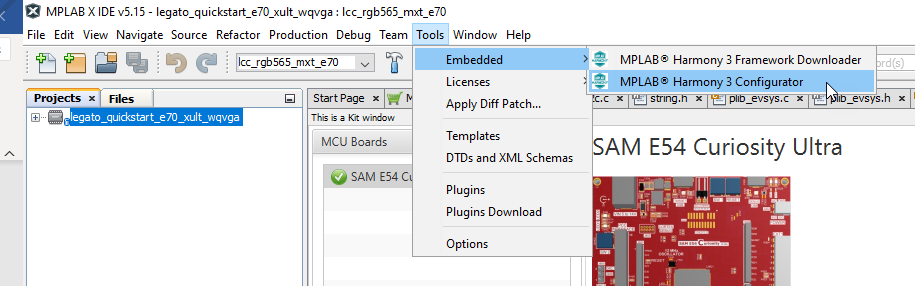
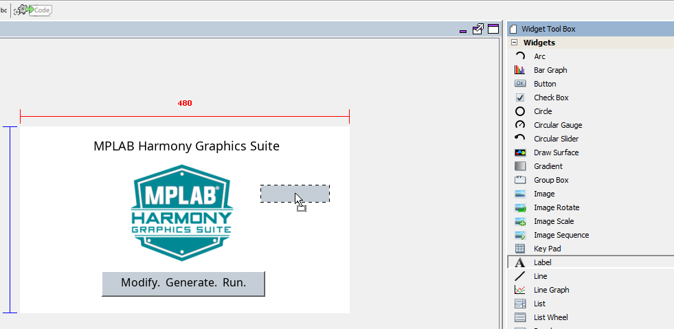
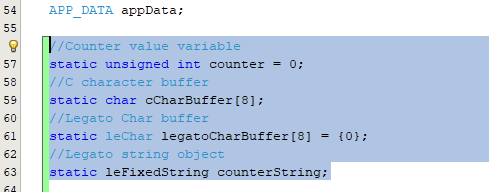

#  Showing Dynamic Labels

A graphics application may need to show text on the screen that changes at run-time. This can be a running clock, an event counter or real-time value from a sensor. 
This tutorial will demonstrate how to use a label widget and the Legato graphics library APIs to show a counter on the screen that updates every time a button is touched. 
This tutorial requires basic knowledge of the MPLAB Harmony Configurator and the MPLAB Harmony Graphics Composer.

1.	Create or open an existing MPLAB Harmony Graphics application that will run on your hardware.

For this tutorial, we will use the legato_quickstart_e70_xult_wqvga demo in Harmony/gfx/apps/legato_quickstart/ and open it in MPLABX.

2.	Launch the MPLAB Harmony Configurator (MHC)

3.	In MHC, launch Legato Graphics Composer.

4.	In Composer, open the Assets -> Font window and add a new font. In the case of this tutorial, import the NotoSans_BoldItalic.ttf font

5.	In the Font Assets window, select the NotoSans_BoldItalic font and set the following properties:

a.	Set Size to 60 and check Antialias

b.	Under the Glyphs tab, add a Glyph Range and set the Starting Character to 32 and Ending Character to 127. This adds the glyphs for the basic alphanumeric ASCII characters to the Font Asset.

6.	In Composer, open the Assets -> Strings Window and Add a new string.

7.	Set the String Asset Name to CounterString, click Create to create the String Asset.

8.	In the String Assets Window, set the CounterString value to 0 and the Font to NotoSans_BoldItalic.

9.	In Composer, add a Label Widget from the Tool Box to the Screen Designer.

10.	In the Widget Properties, set the Label Widget Properties as shown below:

11.	The design should now look like the one below:

12.	Now we’ll enable the events callback function that will get called when the button on the screen is pressed.
13.	In Composer, select the SloganButton widget (Modify. Generate. Run.) 

14.	In the Button Properties window, do the following:
a.	Check the Pressed checkbox.

b.	Click the … button to the right of the checkbox to open the Event Editor window.

c.	Set Generate Mode to Declare Only. This will declare the button’s event handler function in the generated code, but we will define the function in the application code.

d.	Click OK to close the Event Editor dialog box.

15.	Go back to MHC and click the Generate Code button to regenerate the project with the Composer changes.

16.	After regeneration, let’s add the Legato graphics library API calls to change the text in CounterLabel widget.
17.	In MPLABX open the file app.c.

18.	Add the following lines of code to app.c

a.	Include the relevant header file(s)
#include <stdio.h>
#include "gfx/legato/generated/le_gen_init.h"

b.	Declare the highlighted variables below
//Counter value variable
static unsigned int counter = 0;
//C character buffer
static char cCharBuffer[8];
//Legato Char buffer
static leChar legatoCharBuffer[8] = {0};
//Legato string object
static leFixedString counterString;

c.	Define the button press event callback function

void SloganButton_OnPressed(leButtonWidget* btn)
{
    //Increment the counter when button is pressed
    counter = (counter < 1000) ? counter + 1 : 0;

    
d.	In the APP_Tasks() function, add the following code to allocate the temporary counter string object during initialization

//Create and initialize a legato string object, this string object will be used
//to construct the string that will be used by the label object for showing on the 
//screen
leFixedString_Constructor(&counterString, legatoCharBuffer, 16);
//Assign a font to the string object. The font must contain all the glyphs/characters
//that will be used in the dynamic string. In the case of a numeric counter, it needs
//to have all the numbers (0-9)
counterString.fn->setFont(&counterString, leStringTable_GetStringFont(leGetState()->stringTable, string_CounterString, 0));            

e.	In the APP_Tasks() function inside the APP_STATE_SERVICE_TASKS case statement, add the following code to update the string on the CounterLabel widget when the counter value changes

static unsigned int oldCounterValue = 0;
            
if (oldCounterValue != counter)
{
//create the c character array string counter value
        sprintf(cCharBuffer, "%u", counter); 

        //convert the character string to leFixedString object
        counterString.fn->setFromCStr(&counterString, cCharBuffer);    

        //Set counterString string to label
        CounterLabel->fn->setString(CounterLabel, (leString*)&counterString);   
}

f.	In the case of this application, the counterString object is only allocated once and is persistent so we don’t need to call the string destructor to free any allocations. 

In other use cases where the string object can go in and out of scope, allocation may need to be freed by calling the string destructor function. This is needed to prevent any memory leaks. 

19.	Build and run the program on the target board for the legato_quickstart_e70_xult_wqvga project. It should show a counter that increments every time the button is pressed.

***

# Next Step

In this tutorial, you learned how to use the Screens Pane to add a new interface to your existing design. You learn to add a image and a button. You also learn associate the image onto the button and change the the background color to match the image background. At this point, you’re ready to add behavior.
Go to the next tutorial in this series: [How to Add a Image](./How-to-Add-a-Image).

***

If you are new to MPLAB Harmony, you should probably start with these tutorials:

* [MPLAB® Harmony v3 software framework](https://microchipdeveloper.com/harmony3:start) 
* [MPLAB® Harmony v3 Configurator Overview](https://microchipdeveloper.com/harmony3:mhc-overview)
* [Create a New MPLAB® Harmony v3 Project](https://microchipdeveloper.com/harmony3:new-proj)

***

**Is this page helpful**? Send [feedback](https://github.com/Microchip-MPLAB-Harmony/gfx/issues)