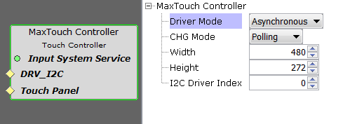
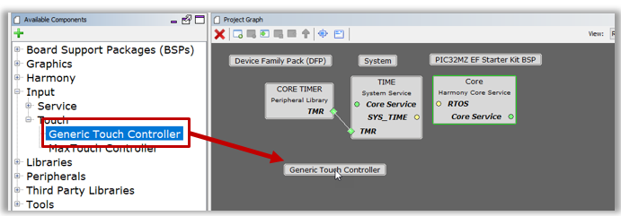
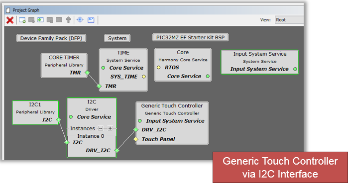
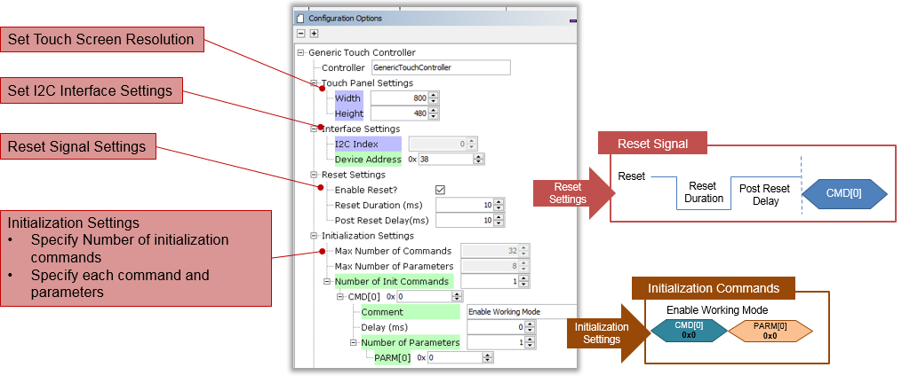
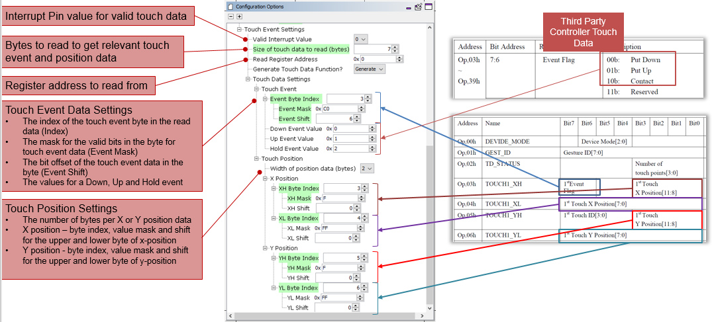
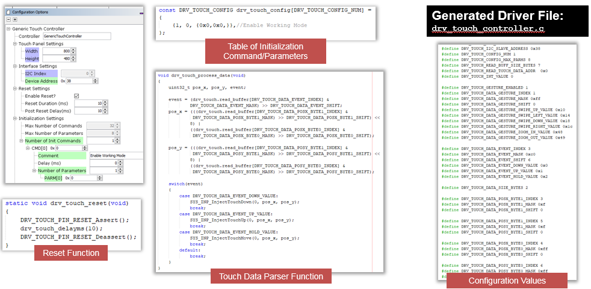
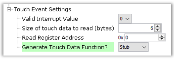
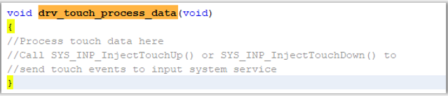

#  Touch Driver Support

MPLAB Harmony Graphics Suite contains the following touch screen driver support:
* Micrchip maXTouch® touch screen controllers
* Generic touch screen controllers
* Peripheral touch controller
* Resistive touch

## Microchip maXTouch controller driver
The Suite contains integrated support for Microchip’s maXTouch® Touchscreen Controllers.

Touch-enabled graphics on maXTouch® powered Touch Display Modules
maXTouch Curiosity Pro include:
* [4.3" WQVGA Display Module with maXTouch® Technology](https://www.microchip.com/DevelopmentTools/ProductDetails/PartNO/AC320005-4)
* [5.0" WVGA PCAP Display Board](https://www.microchip.com/DevelopmentTools/ProductDetails/PartNO/AC320005)
* [7” WVGA Touch Module](http://www.pdaatl.com/doc/tm7000b.pdf)

The driver is pre-coded and can be configured for various display sizes. No coding is required.

* Asynchronous or Synchronous operation
* Polling or interrupt event notification
* Set extent of display
* i2C interface for command communication

## Generic touch screen controllers

The Suite also contains support for specific classes of third-party external touch controllers.
The code for these controllers are generated from configuration input through MHC's Generic Touch Driver
component.
for certain third-party touch controllers:
* Uses I2C interface for setup and reading touch data
* Uses [Command] + [Data] writes for initial setup
* Sends an interrupt signal for valid touch
* Touch Event and Position data can be obtained in a single atomic I2C read transaction

### Using the Generic Touch Controller Driver Generator

1. Add the driver component to the project like a regular Touch Controller driver
Input > Generic Touch Controller

2. Add and connect the I2C Driver and the appropriate Peripheral Library for I2C
Add Input System Service Component

### Configuring the Generic Touch Controller Driver Generator

### Generated Generic Touch Controller Driver

### Generating a Stub Touch Controller Driver

If the target touch controller has an unsupported touch data format, set Generate Touch Data Function to ‘Stub’

This will generate an empty drv_touch_process_data() definition that must be completed manually.

The function must extract the touch event and position from the touch data and call the appropriate SYS_INP_Inject* function.

> **_NOTE:_**   Resistive Touch is supported in Harmony 2 is currently under development for Harmony 3.  Peripheral touch is also under development in Harmony 3.

***

If you are new to MPLAB Harmony, you should probably start with these tutorials:

* [MPLAB® Harmony v3 software framework](https://microchipdeveloper.com/harmony3:start)
* [MPLAB® Harmony v3 Configurator Overview](https://microchipdeveloper.com/harmony3:mhc-overview)
* [Create a New MPLAB® Harmony v3 Project](https://microchipdeveloper.com/harmony3:new-proj)

***

**Is this page helpful**? Send [feedback](https://github.com/Microchip-MPLAB-Harmony/gfx/issues).
