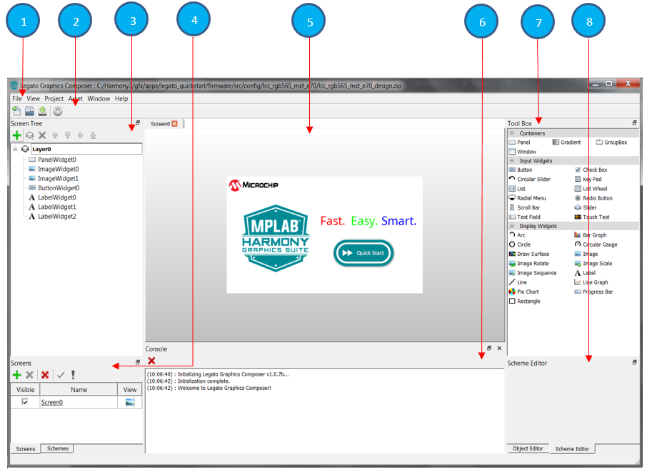

#  Understanding Legato Composer

## <b>Overview of the User Interface</b>

Legato Composer includes everything you need to create a UI design. It provides a gallary of widgets and containers. It supports multiple screens and layers. It provides property editors color schemes and objects. It is capable of creating designs that run on all Microchip hardware and a wide range of display resolutions. 

Referencing the image below, take a few moments to familiarize yourself with the main sections of the Legato composer workspace: 

1. **Main menu bar**. At the top of the workspace are user menus that you can use to perform project tasks and configure your work environment.
2. **Toolbar bar**. Below the main menu is the toolbar. It contains convenience  icons that you can click to perform commonly used tasks such as saving files and generating code.
3. **Screen Tree Pane**. At the top left is the screen tree pane. It maintains a tree list of screen items which includes layers and tool box objects.
4. **Screen and Scheme Pane**. At the bottom left are screen and scheme panes, where you create one or more screens and schemes. Each screen will contain layers and each layer will contain widgets. Schemes define color layout. They can be assigned to objects.
5. **Screen designer**. The middle of the workspace is the screen designer. It contains one or more screens that you create and design in composer.
6. **Console**. The middle of the workspace is the screen designer. It contains one or more screens that you create and design in composer.
7. **Tool Box Pane**. At the top right side of the screen designer is the tool box. It contains a gallery of
containers, input and display widgets. These are used to define user-interface.
8. **Screen and Scheme Editor Pane**. At the bottom left are the editor panes. They are editors for objects and schemes and contain a list of properties for schemes and objects.

# 

## <b>Overview of the Workflow</b>

The workflow to develop an Legato Composer design is conceptually similar to developing a MHC-only application.  The following list provides an overview of the process to build an Legato composer app.

1. Set up your workspace - This is the phase, which includes Harmony3 and MHC, you probably already finished. Launch composer and create a project.

2. Design your UI - For a walkthrough with Legato composer that teaches some development fundamentals, check out tutorial [How to create a New Project](./How-to-Use-New-Project-Wizard). 

3. Save your Legato Composer design and generate the design files.

4. Generate, Build and Run - Save your MHC project and generate your application files and run your application.

## <b>Overview of the Application files</b>

Best practices for user generated files are contained below. See table for complete understanding:

| Source | Description | Location |
| ------ | ----------- | -------- |
| Tool generated | Legato library and UI design files | src/config/default/gfx/legato/generated |
|  User generated | User business logic files  UI screen files| src/screen0/app_screen0.c src/screen1/app_screen1.c |
| Tool generated | Legato Project files .legato_generate_cache.zip *\<project\>*.zip |  src/config |

### <b>About the Main menu bar</b>

Contains menus that you can use to perform these tasks:

* Open, Save, Import, and Generate design files
* set object clipping and display language preferences
* set project properties, launch event manager, memory tools
* add assets for images, fonts, strings, and palette
* manage user interface windows
* set display and usage preferences for composure

### <b>About the Toolbar</b>

Contains icons that you can click to perform commonly used tasks such as saving files and generating code.

### <b>About the Screen Designer Window</b>

Contains one or more screens that you create and design in composer.

### <b>About Screens</b>

Creates one or more screens that you add to the designer window

### <b>About the Screen Tree</b>

maintains a tree list of screen items which includes layers and tool box objects.

### <b>About the Schemes and Scheme Editor</b>

creates one or more schemes that can be assigned to objects

### <b>About the Tool Box and Object Editor</b>

contains gallery of container and objects icons that you can drag onto the designer work area to add to the design. 

***

If you are new to MPLAB Harmony, you should probably start with these tutorials:

* [MPLAB® Harmony v3 software framework](https://microchipdeveloper.com/harmony3:start) 
* [MPLAB® Harmony v3 Configurator Overview](https://microchipdeveloper.com/harmony3:mhc-overview)
* [Create a New MPLAB® Harmony v3 Project](https://microchipdeveloper.com/harmony3:new-proj)

***

**Is this page helpful**? Send [feedback](https://github.com/Microchip-MPLAB-Harmony/gfx/issues)